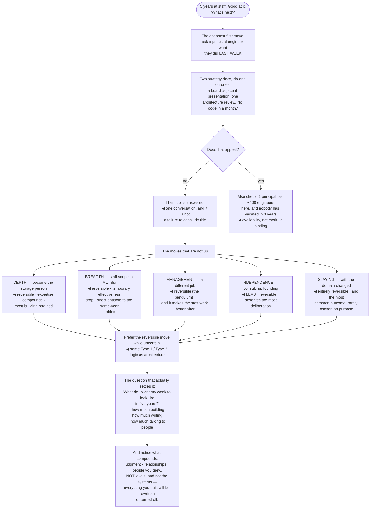

## The model

Above staff the ladder gets thin, inconsistent between companies, and increasingly about the
organisation rather than the systems. **Principal** and **distinguished** exist in some places and
not others, and where they exist they mean different things.

The change in the work is the part worth understanding before pursuing it. Staff is scoped to teams
and systems; the levels above are scoped to the organisation and to multi-year horizons, and the
proportion of the week spent on engineering falls at every step. That is a genuine trade rather than
a simple promotion, and it is why "up" is one of several legitimate directions rather than the
default.

## When to use it

You are at staff and asking what is next, or deciding whether you want it.

1. **Does the level exist here, with people in it?** If nobody holds it, the path is theoretical
   and the first person into it will be defining the job as well as doing it.
2. **What does the work actually look like?** Ask someone who has it what their last week
   contained. The answer is usually less engineering than expected.
3. **Is "up" the direction you want?** Depth, breadth, a different domain, management, or
   independence are all real moves, and several are more reversible.

## Speedrun

**What** — a small set of directions, only one of which is up:

| Direction | Involves | Reversible |
|---|---|---|
| **Principal / distinguished** | organisational scope, multi-year horizons, less code | hard — the roles are scarce |
| **Depth** | becoming the person for a domain | yes |
| **Breadth** | a new domain at the same level | yes |
| **Management** | people and process, a different job | yes — the pendulum |
| **Independence** | consulting, founding, contracting | costly to reverse |
| **Staying** | the work you already like | entirely |

**How to think about it**

1. **Find out what the role actually contains** before wanting it. The gap between the title's
   reputation and the week's content is usually large.
2. **Prefer [[the reversible move|reversible moves]] while you are uncertain.** A domain change is
   undoable; leaving to found something mostly is not.
3. **Notice that the levels above are scarce.** Principal roles frequently exist in a ratio of one
   to several hundred engineers, so availability constrains it more than merit does.
4. **Treat management as a different job, not a rung.** Majors' pendulum: it is not one-way, and
   time in it makes you better at both.
5. **Ask what you want your week to look like** in five years, in concrete terms. That question
   answers this better than any ladder does.
6. **Take staying seriously as a choice.** It is the most common outcome and the one least often
   chosen deliberately.

**Why it works** — the ladder above staff is not a continuation of the same work at greater
difficulty. It is a different job, and evaluating it as a different job produces better decisions
than evaluating it as a level.

**The question that settles it fastest** — ask a principal engineer what they did last week. If
none of it appeals, that is your answer and it cost one conversation.

## Going deeper

### What principal actually is

**Principal** is the most common next rung and the least standardised. In some companies it is
staff with a longer horizon; in others it is a fundamentally organisational role reporting close to
the top.

The consistent elements where it does exist: **organisational scope** rather than team scope,
horizons measured in years rather than quarters, direction-setting for areas rather than systems,
and a significant amount of work that is representing engineering to the rest of the business.

The proportion of hands-on work falls, and this is the part people underestimate. A principal
engineer who writes code weekly is unusual; most describe their week as reading, writing, and
talking to people, with technical judgment applied to decisions rather than to implementations.

Scarcity is the other constraint. These roles frequently exist at a ratio of one per several
hundred engineers, which means availability — not merit — is often the binding factor. Someone can
be operating at the level for years with no seat to move into.

**Distinguished** and equivalent titles above are rarer still, more idiosyncratic, and in many
organisations are recognition of a specific historic contribution as much as a defined job.

### The moves that are not up

Four alternatives, each of which is a real career rather than a consolation.

**Depth.** Becoming the person for a domain — storage, security, machine learning, compilers. The
scope stays similar and the expertise compounds, and it is the direction most compatible with
continuing to build things.

**Breadth.** Taking staff-level scope in an unfamiliar domain. It usually costs a temporary drop in
effectiveness and buys a much wider judgment, and it is the direct antidote to the same-year
problem.

**Management.** A different job with different satisfactions, and Majors' central point is that it
is not a one-way door. Time as a manager produces a much better staff engineer afterward, and
treating the move as permanent is what makes people avoid it or resent it.

**Independence.** Consulting, contracting, founding. Scope and autonomy increase sharply; stability
and the ability to see a long project through frequently decrease. This one is the least reversible
and deserves the most deliberation.

The framing that helps across all four is reversibility, which is the same [[Type 1 decision]]
logic that applies to architecture. A domain change is a two-way door; leaving to found a company
mostly is not. When uncertain, prefer the move you can undo, and spend the irreversible ones
deliberately.

### Staying, chosen deliberately

The most common outcome is staying at staff, and it is the one people least often choose on
purpose.

The case for it is straightforward once stated. The scope is genuinely large, the work is still
technical, the influence is real, and the compensation at staff is at or near the point of
diminishing returns in most companies. The levels above trade engineering for organisational work,
and a lot of people find out too late that they wanted the engineering.

What makes staying good rather than stagnant is the same-year check. Staying at a level while
changing the domain, the problem type or the archetype is continued growth; staying at a level doing
the same work is the plateau in its avoidable form.

Reilly's framing is that the ladder is a company's model of value, not a model of a good career.
The two overlap and are not the same, and confusing them produces people optimising a rubric rather
than a life.

The question that cuts through it: **what do you want your week to look like in five years?**
Answered concretely — how much building, how much writing, how much talking to people, how much
travel, how much on-call — it settles this better than any comparison of titles.

### The long view

A career at this level is measured in decades, and the things that actually compound are not levels.

Judgment compounds. Every hard decision, every migration that went badly, every design that turned
out wrong in an instructive way — that accumulation is what makes someone worth consulting, and it
does not appear on a ladder.

Relationships compound. The people you worked with become the people who hire you, recommend you,
and tell you honestly what is going on. Over twenty years this is the largest single asset most
senior engineers have, and it is built by being someone people want to work with rather than by
being right.

People you grew compound fastest of all. An engineer you sponsored who becomes a staff engineer,
who sponsors someone else, is a multiplier with no ceiling — and it is the one form of impact that
outlives every system you build.

And the systems mostly do not compound. Everything you have built will be rewritten or turned off,
usually sooner than expected. Which is not a reason to build carelessly; it is a reason to notice
that the durable part of the work was never the code.

## See it work

A staff engineer at a fork, five years in.

Asking a principal engineer about their actual week is the cheapest step available and almost nobody
takes it. Two strategy documents, six one-on-ones, a board-adjacent presentation and no code in a
month is an accurate description of the job — and for a lot of staff engineers it settles the
question immediately.

Concluding that you do not want it is a result rather than a failure. The ladder implies that
declining to climb is a deficiency, and the only thing being declined here is a different job that
happens to be numbered higher.

The scarcity check is the second half of the same conversation. One principal per four hundred
engineers, with no vacancy in three years, means the constraint is availability — and no amount of
demonstrating the level creates a seat.

Prioritising reversibility across the alternatives is the same logic as the architecture pages, and
it applies with the same force. Depth, breadth and management can all be undone; leaving to found
something largely cannot, and the ones you cannot undo deserve much more deliberation than they
usually get.

And the last box is the one worth carrying out of the whole section. The systems get rewritten or
turned off, reliably and sooner than expected — what accumulates is judgment, relationships, and
the people who can now do something because of you. None of those has a rung.

## Next

That closes Staff Engineering. The Communication section covers the skill everything here depends
on: making the argument land.
