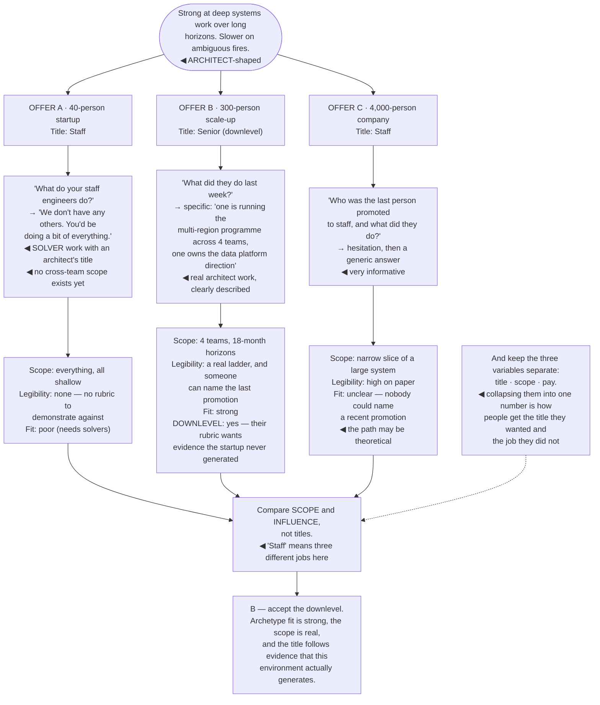

## The model

"Staff engineer" is not a standard. It describes a different job at a fifty-person startup, a
thousand-person scale-up and a large established company, and the differences are larger than the
similarities.

That has a practical consequence people discover late: **the archetype fit** between what you are
good at and what a company needs decides more of your effectiveness than your ability does. An
organisation that needs an architect will not reward solver behaviour, however well you do it, and
the mismatch reads to everyone — including you — as underperformance.

## When to use it

You are considering a move, or trying to understand why the role is not working where you are.

1. **What shape of staff work does this company need?** Tech lead, architect, solver, right hand.
   Ask which one they are hiring for, because they often have not asked themselves.
2. **Is there staff-level scope available?** A company where every problem fits inside one team
   has no staff work in it, whatever the ladder says.
3. **What do the existing staff engineers actually do?** The most informative question in any
   interview, and the answer is frequently not what the job description says.

## Speedrun

**What** — an assessment of whether a company can support the version of the role you want.

**How to assess one**

1. **Ask what the current staff engineers spend their time on.** Specifically, last week. Vague
   answers mean the role is not defined.
2. **Check whether the ladder is real.** Are there staff-plus engineers with genuine influence, or
   is the technical track a title with no authority attached?
3. **Match the archetype.** Larson's four describe what an organisation needs at a given moment,
   and one of them will fit you much better than the others.
4. **Read the growth stage.** Startup, scaling, and established companies each produce a different
   kind of staff work, and each rewards different strengths.
5. **Watch for [[level inflation]] in both directions.** A staff title at one company can map to
   senior at another, and vice versa — compare scope, not titles.
6. **Ask how the last promotion to staff happened.** If nobody can name one, the path is theoretical.

**Why it works** — most of what determines whether the role works is environmental. The same person
thrives in one organisation and stalls in another with no change in ability.

**The question that reveals the most** — "who was the last person promoted to staff here, and what
did they do?" A specific, confident answer is a good sign. Hesitation is a very informative one.

## Going deeper

### The archetypes, as an environment question

Larson's four archetypes are usually read as a self-assessment. They are more useful read as a
description of what an organisation currently needs.

**Tech lead** — guiding one team's execution. Common in scaling companies where teams are forming
faster than experienced leads exist. If a company describes staff as "leading a team's technical
direction", this is what they want.

**Architect** — owning direction in a critical area across teams and over long horizons. Common in
established companies with large systems. Requires the organisation to have long horizons, which
many do not.

**Solver** — parachuting into the hardest current problem, then the next. Common where there are
recurring fires, and it is often what a company means when it says "we need someone senior".

**Right hand** — operating with a senior leader's authority on organisational problems. Rarest,
requires a leader who wants one, and it is the least like engineering.

The mismatch is the thing to detect early, because it is invisible until it has cost you a year.
An architect in a company that needs solvers will be seen as slow and theoretical; a solver in a
company that needs an architect will be seen as unfocused. Neither is a capability problem.

The useful interview question is direct: "which of these describes what you need?" — and if they
cannot answer, ask what the existing staff engineers did last week, which answers it indirectly.

### Growth stage

The **growth stage** of a company changes the work more than the industry or the technology does.

**Startup, under about fifty engineers.** Staff titles often do not exist, and the work is
generalist — everything is under-owned, and nothing is big enough to require cross-team
coordination because there are barely teams. Great for breadth, poor for demonstrating staff-level
scope on paper.

**Scaling, roughly fifty to five hundred.** The richest environment for staff work. Systems and
teams are both multiplying, coordination problems appear faster than structure to handle them, and
almost every problem is genuinely cross-team. This is where most staff-plus narratives are set.

**Established, five hundred and up.** Deep specialisation, long horizons, real architecture work,
and a functioning promotion ladder. Also more process, slower change, and more of the work is
influence rather than building.

The tradeoff worth naming is legibility. A startup gives you enormous scope with no rubric to
demonstrate it against; a large company gives you a clear ladder and a narrower slice. Neither is
better, and knowing which problem you have makes the next move obvious.

Larson's collected narratives contain a pattern worth noticing: many people reached staff by moving
companies, frequently from a place with no available scope to one with plenty. Treating that as a
failure of loyalty misreads what happened.

### Level inflation and comparing offers

**Level inflation** means titles do not compare across companies, and comparing them is how people
make bad moves.

Staff at a fifty-person startup can mean "the third engineer, does everything". Staff at a large
technology company can mean a specific rung with a written rubric and a calibration process. Both
are real, and mapping one onto the other by name produces surprises.

What to compare instead is scope and influence:

- how many teams does the role touch?
- what decisions does it own?
- how many levels sit between it and the person who sets direction?

Those questions have answers that mean the same thing everywhere.

The downlevel risk is worth planning for explicitly. Moving from a smaller company to a larger one
frequently means accepting a lower title for the same work, because the larger company's rubric asks
for evidence the smaller one never generated. That is not always a bad trade, and going in aware of
it beats discovering it in a levelling conversation.

The compensation comparison is a separate axis and is worth keeping separate. Title, scope and pay
are three variables, and companies trade them against each other differently — treating them as one
number is how people end up with the title they wanted and the job they did not.

### The pendulum, and other exits

Majors' **engineer/manager pendulum** is worth knowing about because it removes a false binary that
traps people.

Her argument is that moving between individual-contributor and management roles across a career
makes you better at both, and that the assumption of a one-way door is wrong. An engineer who has
managed understands the organisational machinery; a manager who has recently built understands what
they are asking for.

The relevant version for a staff engineer is that "staff or manager" is not a permanent choice, and
treating it as one produces people who take a management job they do not want because the technical
track appeared to stop.

The other exits are worth knowing exist:

- principal and distinguished roles, which are much scarcer and much more organisation-dependent
- consulting or independent work, which trades stability for scope
- founding something
- staying at staff indefinitely, which is a legitimate destination treated as a failure far more
  often than it should be

Reilly's framing is that the ladder is a company's model of value, not a model of a good career.
Plenty of the most effective engineers deliberately stop at staff — the work is genuinely
interesting, the scope is large, and the next rung frequently trades more of the technical work for
more of the organisational kind.

## See it work

The same engineer, evaluating three offers.

The startup offer is the one that looks best and fits worst. A staff title at forty engineers is
real in its way, and the work described is solver-shaped — everything shallow, nothing cross-team,
because there are barely teams — which is precisely the wrong environment for someone strong at long
horizons.

The scale-up's answer to "what did they do last week" is the tell that matters. Specific, current,
and describing exactly the architect work this person is good at — and the specificity itself is
evidence the role is defined rather than aspirational.

The large company's hesitation on the last promotion is worth more than everything on its job
description. A functioning ladder produces a confident, specific answer; hesitation means the path
exists on paper and nobody has recently walked it.

Accepting the downlevel at B is the right trade and it is uncomfortable. The rubric asks for
evidence the startup never generated, which is a statement about the previous environment rather
than about the engineer — and the environment that can generate that evidence is the one worth
being in.

And keeping title, scope and pay as three separate variables is what makes the comparison honest.
Collapsing them into one ranking is how people take the offer with the best-sounding title and spend
two years doing work that does not fit them.

## Next

The plateau covers what happens when the environment is right and the progression stops anyway.
