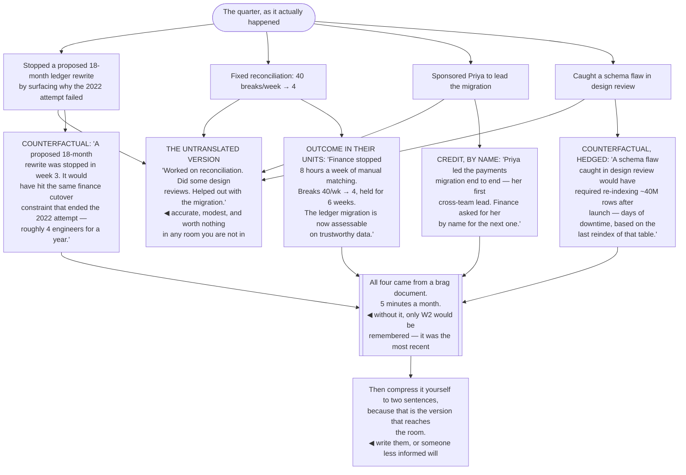

## The model

The best staff work produces nothing you can point at. The incident that did not happen, the
project that was stopped before it started, the two teams that did not build the same thing twice —
all of these are successes, and none of them leaves an artifact.

**The invisibility problem** is structural rather than a failure of modesty. A senior engineer's
output is legible by default; a staff engineer's has to be translated to be legible at all. Doing
that translation is part of the job, and treating it as self-promotion is how good engineers end up
with a year nobody can account for.

## When to use it

Something you did mattered and nobody outside your immediate context knows about it.

1. **Could your skip-level describe what you did this quarter?** If not, it did not happen as far
   as any promotion, staffing or credit decision is concerned.
2. **Is the value stated in their terms?** "We consolidated the reconciliation paths" means
   nothing outside your team. "Finance stopped doing eight hours a week of manual matching" means
   something to everyone.
3. **What did *not* happen because of you?** That is usually the largest part of the impact and
   the part with no evidence attached.

## Speedrun

**What** — a small, consistent practice of recording and translating what you did.

**How to do it**

1. **Keep a [[brag document]].** A running file, updated monthly, of what you did and what changed
   because of it. Five minutes a month, and it is the only defence against forgetting your own year.
2. **Write outcomes, not activities.** "Led the schema split" is an activity. "Three teams now
   deploy independently; release lead time went from a week to a day" is an outcome.
3. **Translate into the reader's language.** Engineer-days, incidents avoided, features unblocked,
   money. Not architecture nouns.
4. **Use [[counterfactual framing]] for prevention work.** "Without this, we would have" is the
   only way invisible successes become describable.
5. **Tell it once, at the end.** A single clear account when something finishes reads as
   competence; a running commentary on incomplete work reads as seeking credit.
6. **Credit others specifically and by name.** It costs nothing, it is usually accurate, and it
   makes your account more credible rather than less.

**Why it works** — decisions about you are made in rooms you are not in, by people working from
whatever description of your work reached them. You are choosing between supplying that description
and letting one be inferred.

**The reframing that makes this comfortable** — you are not promoting yourself. You are making sure
the organisation knows what it got, which is information it needs in order to decide what to fund
next.

## Going deeper

### Why the best work is the least visible

Three properties of staff work make it hard to see, and they are the same properties that make it
valuable.

**Prevention leaves no trace.** An incident that did not happen produces no postmortem, no
dashboard spike, and no story. The better you are at this, the less there is to point at.

**Enabling attributes elsewhere.** When you unblock a team and they ship something excellent, the
visible artifact is theirs — correctly. Your contribution is a conversation nobody recorded.

**Stopping things is invisible by construction.** Talking an organisation out of a bad two-year
project is possibly the highest-value thing you can do in a year, and it produces literally nothing.
Nobody writes a retrospective about a project that never started.

Reilly's "being glue" argument adds the distributional point that matters: this work is essential,
uncredited, and disproportionately carried by women and underrepresented engineers. Her conclusion
is not "do less of it" — it is that a career built only on invisible work stalls, because promotion
is assessed on visible technical impact.

Which gives the practical rule. Keep the glue that only your cross-team context makes possible,
shed the glue anyone could do, and make sure the part you keep is described in a way someone
outside your team can evaluate.

### Translation

**Translation** is the actual skill, and it is more mechanical than it sounds: restate the work in
the units the reader already cares about.

The pattern is a substitution. Architecture nouns become consequences. "We decoupled the services"
becomes "teams stopped waiting a week for each other's releases". "We fixed the reconciliation
pipeline" becomes "finance stopped doing eight hours of manual matching every week, and the ledger
migration became assessable".

The units that travel upward are consistent: engineer-days saved or freed, incidents avoided or
resolved faster, features unblocked or accelerated, revenue protected, risk removed, people who can
now do something they could not.

The test is whether it survives retelling. Your manager will compress it, their manager will
compress it again, and the version that reaches a promotion committee is two sentences long. Write
the two sentences yourself, or someone less informed will.

And be specific, because specificity is what makes it credible. "Improved reliability" is a claim
nobody can weigh; "cut change failure rate from 18% to 6% over two quarters" is one that carries its
own evidence.

### The brag document

Evans' practice is the highest-return habit in this whole area, and it costs about five minutes a
month.

Keep a running file. Each month, add what you worked on, what changed as a result, who you helped,
what you learned, and any numbers you have. Nothing more structured than that.

What it defends against is forgetting your own year, which happens to everyone. At review time,
people reliably remember the last six weeks and a couple of dramatic moments — so a year of steady,
significant work compresses into whatever was recent, and the rest is genuinely lost.

It is also the raw material for everything else: promotion cases, performance reviews, updating a
CV, and the sentence you need when someone asks what you have been working on. Writing it from
notes takes an hour; reconstructing it from memory takes a day and produces less.

The version that works is the one you actually keep. A file with dated bullet points beats an
elaborate system, and monthly beats "when I remember", because monthly is short enough that the
month is still in your head.

### Counterfactual framing, and telling it well

**Counterfactual framing** is how prevention work becomes describable: state what would have
happened without it.

"We caught a design flaw in review that would have required re-indexing 40 million rows after
launch." "The migration ratchet stopped 60 new callers from being added, which would have added
about four months." Both are honest, both are estimates, and both convert nothing-happened into
something someone can weigh.

The estimate needs to be defensible rather than precise, and hedging it appropriately is what keeps
it credible. "Roughly four months, based on the rate new callers were being added" is stronger than
a confident number nobody can check.

On delivery: once, at the end, plainly. A short written account when something finishes — what was
broken, what changed, what it now makes possible — is the whole practice. Frequent updates on
incomplete work read as seeking credit, and that reading is hard to reverse.

Credit others by name, specifically. "Priya found the reporting dependency that would have broken
the cutover" costs you nothing, is usually true, and makes the rest of your account read as an
honest description rather than a claim. The instinct to be seen as the sole author is worth
suppressing every time.

And the audience for all of this is not only your manager. Your manager's manager, the people who
will be in a calibration room, and the peers who will be asked about you — those are the readers,
and most of them will only ever see the compressed version.

## See it work

A quarter of genuinely high-impact work, described two ways.

The untranslated version is what most people actually say, and it is not false modesty — it is an
accurate description of the activities, offered by someone who assumes the value is obvious. It is
worth almost nothing outside the team, because nobody outside the team can convert those activities
into consequences.

Stopping the rewrite is the highest-value item on the list and the one with no evidence at all.
Counterfactual framing is the only way it becomes describable — four engineers for a year, avoided,
with the reason it would have failed attached so the estimate is checkable.

The reconciliation item translates cleanly because it already had someone else's number attached.
Forty breaks a week was finance's complaint before anyone started, so eight hours a week returned to
finance is a claim that carries its own evidence.

Naming Priya makes the whole account more credible rather than less. A quarter described entirely
in the first person invites scepticism; one that says exactly what someone else did reads as an
honest description — and it is also the visible half of sponsorship.

And the brag document is why any of this exists. Without five minutes a month, only the
reconciliation fix would have been remembered, because it was the most recent — the stopped rewrite
and the caught schema flaw are exactly the items that vanish from memory, since neither produced
anything.

## Next

The promotion case takes this material and assembles it into the specific argument a committee
evaluates.
