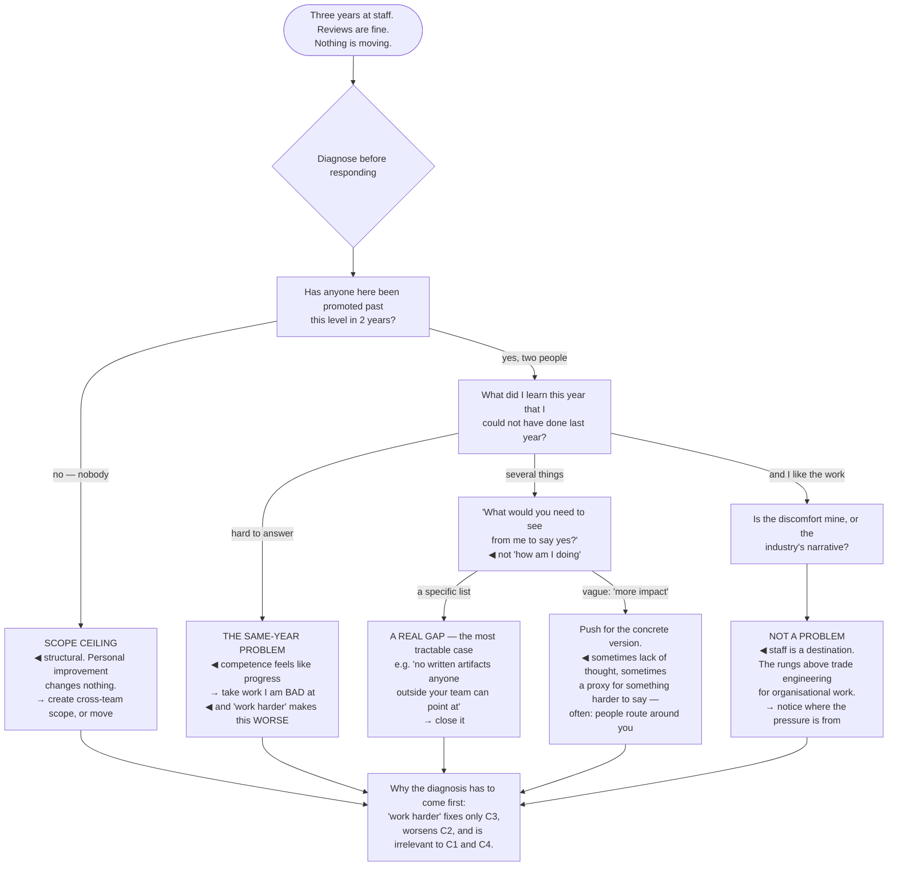

## The model

At some point the trajectory flattens. The work is competent, the reviews are fine, and nothing is
moving — and the standard responses are all wrong for most cases, because "work harder" and "be more
visible" address only one of the four things that produce a **plateau**.

The four are distinguishable and they need different responses: there may be no scope available;
you may be repeating a year rather than accumulating them; the gap may be real and specific; or the
plateau may not be a problem at all, and the discomfort is coming from an assumption that
progression is obligatory.

## When to use it

Two or three years at the same level, with no clear reason why.

1. **Does larger scope exist here?** Look at whether anyone has grown into it recently. If the
   answer is no for everyone, it is environmental rather than personal.
2. **Are you accumulating years or repeating one?** Five years of the same year is a common and
   invisible failure, and it is the one most under your control.
3. **What specifically is missing?** If nobody can name it concretely, either nobody has looked or
   the answer is not about you.

## Speedrun

**What** — a diagnosis, because four different causes produce the same symptom.

**How to tell them apart**

| Cause | Tell | Response |
|---|---|---|
| **Scope ceiling** | nobody has grown into larger scope here recently | change environment, or create scope |
| **The same-year problem** | this year looks like the last three | deliberately take unfamiliar work |
| **A real gap** | someone can name it specifically | close it; it is the most tractable case |
| **Not actually a problem** | you like the work and the discomfort is external | notice where the pressure is coming from |

**How to work through it**

1. **Ask for the specific gap**, from someone who will answer honestly. "What would you need to see"
   beats "how am I doing".
2. **Check whether anyone has been promoted past your level recently.** One question, and it
   separates environment from performance immediately.
3. **Take work you are bad at.** Growth stops when the work stops being unfamiliar, and comfort is
   the plateau's most common cause.
4. **Change one variable at a time** — the domain, the company, the archetype — rather than
   everything at once.
5. **Consider the pendulum.** Management is not a promotion and it is not a one-way door, and
   treating it as either removes an option.
6. **Ask whether you actually want the next thing**, because a plateau you chose is a different
   situation from one imposed on you.

**Why it works** — the four causes have opposite fixes. Working harder helps only the real-gap case
and actively worsens the same-year case, because more of the same is what caused it.

**The question that separates the two most common causes** — has anyone at this company been
promoted past your level in the last two years? If not, no amount of personal improvement changes
anything.

## Going deeper

### The scope ceiling

A **scope ceiling** is the state where the organisation has no problems large enough to demonstrate
the next level, regardless of how good you are.

It happens in small companies where nothing is cross-team, in flat organisations with no ladder
above a certain point, and in teams whose remit is genuinely bounded. It also happens when the
larger scope exists and is permanently occupied by someone who is not leaving.

The diagnostic is external rather than introspective: has anyone here grown into that scope in the
last two years? If nobody has, the constraint is structural and no amount of personal improvement
addresses it.

Two responses. **Create scope** — find the cross-team problem nobody owns and take it, which is
what the wedge argument describes and which sometimes works. Or **change environment**, which is
what a striking number of staff-plus narratives actually did.

The mistake is spending three years trying to earn something that is not available. The signal that
you are in that state is that the feedback keeps being positive and nothing changes — which reads
as being close and frequently means the question is not about you.

### The same-year problem

**The same-year problem** is having one year of experience five times: the work is competent,
familiar, and no longer teaching you anything.

It is invisible from inside, because competence feels like progress. Everything goes well, nothing
is hard, and the absence of struggle reads as mastery rather than as a stalled trajectory.

The tell is specific and worth checking honestly: what did you learn this year that you could not
have done last year? If the answer takes effort to produce, this is the diagnosis.

The response is uncomfortable and simple — deliberately take work you are not good at. A different
domain, a different archetype, the organisational problem rather than the technical one, the thing
you have been avoiding because someone else is better at it.

This is also the cause that "work harder" makes worse. More volume of the same work is exactly what
produced the plateau, and the correction is unfamiliarity rather than intensity.

Reilly's version of the point is that staff engineers can become very comfortable being the expert
in a narrow area, and expertise in a shrinking domain is a slow trap — the area stays comfortable
while its importance declines.

### A real gap, and asking about it

The most tractable case is a specific, nameable gap — and it is under-diagnosed because asking the
question that reveals it is uncomfortable.

The question is "what would you need to see from me to say yes?", asked of someone with standing
and a reason to be honest. It produces a list. "How am I doing?" produces encouragement, which is
pleasant and useless.

Common real gaps at this level are consistent: no cross-team scope evidence, no written artifacts
anyone can point at, influence that is not visible outside the immediate team, or a reputation
issue — being right in a way people find exhausting is the most common version, and nobody will
raise it unprompted.

The last one deserves saying plainly because it is the least likely to be volunteered. If people
route around you, no amount of good work fixes the plateau, and the feedback you get will be about
something else entirely.

When feedback is vague — "more impact", "more visibility" — push politely for the concrete version.
Vagueness is sometimes a genuine lack of thought and sometimes a proxy for something harder to say,
and both are worth surfacing.

### When it is not a problem

The fourth case is the one this page most wants to name: sometimes the plateau is fine.

Staff is a destination, not a waypoint. The scope is large, the work is genuinely technical, and
the levels above it trade more of the engineering for more of the organisational — which many
people, on reflection, do not want.

The discomfort in that situation is often external. An industry that treats continuous progression
as the only healthy state, peers moving, a ladder that implies stopping is failing. Locating where
the pressure is coming from is most of the resolution.

There is also a life-stage dimension that career advice systematically omits. Sometimes the right
choice is a stable, well-scoped role for a few years because of what else is happening — and
treating that as a failure rather than a decision is a category error.

Majors' pendulum is the other option people forget. Management is a different job rather than a
promotion, it is not one-way, and a period in it can produce a much better staff engineer
afterward — so "the technical track has stopped" is not the same as "there is nowhere to go".

The check worth running: if the plateau bothers you, is that because the work has stopped being
interesting, or because a narrative says it should bother you? Those have very different answers,
and only the first one needs fixing.

## See it work

The same symptom, four diagnoses.

The first question is one sentence and it splits the diagnosis in half. Nobody promoted past this
level in two years means the constraint is structural — and three years of self-improvement against
a structural constraint is the most common way people lose time at this stage.

The same-year check is the one that requires honesty rather than information. Competence feels
exactly like progress from inside, and "what did I learn that I could not have done last year"
is the only reliable way to tell them apart.

The wording of the third question matters more than it looks. "What would you need to see to say
yes" produces a list; "how am I doing" produces reassurance, and reassurance is what most people
ask for and then act on as if it were data.

The vague-feedback branch is where the hardest real gap hides. "More impact" is sometimes an
unconsidered answer and sometimes a polite substitute for "people route around you" — and that
version will never be volunteered, so it has to be asked for.

And the fourth branch is the one worth taking seriously rather than skipping. Staff is a
destination, the levels above trade technical work for organisational work, and a plateau that
bothers you only because a narrative says it should is not a problem that needs solving.

## Next

What comes after staff closes the section — the rungs above, what they actually involve, and the
several legitimate directions that are not up.
