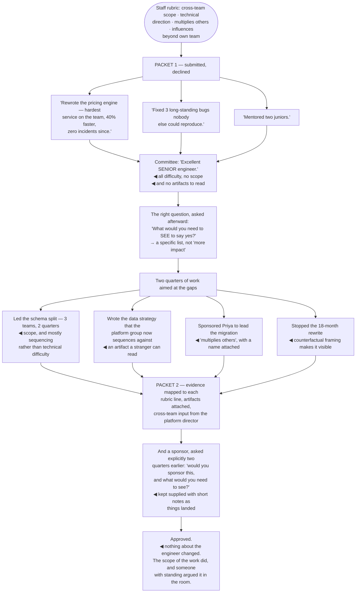

## The model

Promotion to staff is not a reward for doing senior work well for long enough. It is a
recalibration: the committee is deciding whether you have already been operating at the next level,
and the promotion recognises a fact rather than granting a licence.

That inverts the intuitive sequence. You do not get promoted and then start doing staff work — you
do staff work for two or three quarters, someone documents it against the rubric, and the title
follows. **Operating at the level** before the title is the actual requirement, and treating the
promotion as the starting gun is the most common reason people stall.

## When to use it

You want the next level, or you are helping someone else get there.

1. **What does the rubric actually say?** Read it. Most people argue for a promotion without having
   read the criteria they will be evaluated against.
2. **Where is the scope evidence?** A committee needs projects whose *scope* was staff-level, not
   projects you executed well. Those are different claims.
3. **Who will argue for you in the room?** You will not be there. Someone with standing has to
   make the case, and that relationship is built long before the packet.

## Speedrun

**What** — a documented case that you have been operating at the level, assembled from evidence you
have been collecting anyway.

**How to build one**

1. **Get the rubric and read it against yourself.** Where the evidence is thin, that is your work
   plan for the next two quarters — which is the real value of reading it early.
2. **Seek scope, not difficulty.** Committees look for problems whose scope required someone at
   this level. A hard problem inside one team is senior work done well.
3. **Collect evidence continuously**, from the [[brag document]]. Assembling a packet from notes
   takes an hour; from memory it takes a week and is worse.
4. **Get a sponsor early**, and make the ask explicit. Someone senior has to advocate for you in a
   room you cannot attend.
5. **Include the artifacts.** The strategy document, the design, the migration plan, the
   postmortem. Committees weight things they can read.
6. **Ask what is missing, specifically.** "What would you need to see to say yes?" produces a list;
   "am I close?" produces reassurance.

**Why it works** — committees decide from documents against criteria. Everything here is about
making the documents match what someone with no context can verify.

**The most common failure** — a packet full of hard, well-executed work at the previous level's
scope. Excellence at senior work is evidence for being a strong senior engineer.

## Going deeper

### Scope is the thing being assessed

The distinction that decides most cases: senior is measured by the difficulty of what you can
deliver; staff is measured by the *scope* of what you are accountable for.

A brilliantly executed rewrite of your team's hardest service is senior work, however hard it was.
Leading a change that spanned four teams, where most of the difficulty was in sequencing,
alignment and deciding what not to do, is staff work — even if no single part of it was
technically hard.

**Scope evidence** is therefore about span rather than depth. How many teams were affected, over
what horizon, and how much of the outcome depended on judgment that nobody else was positioned to
make.

This is why the wedge argument matters so much: a completed, visible piece of work whose scope
crossed teams is the single most useful thing a promotion packet can contain, and it takes two
quarters to produce.

The corollary is that you frequently have to seek scope deliberately. Waiting to be handed a
cross-team problem is waiting on [[opportunity allocation]] to favour you, and it usually favours
whoever already has the visible work.

### What the packet contains

Formats vary; the content that persuades does not.

**The narrative.** Two or three pages: what you were accountable for, what changed, and why it
required someone at this level. Written for someone with no context, because most of the room has
none.

**Evidence per rubric line.** Take the criteria and answer each one with a specific example. This
is tedious and it is what committees actually work from — a packet that leaves them to map your
stories onto their criteria gets mapped badly or not at all.

**Artifacts.** The strategy document, the design doc, the migration plan, the postmortem you wrote.
These carry disproportionate weight because they can be read and assessed directly rather than taken
on someone's word.

**Peer and cross-team input.** Especially from outside your immediate team. A director from another
group saying your work unblocked them is worth more than any amount of self-description.

**Numbers where they exist**, hedged honestly where they are estimates. Engineer-days, incidents,
lead time, features unblocked.

What to leave out: activity lists, work at the previous level's scope however impressive, and
anything you cannot attach a consequence to. A shorter packet of strong evidence beats a long one
padded to look substantial.

### The sponsor in the room

You will not be in the room. **The sponsor in the room** is the person who will be, and they
determine more of the outcome than the packet does.

The sponsor's job is to make the case against pushback, using your evidence, with their own
credibility attached. Which means two things: they have to believe it, and they have to have the
material to argue it without constructing it themselves.

Getting one is an explicit ask, and most people never make it. "I am aiming for staff in the next
two cycles — would you be willing to sponsor that, and what would you need to see?" is a direct
question that produces a direct answer, including "not yet, and here is why", which is the most
useful outcome available.

Then keep them supplied. A short note when something significant lands, in translated form, means
they are arguing from current evidence rather than from a six-month-old impression.

Hogan's distinction applies exactly here: a mentor advises you about the promotion, a sponsor spends
their credibility on it in a room you cannot enter. Confusing the two is why people arrive at a
cycle with excellent advice and no advocate.

### Timing, and what to do when it does not happen

Promotion cycles have a rhythm, and working with it costs nothing while ignoring it costs a cycle.

The work has to be visible for two or three quarters before the packet, because committees are
sceptical of a single recent project. Steady evidence over a year beats one impressive quarter, and
the difference is the perceived risk of a fluke.

Ask what is missing in specific terms, well before the cycle. "What would you need to see to say
yes?" produces a list you can act on; "how am I doing?" produces encouragement you cannot.

When it does not happen, the useful response is to get the specific gap in writing. Vague feedback —
"more impact", "more visibility" — is not actionable and is frequently a proxy for something more
specific that nobody wanted to say. Pushing politely for the concrete version is fair and usually
works.

And the harder possibility deserves naming. Sometimes the gap is real and the answer is more work
at greater scope. Sometimes there is no staff-level scope available here, or the level is not being
awarded regardless of evidence — and then the fix is a different environment rather than another
quarter of trying harder. Larson's collected narratives include many people who reached staff by
changing companies, and treating that as failure is a mistake.

## See it work

Two packets, same engineer, one cycle apart.

The first packet is not weak work. A hard rewrite, three unreproducible bugs, and two mentees is a
genuinely strong year — and every item is bounded by one team, which is precisely the definition of
the level below.

"Excellent senior engineer" is the correct verdict on that evidence, and it is the most common
outcome for people who assume difficulty is what is being measured. Nothing in the packet lets a
committee distinguish it from an outstanding senior year.

Asking what they would need to *see* is what converts a rejection into a plan. "Am I close?"
produces encouragement; the specific-list version produces the two quarters of work that follow, and
the difference between those two questions is most of the cycle.

The second packet differs in scope rather than in quality. The schema split was mostly sequencing
and alignment across three teams — arguably less technically difficult than the pricing rewrite,
and unambiguously staff-shaped. The strategy document matters because a stranger can read it and
assess it directly.

And the sponsor, asked two quarters early and kept supplied, is what carries it through a room the
engineer is not in. The packet is the evidence; someone with standing has to spend credibility
arguing from it, and that arrangement cannot be made in the week the cycle opens.

## Next

Choosing where to work covers the variable this page keeps running into: staff means different
things at different companies, and the environment decides what is available to you.
