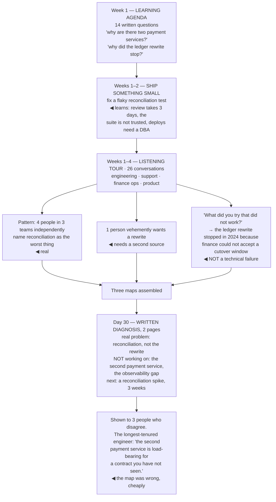

## The model

You arrive with a strong instinct to prove the promotion was right. That instinct, acted on in
month one, is what produces staff engineers who spend a year on the wrong problem.

Watkins' framing is that the first phase is a **learning agenda** — an explicit set of questions
you are trying to answer — rather than a delivery plan. The scarce thing at staff level is
knowing which problem matters, and in month one you do not know it yet. Someone will tell you
what the problem is; several people will, and they will disagree.

## When to use it

You are new to a staff role, a new team, or a new organisation — and any of those resets the map.

1. **What do you actually not know?** Write it down. A learning agenda you have not written is a
   vague intention to pay attention.
2. **Who holds the context you are missing?** Not only the loudest people. The person who has been
   there six years and says little usually knows why the odd thing is odd.
3. **What is the cost of being wrong about the problem?** High, and delayed. A wrong diagnosis
   does not fail — it produces a year of competent work on something that did not matter.

## Speedrun

**What** — a month spent building three maps and one written diagnosis, with deliberately little
shipped.

**How to spend it**

1. **Write the learning agenda in week one.** Ten to fifteen questions you cannot yet answer.
   Revisit it weekly and watch which ones stay open.
2. **Run a listening tour.** Twenty to thirty conversations across engineering, product, support
   and operations. Ask what is broken and what everyone believes that is no longer true.
3. **Read the artifacts nobody offers you** — incident reports, the last two planning documents,
   the deprecation nobody finished, the oldest open design doc.
4. **Build the three maps** — technical, organisational, and historical. Each answers questions
   the others cannot.
5. **Ship something small and real in the first two weeks.** Not to prove value — to learn how
   the pipeline, review culture and deploy process actually feel from inside.
6. **Write the diagnosis at day 30** and show it to three people who will disagree with it.

**Why it works** — the expensive mistakes at this level are diagnostic, not executional. A month of
questions costs a month; a year on the wrong problem costs a year and your credibility with it.

**The pressure to resist** — "what have you shipped?" in week three. The honest answer is a map,
and the people who matter will recognise its value if you can state what it changed about your plan.

## Going deeper

### The three maps

Three separate models, and people routinely build only one.

**The technical map** — what the systems are, what depends on what, where the load is, which parts
are fragile. Built by reading code, tracing a real request end to end, reading the last twenty
incidents, and asking "what breaks most?" The last question is faster than any architecture diagram
and more honest.

**The organisational map** — who owns what, who decides what, and where those two differ. The
formal org chart tells you reporting lines; you need the decision map, which is different. Ask "who
would need to agree for this to happen?" about three real proposals and the shape appears quickly.

**The historical map** — why things are the way they are. This is the one people skip and the one
that prevents the most damage. Every strange design was a reasonable response to something, and
proposing to fix it without knowing what usually means re-proposing something that already failed.

Reilly's version of this point is worth carrying: the value of the maps is that they let you see
work that is invisible from inside a single team — the seam between two systems that nobody owns,
the decision two groups are each assuming the other made.

The historical map has one shortcut. Find the person who has been there longest and is not
defensive about it, and ask directly: "what did you try that did not work?" Twenty minutes of that
is worth a week of reading.

### The listening tour, done properly

A **listening tour** is not a round of introductions. It is structured data collection, and the
quality depends almost entirely on the questions.

The ones that produce signal:

- **"What is the most frustrating part of your week?"** Concrete, current, and it surfaces friction
  that never reaches a planning document.
- **"What does everyone here believe that is no longer true?"** Surfaces stale assumptions, which
  are among the highest-value things to find early.
- **"What have people tried to fix and failed?"** The historical map in one question.
- **"If you had a month with nothing else on, what would you do?"** Reveals what people actually
  think matters, rather than what is on the roadmap.
- **"Who should I be talking to that I have not?"** Routes you toward the quiet people who know
  things.

Spread the conversations beyond engineering. Support and operations know the failure modes
engineering has normalised, and product knows which technical constraints are quietly shaping the
roadmap.

Then look for the patterns rather than the loudest single complaint. A problem raised
independently by four people in different teams is a real problem; one raised vehemently by one
person may be, and needs a second source.

Fournier's caution applies here: you are also being evaluated during these conversations, and
listening well is most of what builds early credibility. Arriving with opinions in week one buys
the opposite.

### Shipping small, early, for the right reason

Ship something in the first two weeks — and be clear with yourself that the reason is learning, not
proof.

What you learn by shipping cannot be learned any other way: how long review actually takes, whether
the test suite is trusted, what the deploy process feels like at 5pm on a Friday, who responds
quickly, where the undocumented step is. That is the technical map's texture, and reading code does
not give it to you.

Pick accordingly: something small, genuinely useful, and in the messy part of the system rather
than the tidy one. A fix in the area everyone avoids teaches more than a clean feature in the
well-maintained service.

The **early win** framing from Watkins is real but frequently misapplied. Its purpose is to build
the credibility that later, larger changes will require — not to demonstrate that you are fast. A
staff engineer who arrives and immediately proposes an architectural overhaul has spent credibility
they had not yet earned.

And it is worth noticing what you are being watched for. In month one, people are calibrating
whether you are safe to disagree with and whether you listen. Both are established by behaviour in
small interactions, not by anything you ship.

### Writing the diagnosis

At day 30, write it down. Two pages, and this is the artifact the month exists to produce.

What it contains: what you have learned, what you believe the two or three real problems are, what
you are *not* going to work on, and what you plan to do next. The exclusions matter as much as the
inclusions — a diagnosis that lists everything has diagnosed nothing.

Then show it to three people who will disagree, and choose them deliberately: someone who has been
there longest, someone from a team you will need, and your manager. The point is not approval; it
is finding out which parts of your map are wrong while it is still cheap to be wrong.

Being wrong at this stage is normal and expected. A month of listening produces a first draft, and
the people who have been there for years will correct it in ways you could not have reached alone.

This also produces something durable: a written record of what you believed at day 30. Six months
later it is the most useful document you have, because it shows what you got wrong — and that is
how the diagnosis gets better next time.

## See it work

A staff engineer joining a payments team, month one.

The historical question is the one that changes the plan. The ledger rewrite is the obvious
unfinished work and the obvious thing for a new staff engineer to pick up — and it stopped for a
reason that has nothing to do with engineering. Finance could not accept the cutover window.
Restarting it without knowing that means re-running a project that will stop in the same place.

Four independent reports of the same problem is the signal to trust. Reconciliation surfaced from
three different teams without prompting, which is a different quality of evidence from one person
advocating strongly for a rewrite — and the diagnosis weights them accordingly.

Shipping the flaky test fix taught things no amount of reading would have. Three-day reviews, a
test suite nobody trusts, and a deploy that needs a DBA are all facts about how fast anything here
can move, and they belong in the plan.

The exclusions in the diagnosis are what make it a diagnosis. Naming the second payment service and
the observability gap as *not* being worked on is a commitment, and it is what makes the
reconciliation spike credible rather than one item on a list of eight.

And the review is the whole point of writing it down. The longest-tenured engineer knows about a
contract that makes the second service load-bearing — information that was nowhere in the code, in
any document, or in twenty-six conversations that did not include the right question. Being wrong
at day 30 costs an afternoon. Being wrong at day 180 costs the quarter.

## Next

Picking your wedge takes this diagnosis and turns it into the one problem worth spending your
credibility on.
