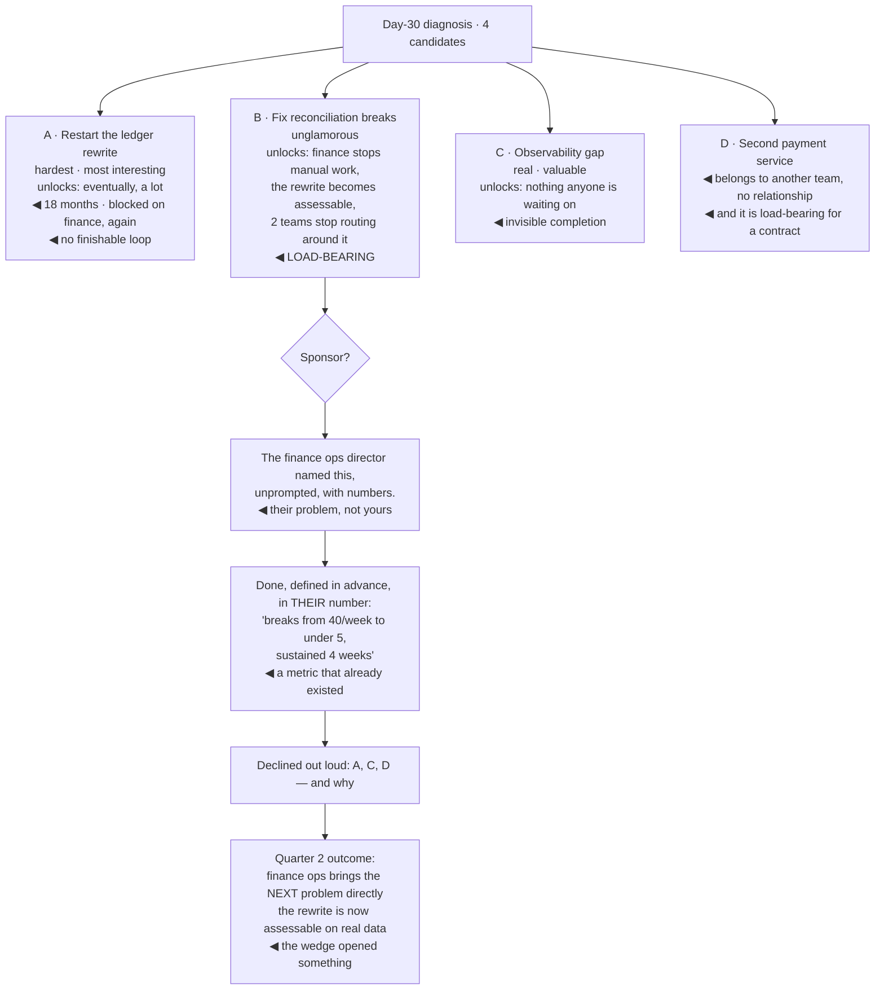

## The model

**The wedge** is the one problem you pick first. It is called a wedge because its job is to open
something — not to be impressive, but to make the next, larger thing possible.

The instinct is to pick the hardest problem, because difficulty feels like the right proof of the
level. The better criterion is what solving it unlocks: which people start bringing you decisions,
which work becomes possible that was not before, and whose confidence you now have. A modest
problem that unlocks three things beats a heroic one that unlocks nothing.

## When to use it

You have a diagnosis and are choosing where to spend the next quarter.

1. **What does solving this make possible?** If the honest answer is "that problem is solved", it
   is not a wedge. A wedge changes what can be attempted next.
2. **Is it visibly, unambiguously done?** Ambiguous completion is worth much less early, because
   nobody can point at it and your credibility does not compound.
3. **Who sponsors it?** Work nobody senior cares about does not build scope, however good it is.
   Find the person whose problem this is.

## Speedrun

**What** — one problem, picked for leverage and sponsorship rather than difficulty, finished
visibly.

**How to choose it**

1. **List the candidates from your diagnosis** — usually three to six real problems.
2. **Score each on what it unlocks**, not on how hard it is. What becomes possible afterward, and
   for whom?
3. **Check it is load-bearing.** A **load-bearing problem** is one that other work is currently
   routing around. Those are the ones whose removal changes everything downstream.
4. **Find a sponsor** — someone senior whose problem this is, who will say so in rooms you are not
   in. Without one, success is invisible.
5. **Make it finishable in a quarter.** A two-year programme does not build early credibility, and
   at this stage you need the loop to close.
6. **Say what you are not doing.** Rumelt's point about strategy applies directly: a plan that
   declines nothing has not chosen anything.

**Why it works** — scope is granted rather than claimed. Finishing one thing that visibly mattered
is what causes people to bring you the next, larger problem, and that is the actual mechanism by
which staff scope grows.

**The trap** — the interesting problem. Interesting and load-bearing are unrelated properties, and
the interesting one will be the one you want.

## Going deeper

### Leverage, not difficulty

Difficulty is a bad proxy and it is the one everyone reaches for, because difficulty is what
distinguished you at the previous level.

The better question is what the solution unlocks. A flaky test suite is not an interesting problem
and fixing it can unblock every team's deploy confidence, unfreeze a migration nobody trusted, and
end an argument that has been consuming a weekly meeting for a year. Meanwhile, a genuinely hard
distributed-systems problem in a service handling 2% of traffic unlocks nothing.

The pattern to look for is **work routing around something**. When you see teams building
workarounds, adding manual steps, or scoping projects to avoid touching a particular system, that
system is load-bearing in the wrong way — and removing it releases all of the effort currently
spent avoiding it.

This is the [[Pareto principle]] applied to organisational problems: a small number of blockages
account for most of the friction, and they are identifiable by watching where the workarounds
cluster rather than by asking what is hardest.

The counterexample worth stating: sometimes the hardest problem *is* the wedge, because everything
is genuinely blocked on it. The point is that difficulty has to be justified by leverage, not
mistaken for it.

### Sponsorship, and why it is not optional

A **sponsor** is someone senior who wants this problem solved and will say so when you are not in
the room. Larson's argument is blunt about why this matters: staff work that nobody senior is
invested in tends to be reorganised away, and the engineer is left with a year of work nobody
counts.

The distinction from a mentor is worth keeping clear. A mentor advises you; a sponsor spends their
own credibility on you. The second is what converts good work into scope, and it is the one people
neglect because asking for it feels presumptuous.

How to find one, practically. In your listening tour, notice who described this problem as *theirs*
— with frustration, in specifics, unprompted. That person is the natural sponsor. Then make the
relationship explicit rather than assumed: tell them what you intend to do, ask whether it is the
right problem, and ask them to tell you if it stops being one.

Then keep them informed on a rhythm they did not have to chase. A sponsor who has to ask how it is
going is a sponsor you are losing, and the update cadence matters more than the content.

The uncomfortable version of this: if you cannot find anyone senior who cares about the problem,
that is information about the problem. Sometimes it means the organisation is wrong; more often it
means you have picked something that matters to you rather than to it.

### Making completion legible

A wedge that finishes ambiguously buys much less than one that finishes visibly, and the difference
is largely decided before you start.

Define "done" in advance, in a form someone else can verify. "Reconciliation breaks are down from
40 a week to under 5, sustained for a month" is checkable. "Reconciliation is much better" is not,
and a year later nobody will remember which it was.

Prefer a number that already existed. A metric you invented for this project invites the argument
that you chose a favourable one; a number the finance team was already complaining about does not.

Then tell the story once it is done, in the plainest available terms: what was broken, what
changed, what it now makes possible. Reilly's framing is useful here — this is not
self-promotion, it is making invisible work visible, and staff work is disproportionately invisible
by nature.

The version to avoid is the running commentary. Frequent updates on incomplete work read as
seeking credit; one clear account at the end, plus a steady low-noise cadence to your sponsor,
reads as competence.

### The traps around choosing

Four failure modes, each of which looks reasonable from inside.

**The interesting problem.** You pick it because you want to work on it. The tell is that you
cannot say what it unlocks without effort.

**The everything plan.** Five workstreams, all important, none finished. This is Rumelt's bad
strategy in miniature — a list of goals presented as a plan. The correction is to say what you are
declining, out loud, to someone who will hold you to it.

**The invisible problem.** Real, valuable, and structurally impossible to point at afterward.
Refactoring that nobody outside your team can evaluate is the common case. Worth doing eventually;
a poor first wedge.

**The other-team problem.** A genuine problem that belongs to a team you have no relationship with.
Fixing something for people who did not ask generates resistance that has nothing to do with the
quality of the work, and month two is early to spend that.

The general shape: the wedge should be a problem the organisation already agrees is a problem, that
you can finish, that someone senior wants finished, and whose completion changes what happens next.

## See it work

The payments staff engineer, choosing from a day-30 diagnosis.

Candidate A is the one that feels like staff work and is the wrong choice. It is the hardest, the
most interesting, and it fails on two counts: eighteen months means no loop closes this year, and
it is blocked on the same non-technical constraint that stopped it last time.

Candidate B wins on leverage despite being the least interesting. Two teams are actively routing
around reconciliation, finance is doing manual work every week, and the ledger rewrite cannot even
be evaluated until the data is trustworthy — so one fix moves three things.

The sponsor was identifiable from the listening tour rather than recruited. The finance ops
director raised this unprompted, with numbers, describing it as their problem. That is what a
natural sponsor looks like, and the relationship only needed to be made explicit.

Defining done in their existing number is the detail that makes completion undeniable. Forty breaks
a week was already being complained about before anyone arrived, so hitting five is not a metric
anyone can argue was chosen favourably.

And declining A, C and D out loud is what makes B real. Without that, all four stay quietly on the
plan, attention splits, and at the end of the quarter there is progress on everything and
completion of nothing — which is the outcome that does not build scope.

## Next

The traps covers what goes wrong in the second and third months, once the wedge is chosen and the
work is actually underway.
