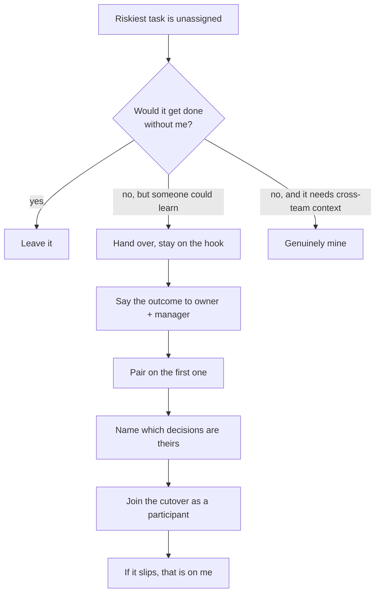

## The model

Staff engineer is the first level where the job is defined by scope rather than output.
A senior engineer is accountable for their own work landing; a staff engineer is
accountable for outcomes spanning more work than one person can do.

That is an arithmetic constraint, not a philosophy. Once what you are accountable for
exceeds what you can personally build, time spent building is time not spent on the
part only you can do.

## When to use it

For any piece of work in front of you, you are choosing between three things: doing it
yourself, handing it over while staying accountable, and leaving it alone.

1. **Would this still get done, roughly as well, if I did not do it?** If yes, leave it
   — your involvement is not what is scarce here.
2. **Does doing it myself build anyone else's capability?** Then hand it over with
   support. Work that grows another person is worth your time even when you are slower.
3. **Is this the highest-leverage use of the one thing nobody else has — context across
   teams?** If yes, it is genuinely yours.

## Speedrun

**What** — the shift from being accountable for your own output to being accountable
for outcomes bigger than your own hands. Your scarce resource stops being hours and
becomes the context you hold across teams.

**How to hand work over** — the move you will make constantly:

1. **Say the outcome you are on the hook for out loud, to the owner and to their
   manager.** Accountability nobody else knows about is not accountability.
2. **Pair on the first instance.** Not a handover document — do one together, so the
   hard parts surface while you are both there.
3. **Transfer the decisions explicitly.** Name which calls are theirs now and which
   still come to you. Ambiguity here is what turns a handover into hovering.
4. **Book yourself into the risky moment** — the cutover, the migration switch — as a
   participant rather than an approver.
5. **Say "if it slips, that is on me."** Then hold to it in the retro, which is the
   only place it counts.

**The four staff archetypes** — Larson's map of what staff work looks like: *tech lead*
(guides one team's execution), *architect* (owns direction in a critical area across
teams), *solver* (parachutes into the hardest current problem), *right hand* (operates
with a senior leader's authority). All four share one property — the bottleneck on
their work is never typing speed.

**Why the pull back to code is strong** — implementing is legible and rewarding today:
a merged PR, a green build. Direction-setting pays off on a lag of months, and the
payoff is often a bad thing that quietly did not happen.

**The one failure everyone hits** — taking the hardest ticket because you are fastest
at it. It feels like leadership, and it is the single behaviour the role most needs you
to stop.

## Going deeper

### What the level actually is

Seniority up to senior is mostly about the size of problem you can solve alone. Staff is
the first level where that stops being the measure, because the problems are larger than
one person's hands.

The practical consequence is a change in what is scarce. Your hours used to be the
constraint; now it is the context you hold that nobody else does — who is building what,
which decisions are load-bearing, where two teams are about to collide.

Scope is granted rather than claimed. You earn it by showing judgment on problems
slightly larger than the ones you were handed, which is why the first ninety days carry
so much weight.

### The archetypes, in full

Larson's four are not a personality test. They describe which shape of staff work an
organisation currently needs, and most people move between them across a career.

**Tech lead** — guides one team's approach and execution, usually paired with an
engineering manager. The closest to the senior role and the most common entry point. The
risk is remaining a very good senior engineer with a new title.

**Architect** — owns direction and quality in a critical area, across teams and over
long horizons. Depth in one domain rather than breadth. The risk is drifting away from
what the code actually does today.

**Solver** — dropped into whatever the hardest current problem is, then moved to the
next one. Valued in organisations with recurring fires. The risk is never staying long
enough for anything to compound.

**Right hand** — operates with a senior leader's authority on organisational problems.
The rarest, and the least like engineering. The risk is spending the technical
credibility the role rests on.

Knowing which one your company is asking for is worth more than knowing all four. An
organisation that needs an architect will not reward solver behaviour, however well you
do it.

### Handing work over: the judgment inside each step

**Saying it out loud** matters because accountability that lives only in your head
reads, from outside, as the owner being on their own. The manager has to hear it, or
they will escalate to you as a bottleneck instead of coming to you as a backstop.

**Pairing on the first instance** beats a document because the hard parts of most work
are not writable down — they are the moments where you would have hesitated. Doing one
together surfaces those. A document records the parts you already knew.

**Transferring decisions explicitly** is the step people skip, and it is why handovers
turn into hovering. "You own it" without naming which decisions are theirs means every
decision comes back to you, and now the work is slower than if you had done it yourself.

**Booking yourself into the risky moment** as a participant rather than an approver is
the difference between support and supervision. An approver adds a gate; a participant
absorbs risk.

**Saying "if it slips, that is on me"** is worth nothing unless it survives the retro.
If it slips and you let the owner absorb it, everyone learns the sentence was
decoration, and your next handover gets refused.

### Glue work: the necessary counterweight

Reilly's argument is more careful than the version usually quoted. **Glue work** —
noticing the gap between two teams, writing the document nobody owns, onboarding the new
person — is essential, mostly invisible, and disproportionately done by women and
underrepresented engineers.

Her point is not "do more glue." It is that glue work is real work which goes uncredited,
and a career built only on it stalls, because promotion committees measure technical
impact.

So the razor is narrower than "stop doing unglamorous work." Stop doing work whose only
justification is that you are fast at it. Keep the glue that only your cross-team context
makes possible — and make sure somebody with influence knows you are doing it.

### Why the pull is so strong

That asymmetry is not a character flaw, it is a feedback loop. A merged PR rewards you
this afternoon; a migration that did not go wrong rewards you never, because nobody
notices an incident that failed to occur.

Left alone you drift back to the keyboard, and the drift feels like productivity the
entire time it is happening.

### Nobody will tell you

From the outside, a staff engineer doing senior work still looks like a strong
contributor. No alarm fires. The cost — the four teams whose sequencing nobody held — is
invisible, because it shows up as things that did not happen.

Watkins' framing for the first ninety days applies directly: the behaviours that made
you successful in the previous role are the default you have to actively override,
because nothing in the environment will override them for you.

## See it work

A newly promoted staff engineer is three weeks into a migration spanning four teams. The
riskiest piece is rewriting the dual-write path — the window where the system writes to
both the old and new stores at once — and it is unassigned. They take it, because they
are the fastest implementer available and the deadline is real.

That is the wrong call, in a specific way. For three weeks they are unavailable to the
four teams whose sequencing nobody is holding, and the one engineer who could have
learned the dual-write path does not learn it.

The alternative is not "delegate and walk away." It is to run the handover: name the
outcome to the owner and their manager, pair on the first dual-write, say which
decisions are theirs, and put yourself in the room for the cutover — the moment traffic
actually moves to the new store.

Then the last step, which is the whole transition in one line: "if it slips, that is on
me, not you." Taking the ticket keeps you accountable by doing. That sentence keeps you
accountable without doing.

## Next

Days 1–30, picking the wedge, and the traps are the pages that follow — this one is what
to stop, and those are what to start.
