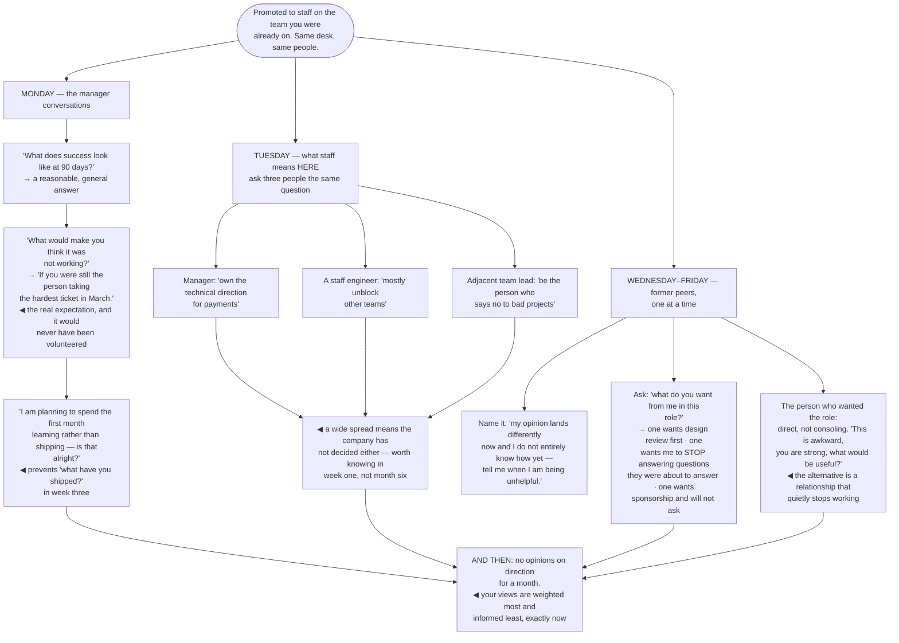

## The model

A title changed. Nothing else did — not your manager's expectations, not what your former peers
assume you will do with a casual opinion, not what "staff" means at this particular company.

All three are now ambiguous, and ambiguity in a working relationship resolves itself badly. People
fill it in with whatever they already believed, and by month three those inventions have hardened
into how you are treated. The first week is when they are still cheap to correct.

## When to use it

Week one of a new staff role, whether you moved companies or were promoted in place.

1. **Do you know what staff means here?** The ladder document is not the answer. What matters is
   what the people around you expect to change about your behaviour.
2. **Who is now in your blast radius who was not before?** Former peers, the team you were on, and
   anyone whose work your opinion now affects more than it used to.
3. **What does your manager think you are for?** If you cannot state it in a sentence they would
   recognise, that is the first conversation.

## Speedrun

**What** — three or four short conversations in week one, each renegotiating something the title
change left unstated.

**How to have them**

1. **Ask your manager what success looks like at 90 days**, concretely. Then ask what would make
   them think it was not working. The second question produces far more.
2. **Ask what staff means at this company**, in behaviour rather than in rubric language. "What do
   the staff engineers here do that senior engineers do not?"
3. **Say what you are planning to spend the first month on** — learning, not delivering — and get
   agreement. Otherwise week three produces "what have you shipped?"
4. **Recalibrate with former peers, individually.** Name the change rather than hoping it settles.
   "My opinion lands differently now and I would rather you tell me when it is unhelpful."
5. **Ask each of them what they want from you in this role.** It is a better question than any
   announcement, and it produces things you would not have guessed.
6. **Say nothing about direction for a month.** A new staff engineer's early opinions are weighted
   heavily and formed on the least information they will ever have.

**Why it works** — every one of these relationships has been silently redefined and nobody has
said so. Naming the change is uncomfortable once; leaving it unnamed is uncomfortable
indefinitely.

**The question that produces the most** — "what would make you think this was not working?" People
answer it honestly, and the answer is the thing they would otherwise never have raised.

## Going deeper

### The expectations conversation

Watkins' framework for a new role separates five conversations with your manager, and running them
as one muddled catch-up is why most of them do not happen.

**Situational diagnosis** — how do you see the state of things? You are asking for their model
before you form your own, which is both useful and a signal that you intend to.

**Expectations** — what does success look like in 90 days, and what would failure look like? The
failure half is the one people omit and the one that surfaces the real concern.

**Style** — how do you want to hear about problems, how often, in what form? A ten-minute
conversation that prevents a year of mismatched updates.

**Resources** — what do you need that you do not have? Air cover, access, time, a person. Asking in
week one is much easier than asking in month four.

**Personal development** — what do you want to be doing in a year? This one feels premature and is
the reason opportunities get routed toward you rather than past you.

Do them across two or three conversations rather than in one sitting, and write down what you
heard. Watkins' point is that these are negotiations rather than briefings, and treating them as
briefings is how people end up accountable for something they never agreed to.

### What staff means here

**What staff means here** is a local fact, and the ladder document will not tell you. The same title
covers a tech lead guiding one team, an architect owning a domain for years, and a solver moved
between fires — Larson's [[tech lead|archetypes]]. A mismatch between the shape you are good at and
the shape the company needs reads to everyone, including you, as underperformance.

The questions that produce the real answer are behavioural. What do the staff engineers here do
that senior engineers do not? Who was the last person promoted to staff, and what had they done?
What does this team need from me that it is not currently getting?

Ask three different people and compare. Your manager, a staff engineer who has been here a while,
and someone on an adjacent team will give three answers, and the spread between them is the actual
information — a wide spread means the company has not decided either, which is worth knowing in
week one rather than in month six.

The answer also constrains the first month. An organisation that needs a solver will not reward
three weeks of listening, however correct the listening is, so the plan you make has to survive
contact with what the place actually wants.

### Recalibrating with former peers

Promotion in place changes a set of relationships that nobody renegotiates, and the change is real
whether or not anyone acknowledges it.

**The peer recalibration** is the conversation that does, and three things have shifted:

- your casual opinion now carries weight it did not, so thinking out loud in a review lands as
  direction
- you may now be consulted on their scope, which they did not ask for
- at least one of them probably wanted this and did not get it

Naming it directly is far better than letting it settle. "I am aware this changes things and I do
not entirely know how yet — tell me when I am being unhelpful" is a sentence most people are
relieved to hear, and it gives them permission they will not otherwise take.

Asking what they want from you in the role is the other half, and it produces specifics:

- one wants design review before they go to the wider group
- one wants you to stop answering questions they were about to answer
- one wants sponsorship and will not ask for it

The person who wanted the promotion needs a separate conversation and it should be direct. Not
consolation — an acknowledgement that they are strong, that you know the situation is awkward, and
a question about what would be useful. Reilly's framing is that the alternative is not neutrality;
it is a relationship that quietly stops working while both of you are polite about it.

### The month of not having opinions

The strongest early move is restraint, and it is the hardest one because it feels like not doing
the job.

A new staff engineer's opinions are weighted heavily — the title does that — and they are formed on
the least information you will ever have. So an early confident view on architecture, process or
who is good gets adopted, propagates, and is expensive to withdraw.

Hogan's caution about the first weeks is that you are also being assessed on whether you are safe
to disagree with, and that is set by behaviour in small interactions rather than by anything you
say about it. Arriving with a view on the codebase in week one answers that question badly.

What to do instead is ask, publicly and repeatedly. Questions in a design review signal that you
intend to understand before directing, and they surface the history that the code does not carry.

The exception is worth naming, because restraint is not a rule about silence. Something actively on
fire, or a decision closing this week that you have direct experience of, deserves your view — and
saying "I have seen this fail before, in this specific way" is different from having a general
opinion about the architecture.

## See it work

Week one, promoted in place.

The second question to the manager is the one that pays. "What does success look like" produces a
reasonable general answer; "what would make you think it was not working" produces the specific
thing they are actually worried about — and here it is precisely the [[the hero trap|hero pattern]]
they have watched happen before.

Getting agreement on a month of learning is a thirty-second conversation that prevents the most
common week-three failure. Without it, the pressure to demonstrate value arrives exactly when you
know least, and it is the reason new staff engineers spend a year on the wrong problem.

The spread across three answers to "what does staff mean here" is more informative than any single
answer. Three different jobs described by three people means the organisation has not decided, and
knowing that in week one changes what you go and negotiate rather than discovering it after two
quarters of doing the wrong shape of work.

The former-peer conversations produce things you would not have guessed and could not have asked
for in a group. Someone wanting you to *stop* answering questions is a genuine ask about the hero
pattern, from the person it costs the most, and it arrives only because the question was asked one
to one.

And the last box is the hardest part of the week. The instinct after all of this is to demonstrate
the judgment you were promoted for — and your judgment is at its least informed and its most
heavily weighted in exactly the same month.

## Next

Days 1–30 turns these conversations into a plan: what to learn, from whom, and what to have written
down by day 30.
