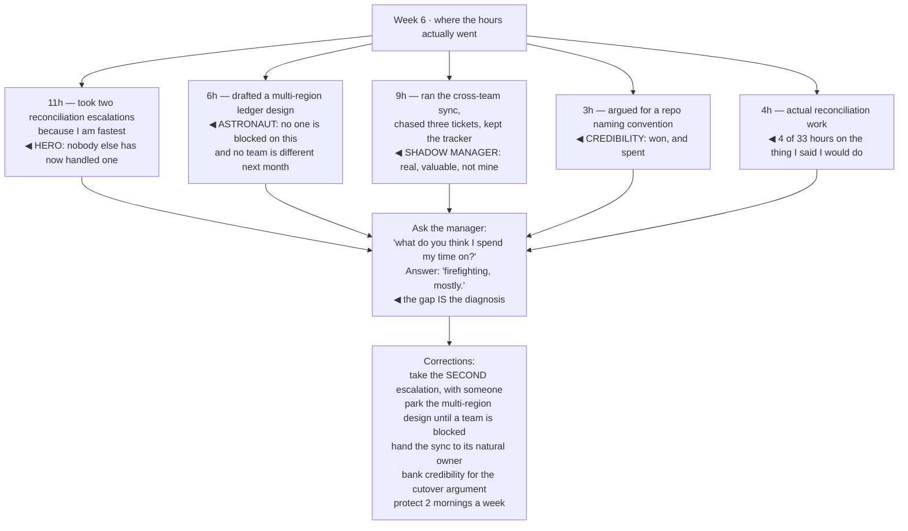

## The model

Every failure mode in a new staff role is a virtue applied in the wrong place. Helping, thinking
ahead, organising, having standards — each of those is the right instinct, and each has a version
that quietly consumes the role.

They share a property that makes them dangerous: **they feel productive the entire time.** Nothing
in the environment corrects them, because from outside a staff engineer failing this way still
looks like a strong, busy, helpful person. The only defence is knowing their names before you are
inside one.

## When to use it

Month two onward, when the wedge is chosen and the actual work has started.

1. **What did I spend last week on?** Not what was on the plan — what actually consumed the hours.
   The gap between those two is where the traps live.
2. **Is anyone else growing?** If you are the only person who got better at anything this quarter,
   you are doing senior work with a staff title.
3. **What have I spent credibility on?** It is finite, it recharges slowly, and spending it on
   small things is how you have none left for the change that matters.

## Speedrun

**What** — five failure modes, and the tell that identifies each one early:

| Trap | Looks like | The tell |
|---|---|---|
| **The hero** | availability, helpfulness | you are on every escalation, and nobody new can handle one |
| **The architect astronaut** | thinking ahead | your designs describe systems nobody has asked for |
| **The shadow manager** | organising | you run the process and own no technical outcome |
| **Credibility overspend** | having standards | you have opinions on everything and traction on nothing |
| **The invisible quarter** | focus, humility | real work landed and nobody senior can describe it |

**How to catch them**

1. **Audit where the hours went**, weekly, against what you said you would do.
2. **Count who is growing.** If the answer is nobody, the delegation is not happening.
3. **Check your designs against demand.** A design for a problem no one currently has is a
   preference document.
4. **Spend credibility deliberately.** Ask what you are saving it for before spending it on a
   naming argument.
5. **Make the work visible once**, at the end, in the plainest terms available.
6. **Ask your manager directly**: "what do you think I am spending my time on?" The gap between
   their answer and yours is the most useful signal available.

**Why they persist** — none of them produces a failure signal. Every one of them produces gratitude,
busyness and a full calendar, which is indistinguishable from doing the job well.

## Going deeper

### The hero trap

**The hero trap** is being the person every escalation routes to. It starts as helpfulness and
becomes structural: you are fastest at the hard problems, so the hard problems come to you, so
nobody else gets to become fast at them.

The tell is specific and easy to check: over the last quarter, did anyone other than you handle a
serious incident in your area? If not, you are not a staff engineer in that area — you are a
single point of failure with a broad job title.

What makes it hard to escape is that it works. Incidents do resolve faster when you take them, and
every individual instance of stepping in is the correct local decision. The cost is entirely in
what does not happen: the engineer who would have learned, the runbook that would have been
written, the pager rotation that would have become viable.

The exit is uncomfortable and mechanical:

- Take the second escalation rather than the first.
- Sit with someone else while they handle it, and let it be slower.
- Write down what you did afterward — the part that turns one rescue into a capability.

Reilly's framing is that you are trying to remove yourself from the critical path, and doing so
always costs speed in the short term.

The version that catches senior people who know all this: being the hero *only occasionally*, for
the genuinely worst problems, and considering it justified each time. That is exactly how it
sustains itself.

### The architect astronaut

Spolsky's term describes designing at an altitude where the details that decide everything are
invisible. The staff version is a design document for a system nobody is asking for, solving
problems the organisation does not currently have.

The signals are consistent:

- the design is for the load you expect in three years
- it abstracts over two use cases in anticipation of a third
- nobody outside the document is blocked on it
- you cannot name a team that will be different next month because of it

[[The wrong abstraction]] is the razor that governs this, and it applies with unusual force to
architecture proposed in advance. An abstraction built for anticipated needs is built without the
information that makes abstractions good — which cases actually recur — so it is more likely to be
wrong and much more expensive to remove than a duplication would have been.

The correction is to attach every design to a current problem with a name attached. Not "we will
need multi-region eventually" but "the checkout team's deploys are blocked by this coupling, and
here is what unblocks them." Where the future genuinely matters, argue for the option rather than
the implementation: keep the seam, defer the build.

The related failure is the design that is right and lands nowhere, because it was written without
the people who would have to build it. A document that arrives finished invites review rather than
ownership, which is a different page's problem and a very common one.

### The shadow manager

**The shadow manager** is a staff engineer whose week is entirely meetings, planning, coordination
and unblocking — real work, genuinely valuable, and not the job.

The distinction Larson draws is about accountability. A manager owns people and process; a staff
engineer owns technical outcomes. Coordination in service of a technical outcome you are on the
hook for is the job. Coordination as the output is management without the title, the authority, or
the support structure.

Two things make it easy to fall into. Organisations under-invest in coordination, so the need is
real and visible. And coordination is immediately rewarding — people thank you this week, whereas
technical direction pays off in months.

The check is simple and worth running quarterly: name the technical outcome you are accountable
for, and the specific artifacts you produced toward it. If the honest answer is a set of meetings
and a spreadsheet, the drift has happened.

Reilly's "being glue" argument is the necessary counterweight, and it is more careful than the
version usually quoted. Glue work is essential, disproportionately invisible, and
disproportionately carried by women and underrepresented engineers. Her point is not to stop —
it is that a career built only on glue stalls, because promotion is assessed on technical impact.
So keep the glue only your cross-team context makes possible, and make sure it is visible.

### Credibility, which is a budget

You have a **credibility budget**. It is spent when you push for something against resistance, and
it recharges when you are visibly right about something that mattered.

New staff engineers routinely spend it on small things — a naming convention, a linter rule, a
library preference — and arrive at the change that actually matters with nothing left. The
individual arguments are all winnable; that is what makes it easy.

Before pushing on something, ask what you are saving it for. Most opinions are worth holding and
not worth spending on, and the discipline is being able to tell which is which in the moment rather
than afterward.

The way it recharges is worth knowing precisely: being right in public about something consequential
and checkable. Which is another argument for the wedge — a completed, verifiable improvement is a
credibility deposit, and the next thing costs less.

Fournier's related observation applies to the first ninety days specifically: early on you are
being calibrated on whether you are safe to disagree with. An engineer who is right and
insufferable gets routed around, and being routed around at staff level is functionally the same
as not being there.

### The invisible quarter

The last trap is the most unfair: doing real work that nobody senior can describe.

Staff work is disproportionately invisible by nature. Preventing an incident, unblocking two teams,
killing a bad project before it started — none of these produce an artifact, and the best outcomes
are things that did not happen.

The failure is not modesty; it is not translating. "We consolidated the two reconciliation paths"
means nothing outside your team. "Finance stopped doing eight hours of manual matching a week, and
the ledger migration can now be assessed on real data" means something to everyone.

Watkins' framing is that early wins have to be *legible to the people whose support you will need
later*. That is not self-promotion, and treating it as such is how good engineers end up with a
quarter nobody can account for.

The lightweight version costs almost nothing: one short written account when something finishes,
in plain language, naming what changed and what it makes possible. Once, at the end — not a running
commentary, which reads as seeking credit and is the overcorrection.

## See it work

Month two of the payments wedge, and four traps in one week.

Thirty-three hours, four of them on the thing the quarter was supposedly about. Every one of the
other twenty-nine was defensible in isolation, which is exactly the property that makes this hard
to see from inside — nothing on that list looks like a mistake while you are doing it.

The manager's answer is the cheapest diagnostic available and almost nobody asks for it. "Firefighting,
mostly" is not a criticism; it is an accurate description of where the visible time went, and the
distance between that and "leading the reconciliation fix" is the whole problem stated in one
sentence.

The corrections are all small and none of them is "work harder". Taking the second escalation
instead of the first costs a slower incident and buys a second person who can handle one. Parking
the multi-region design costs nothing, because nothing was waiting on it. Handing back the sync
returns nine hours to a technical outcome.

The naming-convention argument is the one worth sitting with. It was won, and it cost credibility
that will be needed in six weeks for the cutover argument — where being listened to actually
decides something. Most opinions are worth holding and not worth spending on.

## Next

The Technical direction group takes the credibility this ninety days built and spends it on the
thing it is for: deciding where the systems go.
