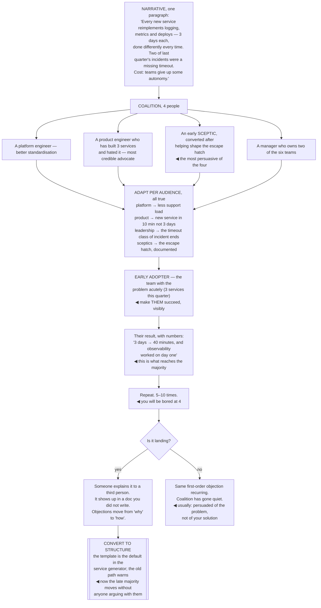

## The model

One decision is a conversation. **Alignment** across six teams over two quarters is a campaign, and
the skills are different.

The mistake is treating it as a communication problem — write the document, present it well, and
people will agree. What actually moves an organisation is repetition, a small group of people who
will say it when you are not there, and enough patience to let the idea become familiar before it
has to be decided. Larson's phrasing is that you are not convincing people once; you are making an
idea ambient.

## When to use it

Something needs many teams to change what they do, and none of them reports to you.

1. **How many teams have to act?** One is a conversation. Three or more is a campaign and needs a
   campaign's timeline.
2. **Who moves first?** There is always an early team whose adoption makes the next one easier.
   Finding them is more important than convincing everyone.
3. **What is in it for each team?** The same change has a different argument for each audience, and
   a single pitch repeated verbatim reaches one of them.

## Speedrun

**What** — a repeated, adapted argument, carried by a small group, over months.

**How to run one**

1. **Write the narrative once**, short. Problem, why now, what changes, what it costs. Everything
   else is a restatement of this.
2. **Build a [[coalition]] of three or four people** who believe it and will say so independently.
   An idea repeated by four people is an emerging consensus; the same idea from one person is a
   campaign by one person.
3. **Adapt the argument per audience.** Platform hears reduced load, product hears faster
   features, leadership hears risk removed. Same change, different true reasons.
4. **Find the early adopter and make them a success story.** One team's real result outperforms
   any amount of argument.
5. **Repeat far past your own boredom.** You will be tired of saying it around the time most people
   are hearing it for the first time.
6. **Convert it into structure** once it is agreed — a default, a template, a lint rule. An
   alignment held only by agreement decays.

**Why it works** — familiarity precedes agreement. An idea heard for the fifth time is evaluated on
its merits; an idea heard for the first time is evaluated on how disruptive it sounds.

**The number that surprises people** — you will say it five to ten times before it lands, and the
tenth time will feel absurd to you and be new to someone in the room.

## Going deeper

### The narrative, and why it must be short

**The narrative** is the compressed version of the argument, and its job is to be repeatable by
other people. If your coalition cannot restate it accurately after one hearing, it is too long.

Four parts, in this order: the problem, why it matters now, what changes, and what it costs. The
last one is the part people cut and the one that buys credibility — an argument that claims no
downside invites everyone to go looking for the one you hid.

"Why now" is doing more work than it looks. Most organisations have a long list of things that are
genuinely wrong and are not being fixed, and the distinguishing feature of the ones that do get
fixed is a reason the timing is forced. A contract renewal, a scaling limit, a team disbanding, a
migration that unblocks it.

Concrete beats abstract in every version. "Three teams cannot deploy independently" moves people;
"our architecture has coupling issues" does not, because the second one has no one in it.

And it has to survive being retold badly. Your coalition will paraphrase it, leadership will
compress it further, and by the time it reaches the sixth team it will have been through three
retellings — so the version that matters is the one that is robust to that, not the one that is
most precise.

### The coalition

A **coalition** is three or four people who believe the thing and will say it independently, in
rooms you are not in. It is the single highest-leverage structure in this whole activity.

The reason it works is about how consensus is perceived rather than about volume. One person
advocating repeatedly is a campaign, and campaigns invite resistance. Four people independently
saying the same thing reads as an emerging view that one should probably get on the right side of.

Who to recruit is specific:

- people with [[informal authority]] rather than titles
- people from different teams, so it does not read as one group's agenda
- people who will genuinely be better off
- at least one person who was initially sceptical, because a converted sceptic is the most
  persuasive advocate available

Recruiting is not pitching. It is bringing the problem, not the solution, and letting them shape
the answer. Someone who helped form the idea will defend it; someone who was sold it will endorse
it and not much more.

Then keep them informed, and make it cheap. A short, regular update they do not have to chase, and
an explicit statement of what would be useful — "if it comes up in your planning, this is the
one-line version". People help more when the help is specified.

### The adoption curve

Rogers' **adoption curve** describes how ideas spread through a population, and it maps closely
enough onto organisations to be useful.

**Innovators and early adopters** will try things because they are new or because they have the
problem acutely. They are cheap to convince and they are not representative — their adoption
proves nothing about whether the idea works for a normal team.

**The early majority** is the group that decides whether it becomes the default. They adopt on
evidence, and the evidence they trust is a team like theirs having succeeded. This is why the early
adopter's *result*, not their enthusiasm, is what matters.

**The late majority and laggards** adopt when not adopting becomes the harder path — when the
default changed, when the tooling assumes it, when the old way is deprecated. Arguing with this
group is a poor use of time; changing the defaults is what moves them.

The practical sequence follows directly: find one team with the problem acutely, make them
succeed, tell that story specifically and with numbers, then use it to reach the majority, then
convert the agreement into defaults so the rest happens without persuasion.

The mistake is spending the campaign's energy on the laggards. They are the loudest objectors and
the last to move regardless, and the energy is better spent making the early adopter's result
undeniable.

### Repetition, and reading the room's state

The most common failure is stopping too early, and it happens because your boredom arrives long
before their familiarity.

You will have said it in three one-on-ones, a design review, a team meeting and a written document,
and it will feel like everyone has heard it. In practice, attendance overlaps unevenly, people were
half-listening, and the ones who most need to have heard it were in another meeting.

The signals that it is landing are specific and worth watching for:

- someone else explains it to a third person
- it appears in a document you did not write
- someone argues about a *detail* rather than the premise
- objections change from "why would we" to "how would we"

The signals that it is not landing are equally clear: the same first-order objection keeps
recurring, people agree in the room and nothing changes, or your coalition has stopped repeating
it. The last one usually means they were persuaded of the problem and not of your solution, which
is worth finding out directly.

[[Conway's Law]] explains a specific failure worth anticipating. If the change requires two teams
that rarely talk to cooperate, alignment on the idea will not be enough — the communication path
does not exist, so the work will not happen. Sometimes the real intervention is a shared goal or a
structural change, not a better argument.

And once it is agreed, convert it. An alignment that lives only in people's heads decays with every
reorganisation and every departure; one that lives in a default, a template or a build failure does
not need to be re-argued.

## See it work

Getting six teams to adopt a shared service template.

The narrative fits in a paragraph and names its own cost. Giving up some autonomy is a real loss for
the teams being asked to adopt, and stating it is what makes the rest of the paragraph credible —
a pitch with no downside gets audited for the downside.

The converted sceptic is the most valuable person in the coalition. They helped shape the escape
hatch, which means the objection they would have raised is already answered, and when they say it is
fine, that carries weight nothing else does.

Adapting per audience is not four different messages — it is four true consequences of the same
change. Platform genuinely gets less support load, product genuinely gets three days back, and
leadership genuinely stops seeing one class of incident.

The early adopter's result is what actually moves the early majority, and the reason is that they
are a team like theirs. Enthusiasm from an innovator proves nothing; forty minutes instead of three
days, with observability working on day one, is evidence.

And converting to structure at the end is what makes it stick. Once the generator defaults to the
template and the old path warns, the late majority adopts without anyone persuading them — which is
the only way that group ever moves, and it costs no further campaigning.

## Next

Disagreeing well covers the other side: what to do when the alignment does not happen because
someone competent thinks you are wrong.
