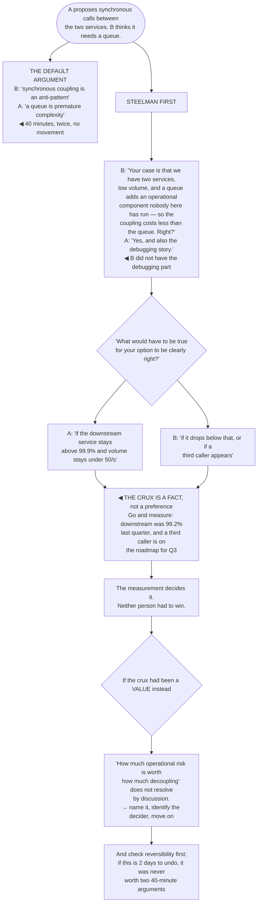

## The model

Technical disagreement is the mechanism by which organisations avoid bad decisions, and most
engineers are bad at it in a specific way: they optimise for winning the argument rather than for
reaching the right answer.

The distinction matters because the resource being spent is not the argument, it is the
relationship. An engineer who is right and exhausting gets routed around, and being routed around
at staff level is functionally identical to not being there. **The cost of being right** is paid in
whether people bring you the next problem.

## When to use it

You think a decision is wrong and you are deciding how hard to push.

1. **How reversible is this?** A [[Type 2 decision]] is not worth a fight. Save the energy for the
   one-way doors, where being wrong is expensive and permanent.
2. **Do you actually understand their reasoning?** If you cannot state their position in a form
   they would accept, you are arguing with a version of it you invented.
3. **What would change your mind?** If nothing would, you are not in a disagreement, you are in a
   commitment — and you should say so rather than pretending to deliberate.

## Speedrun

**What** — a way of being wrong in public, cheaply, that keeps the next disagreement available.

**How to do it**

1. **Steelman first.** State their position better than they did, and get agreement that you have
   it right. Everything after this lands differently.
2. **Separate the disagreement from the person.** "This design has a failure mode" rather than "you
   missed a failure mode".
3. **Argue about the thing that decides it.** Most disagreements are about a hidden assumption, not
   about the visible options — find it and the argument usually resolves itself.
4. **Say what evidence would move you**, and ask what would move them. If neither answer exists,
   stop; the disagreement is about values and needs a decider, not more discussion.
5. **Escalate rarely and openly.** Escalation is a real option, it is expensive, and doing it
   without telling the other person is the version that damages the relationship permanently.
6. **Lose cleanly.** State your position once, in writing if it matters, then commit. Do not
   relitigate, and never say "as I predicted".

**Why it works** — people accept challenges from people they trust are trying to get it right
rather than trying to win. The steelman is the cheapest way to demonstrate which one you are doing.

**The habit that costs the most** — being right loudly, repeatedly. It wins individual arguments
and it removes you from the conversations where decisions are actually formed.

## Going deeper

### Steelmanning, and why it comes first

A **steelman** is the strongest version of the position you disagree with — stated so well that the
person holding it says "yes, that is what I mean."

It does two things at once. It proves you understood before you objected, which changes how the
objection is received entirely. And it frequently changes your own mind, because the strongest
version of an argument is often better than the version that was actually made.

The test is external rather than internal. State their position and ask "is that right?" If they
add or correct anything, you did not have it — and the thing they add is usually the crux you were
about to miss.

What this replaces is the common pattern of arguing against a weaker version. It feels efficient
and it is why so many technical disagreements go in circles: two people each addressing a position
the other does not hold, each becoming more confident the other is being unreasonable.

Reilly's framing is that the goal is a shared understanding of the problem, and disagreement about
solutions is easy once that exists. Most persistent technical arguments are actually disagreements
about the problem that nobody has surfaced.

### Finding the crux

Most disagreements are not about the options. They are about an assumption underneath the options
that neither person has stated.

Two engineers arguing about microservices versus a monolith are usually disagreeing about expected
team growth, or about how much operational capacity exists, or about whether the domain boundaries
are actually known. The architecture argument is unresolvable; the assumption argument is often
settleable in ten minutes with data.

The question that surfaces **the crux**: *"what would have to be true for your option to be clearly
right?"* Asked genuinely, it moves the conversation from positions to conditions, and conditions
can be checked.

Sometimes the crux is a fact — throughput, growth rate, how many callers there are. Then the
disagreement is not a disagreement, it is a measurement nobody has taken, and the correct move is
to stop arguing and go and take it.

Sometimes it is a value — how much to weight speed against safety, autonomy against consistency.
Those do not resolve through discussion, and pretending otherwise wastes weeks. Name it as a values
difference, identify who decides, and move.

And sometimes the crux is that one person has information the other does not. Which is the most
common case and the easiest to fix, and it is invisible until someone asks why the other person
believes what they believe.

### The cost of being right

There is a specific failure that catches technically strong staff engineers, and it is worth naming
precisely because it does not feel like a failure.

You are right more often than average. So you object more often, and you win more often. Each
individual instance is correct. The accumulated effect is that people stop bringing you things
early, start pre-defending their ideas, and route decisions around you — and the decisions you were
best placed to improve are the ones you now hear about last.

The arithmetic that helps: you cannot object to everything, so the question is not "is this wrong"
but "is this wrong enough to spend on". Most things that are slightly wrong will be fine, and some
will be discovered and fixed by the people doing them, which is also how they learn.

Reversibility is the filter. A [[Type 2 decision]] — undoable in days — is almost never worth a
fight, even when you are clearly right. A one-way door is worth being difficult about. Spending the
same energy on both is the actual mistake.

The complementary habit is visibly changing your mind. An engineer who says "you are right, I had
not thought of that" in public is one people bring problems to. It is also the cheapest possible
signal that your objections are about the work rather than about being the one who was right.

Edmondson's psychological-safety research applies directly and in a direction people often miss:
you are not only a participant in the safety of a room, at staff level you are a major determinant
of it. How you respond to being disagreed with sets what junior engineers believe is possible.

### Escalation, and losing well

**Escalation** — taking a disagreement to someone with authority — is a legitimate tool and a
depleting one.

The rules that keep it usable:

- escalate only when the decision is consequential and hard to reverse
- tell the other person you are doing it, before you do it
- present their position fairly, including the parts that favour them
- accept the outcome

Doing it without warning is the version that permanently damages a working relationship, and it is
the version most people do — because telling someone you are escalating is uncomfortable and
skipping it feels efficient.

Losing well is a skill and it is mostly restraint. State your position clearly, once. Write it down
if it is consequential, in a form that is a record rather than a warning. Then commit, and commit
visibly — a decision implemented half-heartedly by someone who disagreed with it fails for reasons
that have nothing to do with whether it was right.

The thing not to do, when it goes badly and you were right: say so. The person who made the call
already knows. "As I predicted" is satisfying once, costs you the room, and guarantees that the
next disagreement happens without you in it.

And write down what you expected, before the outcome is known. Not for vindication — for
calibration. Staff engineers are wrong more often than they remember being, and the only way to
find out is to have recorded the prediction.

## See it work

Two engineers disagreeing about a queue.

The default argument is not stupid — both statements are defensible general principles, and that is
exactly why it goes nowhere. Neither person is addressing what the other actually believes, so each
round makes both more confident the other is being unreasonable.

The steelman does the work in one move, and it produces something neither party expected: A adds
the debugging concern, which B had not heard and which was doing real work in A's reasoning. That
addition is the normal outcome, and it is the reason the check has to be external rather than a
private "I understand their view".

Asking what would make the other option clearly right converts positions into conditions.
Ninety-nine point nine percent availability and fifty requests a second are checkable; "anti-pattern"
and "premature complexity" are not.

Then the measurement decides it rather than either person. Downstream availability was 99.2% last
quarter and a third caller is already on the roadmap — so the disagreement was never about
architecture philosophy, it was about two facts nobody had looked up.

The two branches at the bottom are the ones to carry. If the crux had been a value rather than a
fact, more discussion would have been pure cost — name it, find the decider, move. And if the whole
decision was reversible in two days, neither forty-minute argument should have happened at all.

## Next

Sponsorship and mentorship covers the relationships this depends on — the ones where influence
comes from having invested in people before you needed anything.
