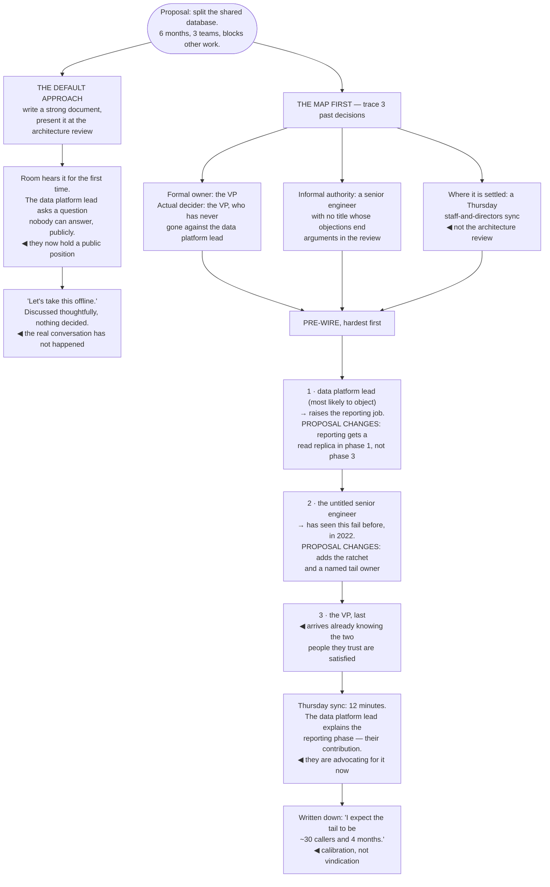

## The model

The org chart says who reports to whom. It does not say who decides, and those two structures are
different in every organisation.

Real decisions are made by a small number of people, often before the meeting where they are
announced, in conversations you were not part of. That is not a conspiracy — it is how groups
converge without spending forever converging. The staff engineer's error is assuming that being
right in the meeting is what determines the outcome, when the meeting is usually where an already
formed position is ratified.

## When to use it

You need something to happen that you cannot make happen yourself.

1. **Who actually decides this?** Not who has the title — who has said no to something like this
   before and made it stick.
2. **Who do they listen to?** Decisions are made by people who are influenced by other people, and
   the second group is frequently more reachable than the first.
3. **When is it decided?** If the answer is "in the review", you are probably already too late.

## Speedrun

**What** — a **decision map**: for a given class of decision, who decides, who influences them,
and when it actually gets settled.

**How to build one**

1. **Take three real past decisions** and trace them backwards. Who proposed it, who objected, who
   ended the discussion, and where. This is the fastest way to see the actual shape.
2. **Separate deciders from influencers.** The person with formal authority frequently defers to
   one or two people they trust, and those people are usually easier to reach.
3. **Find the pre-meeting.** Most decisions are shaped in a one-on-one, a corridor, or a Slack
   thread. The formal meeting confirms.
4. **Do the [[pre-wiring]].** Talk to each person who matters, individually, before the meeting.
   Surprise in a group setting produces defensiveness, not agreement.
5. **Bring them the version they can support**, not the version you like best. A proposal that
   already accounts for someone's objection is one they can advocate for.
6. **Notice who has [[informal authority]]** — the engineer with no title whose opinion ends
   arguments. Losing them costs more than losing a director.

**Why it works** — people commit to conclusions they participated in reaching. Pre-wiring is not
manipulation; it is giving people time to think, object and be answered before they have to take a
public position.

**The signal you missed it** — a meeting where your proposal is discussed thoughtfully and nothing
is decided. That usually means the real conversation has not happened yet, and it was not with you.

## Going deeper

### Reading the decision map

The map is built by tracing real decisions backwards, and three is enough to see the pattern.

For each one, ask: who first proposed it, who objected and what happened to the objection, who said
the thing after which the discussion stopped, and where that happened. The last question is the one
that reveals structure — "in the architecture review" and "in a one-on-one two weeks earlier" are
completely different organisations.

Watch for the gap between formal and actual authority. A director may formally own a decision and
in practice always defer to one principal engineer. A staff engineer may have no formal say and
veto power in practice because nothing ships without their agreement. Neither of those is on any
chart.

**Informal authority** is worth naming as a real thing. It accrues to people who have been right
about consequential things, who are trusted not to be self-interested, and who are known to say so
when they do not know. It is more durable than title-based authority and it is what you are
building when you build credibility.

[[Conway's Law]] gives you a shortcut for the technical half of the map. Decisions about a system
tend to be made along the communication boundaries of the teams that own it — so if you want to
know who will actually decide an interface question, look at which teams have to talk to each other
to build it.

The failure mode to avoid here is cynicism. Reading the map accurately is not the same as
concluding that merit does not matter — being right is necessary and it is not sufficient, and
treating the process as pure politics produces worse outcomes than either extreme.

### Pre-wiring, and why surprise fails

**Pre-wiring** is talking to each person who matters, individually, before the decision meeting. It
is the single highest-return habit available at this level, and engineers resist it because it
feels like lobbying.

The reason surprise fails is about position-taking rather than about the idea. In a group, someone
hearing a proposal for the first time has to respond publicly with no time to think — and the safe
public response to an unfamiliar proposal is caution or objection. Once stated publicly, that
position is expensive for them to abandon.

The individual conversation removes all of that. They can ask the naive question, raise the
objection that turns out to be wrong, and change their mind at no cost. And crucially: **you find
out what they think while you can still change your proposal.**

That last part is what distinguishes pre-wiring from selling. If you come out of five conversations
with the same proposal you went in with, you were not listening — you were counting votes. The
proposal that arrives at the meeting should visibly contain what people told you.

Reilly's framing is that alignment is built before the meeting, and the meeting is for the
disagreements that could not be resolved beforehand. A meeting full of fundamental objections is
evidence the pre-wiring was skipped, not evidence of a rigorous culture.

The order matters too. Start with the people most likely to disagree, not the friendly ones. Their
objections shape the proposal, and arriving at the sceptic last with a fully-formed position is how
you get a public fight.

### Making it their idea, honestly

There is an uncomfortable and true observation here: proposals succeed more often when the people
who have to support them feel ownership of them.

The dishonest version of this is manipulation — engineering the appearance of ownership. The honest
version is easier and works better: actually incorporate what people tell you, and say so. "This
changed after talking to Priya — she pointed out the reporting job" is both accurate and the reason
Priya will defend it.

Credit is the cheapest currency available and staff engineers systematically underspend it.
Attributing an idea to the person who had it costs nothing, is usually true, and buys more than any
argument. The instinct to be seen as the one who thought of it is worth actively suppressing.

Grove's distinction between consultation and decision applies throughout. Being clear about which
one you are doing — "I want your input and the call is mine" versus "you decide, here is my view" —
prevents the most common failure, which is someone believing they were consulted when they were
informed.

### When you lose

You will lose decisions, including ones where you were right, and how you lose determines whether
you get to influence the next one.

The discipline is to lose cleanly. State your position once, clearly, in writing if it matters.
Accept the decision. Do not relitigate it in side channels, and do not become the person who says
"as I predicted" when it goes badly — that is satisfying once and costs you the room permanently.

Write down what you expected to happen, and why. Not to be vindicated, but because it makes you
calibratable — and if you turn out to be wrong, which happens more than it feels like it should,
you will know.

Fournier's observation about escalation is worth carrying: escalating a decision is a real option
and it is expensive, so it should be reserved for cases where the cost of being wrong is high and
the decision is hard to reverse. Escalating routinely marks you as someone who cannot be
disagreed with, which is the fastest way to stop being consulted.

And when you are right later, the useful move is silence. The person who made the call knows. Being
gracious in that moment is worth more influence than any argument you could have won.

## See it work

Getting a shared-database split approved.

The default approach is not lazy — a strong document presented to the right forum is what most
people are taught to do, and it fails for a structural reason rather than a quality one. The room
hears it cold, someone has to respond publicly without time to think, and caution is the safe public
response.

Tracing three past decisions is an hour of work that reveals the two things that matter: the VP
formally decides and has never overruled the data platform lead, and the actual settling happens in
a different meeting from the one everyone treats as the decision point.

Talking to the most likely objector first is what changes the proposal rather than merely counting
who is against it. The reporting job moves from phase three to phase one, and that change is real —
the proposal that arrives Thursday is better than the one that would have been presented.

The untitled senior engineer is the person the org chart would have hidden entirely. They remember
a version of this failing in 2022, which is how the ratchet and the named tail owner end up in the
plan — the single most valuable contribution, from the person with no formal standing.

And the twelve-minute meeting is the outcome to aim for. The data platform lead explains the
reporting phase because it is their contribution, which means they are advocating rather than
approving — and that is a completely different level of support when the project gets difficult in
month four.

## Next

Building alignment covers the slower version of the same problem: getting agreement across many
teams, over months, where no single conversation is enough.
