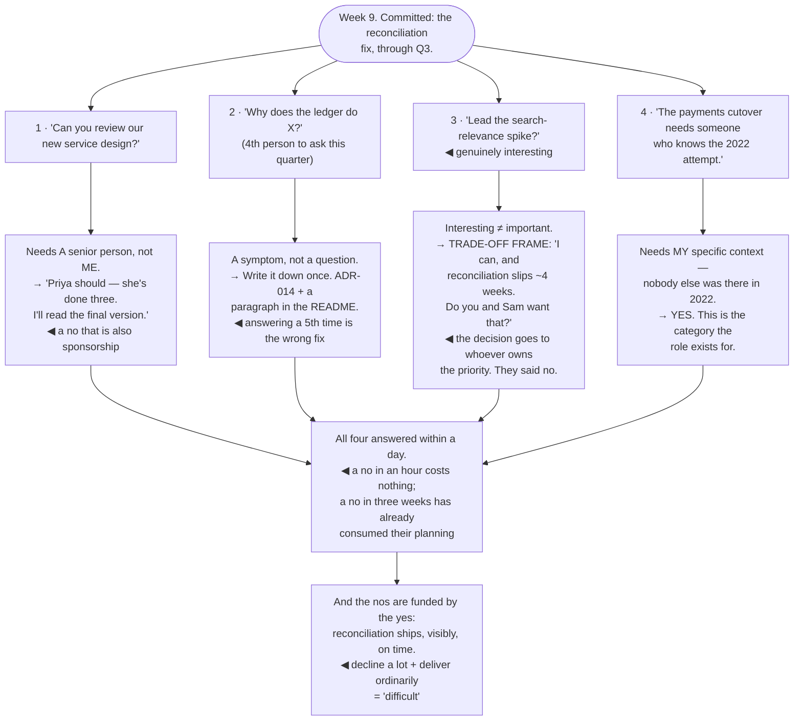

## The model

Becoming visible produces requests, and requests arrive faster than capacity. That is the steady
state of the role, not a temporary condition — so the question is never whether to decline things,
only whether you decline deliberately or by quietly doing everything badly.

The version most engineers default to is the worst one: saying yes to everything, then failing
some of it silently. A clear no is cheap. A yes that does not happen costs the other person a
quarter of planning built on a commitment that was never real.

## When to use it

Someone asks for your time, and you already have less of it than the things you agreed to.

1. **What does this displace?** Every yes is a no to something. If you cannot say what it displaces,
   you have not actually decided.
2. **Does this need *me*?** A large fraction of requests need someone senior, not you specifically,
   and redirecting is a better answer than either yes or no.
3. **Is this a no or a not yet?** They are different answers with different consequences, and
   conflating them is why people keep asking.

## Speedrun

**What** — a small set of responses that decline clearly without spending the relationship.

**How to decline**

1. **Say it in trade-offs, not in refusals.** "I can do this if the reconciliation work slips three
   weeks — do you want that?" moves the decision to the person who owns the priority.
2. **Give the reason.** A no with a reason is information; a bare no is a verdict, and people
   argue with verdicts.
3. **Redirect where you can.** "Not me, and Priya has done three of these" is a better answer than
   yes, and it is also sponsorship.
4. **Say "not yet" when you mean it**, with a date or a condition. "Not this quarter — bring it
   back in planning" is a real answer; "maybe later" is a no that wastes their time.
5. **Decline fast.** A no in an hour is a small cost. A no in three weeks has already consumed
   their planning.
6. **Fix the recurring ones structurally.** If the same request arrives five times, the answer is
   documentation, a tool, or a rotation — not five more nos.

**Why it works** — moving the decision to the person who owns the priorities is honest and it is
usually accurate. You are not refusing; you are declining to make a prioritisation call that is not
yours.

**The most expensive answer** — a yes you cannot keep. It removes the other person's ability to
plan, and it is discovered late, which is when it costs the most.

## Going deeper

### The trade-off frame

**The trade-off frame** is the single most useful move here, and it works because it is true rather
than because it is clever.

"No" invites negotiation, because from the requester's side there is no visible reason. "Yes, and
here is what moves" invites a decision, because now they can see the actual cost and can weigh it
against their own request.

The form: *"I can take this on. It means the reconciliation work slips about three weeks. Which do
you want?"* Then genuinely accept either answer — if they say the new thing matters more and they
own that call, that is a legitimate outcome and you have just been re-prioritised correctly.

Where the priority is not theirs to change, the frame routes it to whoever does own it, which is
usually your manager. "This is a real request and it displaces something I committed to — can you
two sort out which matters more?" is not passing the buck; it is putting a prioritisation decision
where the information is.

What this replaces is the silent version, where you take on the extra work, absorb it personally,
and something else quietly slips. That version protects nobody: the displaced work still slips, and
now it slips without anyone having decided.

McKeown's phrasing is that if you do not prioritise your time, someone else will — and at staff
level the someone else is a queue of people each making an individually reasonable request.

### Triaging what arrives

**Request triage** is worth doing explicitly, because the categories have different right answers
and treating them uniformly is what produces overload.

- **Needs a senior person, not specifically you.** The largest category by far. Redirect, and
  redirect toward someone for whom it is growth.
- **Needs your specific context.** Cross-team history, the decision map, why the thing is the way
  it is. This is the category only you can serve, and it should get your yes.
- **A symptom of a missing structure.** The fifth person asking the same question needs
  documentation, a template or a rotation. Answering it a fifth time is the wrong fix.
- **Interesting but not important.** The hardest one to decline, because you want to do it. Notice
  the pull, and treat wanting to as a warning rather than a reason.
- **Genuinely somebody else's job.** Politely and clearly not yours.

The [[Pareto principle]] is the underlying shape: a small fraction of requests carry most of the
value of your attention, and triage is how you find them rather than discovering them by accident.

The category worth guarding hardest is the second. Your cross-team context is the scarce thing, and
spending it on requests that any competent senior engineer could serve is the specific waste that
the role exists to avoid.

### How to say it

The mechanics matter more than they should, because the same decision lands completely differently
depending on how it is delivered.

**Fast.** A no within an hour costs them nothing; a no after three weeks of ambiguity has already
consumed their planning. Speed is the largest single component of how a decline feels.

**With a reason.** "I'm committed to the reconciliation work through Q3" is information they can
act on. "I don't have capacity" is a verdict, and it invites the argument about whether that is
really true.

**With an alternative, where one exists.** A redirect, a smaller version, a later date, or half an
hour of context that unblocks them without you doing the work. Often thirty minutes is genuinely
what they needed.

**Without over-apologising.** Extended apology reads as negotiable, and it invites a second ask. A
clear, warm, brief no is kinder than a soft one that leaves the door visibly open.

**In writing, for anything that matters.** A verbal no in a corridor gets remembered as a maybe by
at least one of you.

And say "not yet" only when it is true. A deferral with a condition — "bring it to planning, and if
it beats X I will take it" — is a real answer. "Maybe later" said to avoid the discomfort of a no is
the version that produces four follow-up messages and a worse relationship than the no would have.

### What makes it survivable

Saying no repeatedly is only sustainable if the yeses are visibly good, and that is the part people
miss.

An engineer who declines a lot and delivers exceptionally on what they take is respected. One who
declines a lot and delivers ordinarily is difficult. The no is funded by the quality of the yes.

Being visibly busy on something legible helps more than it should. If people can see what you are
working on and why it matters, the decline is self-explaining — which is another argument for
making the wedge's completion legible.

Reilly's framing is worth carrying: your availability is a resource the organisation is allocating,
and if you never decline, it is being allocated by whoever asks most persistently. That selects for
persistence, not for importance.

And the recurring requests should be treated as a signal rather than a nuisance. Five people asking
the same thing is a missing document, a missing tool, or a missing owner. Answering it five times is
five nos you did not need to say and one structural fix you did not make.

## See it work

Four requests in one week, triaged.

The first request is the most common shape and the one people get wrong by saying yes. It genuinely
needs a senior reviewer and does not need this particular one — and redirecting it to someone who
has done three of them is simultaneously a decline, a better answer, and sponsorship.

The second is not a question at all, and treating it as one is the trap. The fourth person asking
why the ledger does X means the answer does not exist in writing, so the correct response costs
twenty minutes once instead of ten minutes four more times.

The third is the hard one, because wanting to do it is a strong pull that feels like enthusiasm for
the work. The trade-off frame is what makes it decidable: four weeks of reconciliation slip, stated
plainly, routed to the people who own the priority — and they declined, which they could not have
done if the cost had been absorbed silently.

The fourth is the yes the role exists for. Nobody else was present in 2022, that context is not
recoverable from any document, and spending it is exactly what a staff engineer's cross-team history
is for.

And the last box is the condition that makes all of it work. Declining three of four requests is
sustainable only because the one that was accepted ships visibly and on time — the quality of the
yes is what funds every no.

## Next

The Scaling yourself group takes this further. Deciding what to accept is one half; the other is
making your attention go further than one person's week allows.
