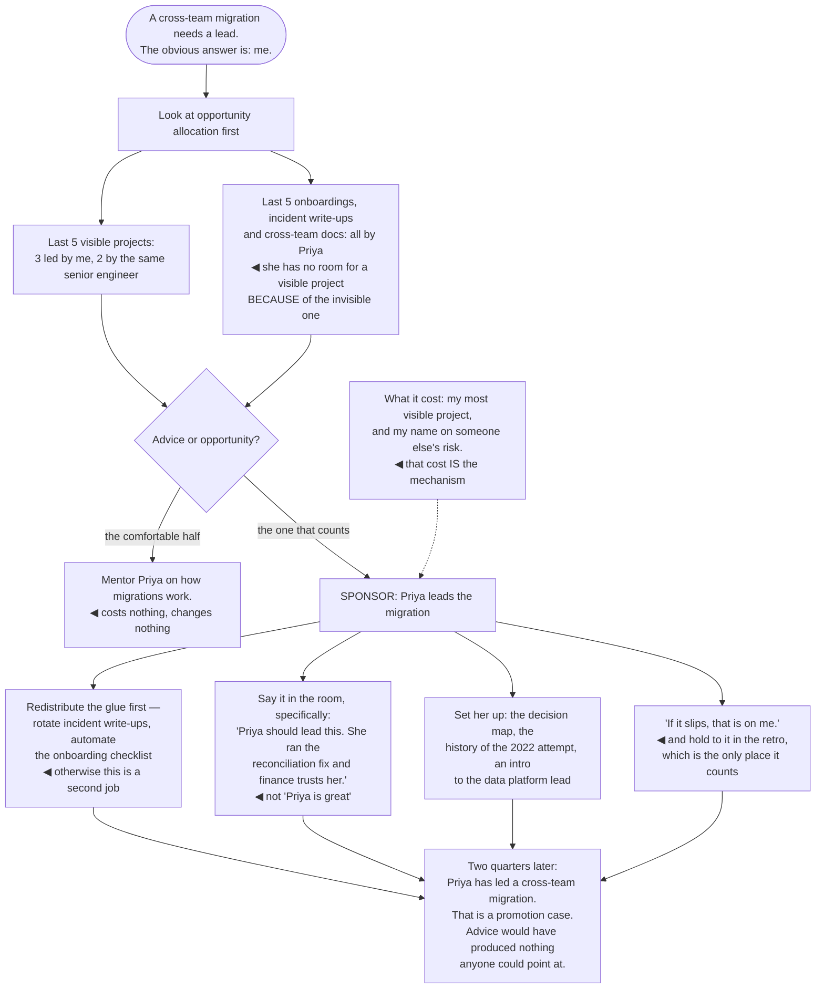

## The model

**Mentorship** is giving someone advice. **Sponsorship** is spending your own credibility to get
them an opportunity. Hogan's distinction is the sharpest available, and the gap between the two is
where most careers actually turn.

Mentorship is comfortable, low-cost, and easy to volunteer for. Sponsorship means putting your name
on someone — recommending them for the visible project, arguing for them in a calibration meeting,
handing them the thing you would have done yourself. If they fail, it costs you something. That is
precisely why it works.

## When to use it

You have credibility and someone else could use it.

1. **Are you giving advice or opportunity?** Advice is what people ask for. Opportunity is what
   changes their trajectory, and it is what you are uniquely positioned to give.
2. **Who is getting the visible work?** Look at who was handed the last three high-profile
   projects. **Opportunity allocation** is where careers are actually decided, and it is usually
   unexamined.
3. **Whose name do you say in rooms they are not in?** That list is short, it is who you are
   actually sponsoring, and most people have never looked at it.

## Speedrun

**What** — two different activities, and only one of them costs you anything:

| | Mentorship | Sponsorship |
|---|---|---|
| You give | advice, context, time | your credibility |
| They get | better judgment | an opportunity |
| Risk to you | none | real — you are vouching |
| Happens in | a one-on-one | rooms they are not in |
| Changes | how they work | where they end up |

**How to sponsor**

1. **Look at who gets the visible work**, over the last quarter, honestly. The pattern is usually
   clearer and less flattering than expected.
2. **Hand over something you would have done.** The migration, the design doc, the incident review,
   the talk. This is the whole mechanism.
3. **Say their name in rooms they are not in.** Promotion, staffing and project decisions happen
   without the person present.
4. **Set them up to succeed** — context, air cover, and a stated "if it goes wrong, that is on
   me". Sponsorship without support is a trap dressed as an opportunity.
5. **Be specific in the room.** "Priya should lead this; she ran the reconciliation fix and finance
   trusts her" beats "Priya is great."
6. **Sponsor beyond your natural network.** The default allocation of opportunity flows along
   familiarity, and familiarity is not evenly distributed.

**Why it works** — nobody is promoted for potential you can see and nobody else has observed.
Sponsorship converts your private assessment into public evidence, which is the thing promotion
processes actually run on.

**The uncomfortable check** — name the last three people you sponsored, and what you spent. If the
answer is a list of people you mentored instead, you have been doing the comfortable half.

## Going deeper

### The advice trap

**The advice trap** is spending your senior time on the thing that feels most like helping and
changes the least.

Advice is cheap for you and pleasant for both parties. It is also frequently redundant — the person
asking usually knows what to do and is looking for either confidence or permission, and giving them
an answer removes the practice of deciding.

Reilly's version of the point is that advice about how to do the work is much less valuable than
access to the work. An engineer who has been told how to run a migration and one who has run a
migration are not comparable, and only the second one gets promoted.

The correction is mechanical rather than attitudinal. When someone brings you a problem, ask
whether the useful response is an answer or an opportunity. "Here is what I would do" is advice;
"you should own this one, and I will be in the room" is sponsorship.

There is a version of mentorship that is genuinely high-value and worth distinguishing: context
transfer. Explaining why the organisation works the way it does, what the political map looks like,
what happened in 2022 — that is information they cannot get elsewhere and it does not substitute
for opportunity, it makes them able to use one.

### Opportunity allocation, examined

**Opportunity allocation** is who gets handed the work that leads somewhere, and in most teams
nobody has ever looked at it deliberately.

The default allocation runs on familiarity and on who is already known to be good — which is
self-reinforcing, because being handed visible work is how you become known to be good. The engineer
who did the last high-profile project gets the next one, and the distance widens.

It also runs on availability, which quietly penalises the people carrying invisible work. The
engineer doing onboarding, documentation, incident follow-ups and cross-team coordination has no
room for the visible project — and Reilly's "being glue" argument is that this work is essential,
uncredited, and disproportionately carried by women and underrepresented engineers.

So there are two interventions and both are needed. Redistribute the glue — rotate it, automate it,
or make it explicitly part of someone's scope with credit attached. And redistribute the visible
work deliberately rather than by default.

The check is simple and worth doing quarterly: list the last five significant projects and who led
them. Then list who did the last five onboardings, incident write-ups and cross-team documents. If
those are different sets of people, that is a decision the team has made without noticing.

Ibarra's research on the sponsorship gap is worth knowing in its specifics: women report receiving
*more* mentorship than men and less sponsorship, and the sponsorship gap tracks the promotion gap.
Advice was never the scarce resource.

### How to sponsor concretely

The forms sponsorship takes, roughly in ascending order of what they cost you:

- **Naming them in a room.** Staffing decisions, promotion discussions, "who should present this" —
  say a specific name with a specific reason.
- **Handing over your work.** The design doc, the incident review, the migration. Work that would
  have been yours, given away while you stay on the hook.
- **Recommending them for something they are not obviously ready for.** With support. This is where
  most growth happens and where the risk is real.
- **Putting them in front of leadership.** Having them present the thing you would have presented,
  with preparation and with you in the room.
- **Advocating in calibration.** Arguing for their promotion, with evidence, against resistance.

The precondition for all of them is that your assessment is trusted, which means sponsorship is
credibility spent — and it recharges when the person succeeds. Sponsoring well is
self-reinforcing; sponsoring carelessly is not, and one bad recommendation makes the next three
harder.

Support is what separates sponsorship from abandonment. Handing someone a stretch assignment with
no context, no air cover and no stated backstop is not an opportunity, it is a test they did not
agree to take. The sentence that matters is the same one as in any handover: *if it goes wrong, that
is on me.*

### Being sponsored, and reciprocity

The other half, briefly, because it applies to you too.

Sponsorship is not something to wait for. Making your work visible to people who make decisions,
telling your manager what you want to be doing in a year, and asking directly for the specific
opportunity are all legitimate and all underused — "I would like to lead the next migration" is a
sentence most engineers never say.

What makes someone sponsorable is being reliably good at the thing they were last given, and being
someone whose success does not cost the sponsor anything to explain. Both of those are earned before
the ask.

And the obligation runs downward. Larson's framing is that the staff role is a position of
structural advantage — you have access, context and credibility that most engineers do not, and
distributing it is part of the job rather than a nice thing to do with spare time.

The measure that matters is not how many people you have helped. It is how many people are doing
work they would not otherwise have been given, and could not have got to on their own.

## See it work

A staff engineer with a high-visibility migration to staff.

Looking at opportunity allocation before deciding is what changes the answer. Three of the last five
visible projects went to the same person — me — and the pattern was invisible until it was listed,
which is the normal case rather than an unusual one.

The second list is the one that matters more. Priya is carrying all the invisible work, and that is
*why* she has no room for a visible project — so handing her the migration without redistributing
the glue would have been giving her a second job rather than an opportunity.

Mentoring her on how migrations work is the comfortable option and it is genuinely useless here. She
does not need to be told how migrations work; she needs to have run one, because that is what a
promotion committee can evaluate.

The specific sentence in the room is doing more work than it looks. "Priya should lead this, she ran
the reconciliation fix and finance trusts her" is evidence someone can repeat; "Priya is great" is a
sentiment that dies in the room it is said in.

And the cost is the mechanism rather than a regrettable side effect. Giving away the most visible
project and putting your name on someone else's risk is exactly what makes the recommendation worth
anything — a recommendation that costs the recommender nothing carries no information.

## Next

Working with managers covers the relationship this all runs through: the person who owns the people
and the process while you own the technical outcome.
