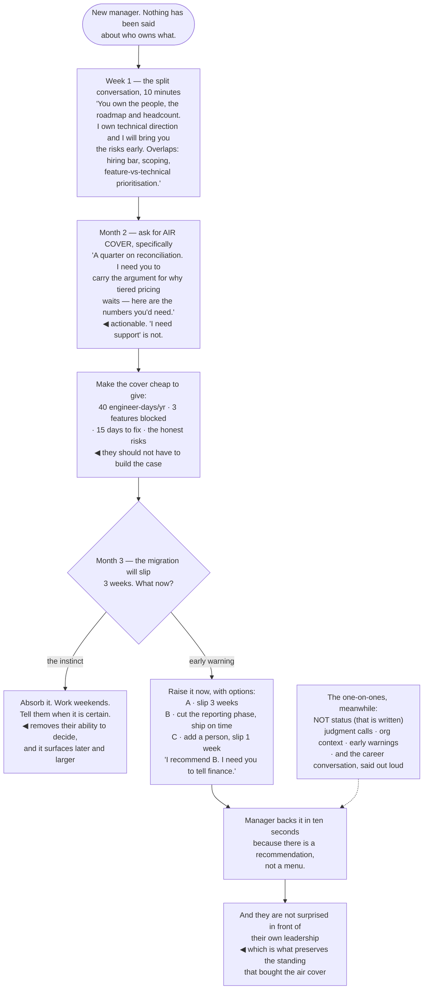

## The model

A staff engineer and an engineering manager are a **staff-manager pair** with a split
responsibility: the manager owns people, process and headcount; the staff engineer owns technical
outcomes and direction.

Most of the friction between them is not personality. It is that the split was never stated, so
both are guessing at the boundary — and the two failure modes are symmetric. The staff engineer
drifts into coordination and becomes a manager without the title; or the manager makes technical
calls without the context and the staff engineer finds out afterward.

## When to use it

You have a manager, or a manager counterpart on a team you work with.

1. **Who owns what, explicitly?** If you have not had the conversation, you do not have agreement —
   you have two private assumptions that mostly overlap.
2. **What does your manager need from you that they have not asked for?** Usually: early warning,
   a clear read on the technical risk, and not being surprised.
3. **What do you need from them?** Usually: air cover, context on decisions being made above, and
   the headcount conversation. Neither of you should be guessing.

## Speedrun

**What** — an explicit division of labour, and a rhythm that keeps it working.

**How to run the relationship**

1. **Have the split conversation, out loud, early.** "You own the people and the roadmap; I own
   the technical direction and I will bring you the risks" takes ten minutes and prevents months.
2. **Never let them be surprised.** A manager blindsided in front of their own boss loses standing
   they need in order to be useful to you.
3. **Bring problems with a recommendation.** "Here is the issue, here are the options, here is what
   I would do, here is what I need from you" is what makes you easy to back.
4. **Ask for [[air cover]] explicitly.** Protection from interrupts, permission to spend a quarter
   on something unglamorous, backing in a room you cannot be in.
5. **Use the [[one-on-one]] for the things that are not status.** Status can be written; the
   meeting is for judgment calls, organisational context and disagreements.
6. **Translate in both directions.** Technical risk into business consequence for them, and
   organisational context into engineering priorities for the team.

**Why it works** — the manager has organisational context you do not and you have technical context
they do not. Almost every failure of this pair is one of those two flows being blocked.

**The single most valuable habit** — early warning. A problem raised three weeks before it hurts is
a decision; the same problem raised the week it hurts is an incident with your name on it.

## Going deeper

### Drawing the line

The split that works is roughly: the manager owns **who** and **how the work flows**; the staff
engineer owns **what** and **how it is built**. Both are accountable for the outcome, and both
should say so.

Where it genuinely overlaps is worth naming in advance, because these are the actual friction
points: technical hiring and levelling, project scoping and estimates, prioritisation between
feature work and technical work, and performance signals about engineering quality. In each, both
of you have real standing and neither has all of the information.

The resolution is not a rule, it is a conversation about each one. Fournier's framing is that the
pair should be able to state, for any recurring decision, who consults and who decides — and that
naming it once removes almost all the recurring tension.

The two drift patterns are the ones to watch. If your week is meetings, planning and coordination
and you cannot name a technical outcome you are accountable for, you have drifted into management.
If your manager is making architectural calls you learn about afterward, the technical context flow
has broken and that is usually because you have not been supplying it.

Larson's observation about the pair is that it is the most leveraged working relationship a staff
engineer has, and it is the one most often left to develop by accident.

### Managing up, without the connotation

**Managing up** has a manipulative smell it does not deserve. It means making your manager
effective at the parts of their job that depend on you, and it is straightforwardly in your
interest.

What managers consistently need and rarely ask for:

- **Early warning.** The slip, the risk, the thing that is going wrong. Three weeks ahead it is a
  decision; the week of, it is an incident.
- **Compressed technical context.** They are making resourcing and commitment decisions on your
  read of the technical situation, and they need it in the terms their conversations happen in.
- **A recommendation, not a menu.** Bringing three options with no view makes them do your
  analysis; bringing a recommendation makes them able to back it in ten seconds.
- **No surprises in public.** Being blindsided in front of their own leadership costs them
  standing, and that standing is what buys you air cover later.
- **The state of the team, from where you sit.** You see things in code review and pairing that
  they cannot see in one-on-ones.

The translation obligation runs both ways and is the actual skill. "The reconciliation code is a
mess" is not usable; "reconciliation costs us about forty engineer-days a year and blocked three
features" is a sentence that survives being repeated upward.

And when they are wrong about something technical, the useful move is the same as any
disagreement: understand their reasoning first. A manager pushing an unrealistic date is usually
carrying a commitment you have not seen, and the productive question is what it is.

### Air cover, and what to ask for

**Air cover** is a manager using their position to protect something you cannot protect yourself.
It is the most concrete thing they can give you and most staff engineers never ask for it
specifically.

The forms it takes: protection from interrupts so you have contiguous time; permission to spend a
quarter on unglamorous work with the value argued upward; defence of a decision in a room you are
not in; and absorbing pressure so a schedule negotiation does not land on the team as panic.

Asking specifically is what makes it work. "I need a quarter on reconciliation, and I need you to
carry the argument for why we are not shipping the tiered-pricing feature first" is actionable. "I
need more support" is not, and it is the version most people say.

What you owe in return is making the cover cheap to give. A manager defending your project needs
the argument, the numbers, and the honest risks — and if they have to construct those themselves,
they will defend it less often.

The failure mode to watch is silently absorbing the cost instead. Working weekends to hide a slip
protects nobody: the manager cannot make a decision they do not know is needed, and the slip
surfaces later and larger.

### The one-on-one

The **one-on-one** is the highest-bandwidth channel you have with your manager, and it is routinely
wasted on status that could have been a written update.

Grove's framing is that the meeting belongs to the more junior person in the reporting line — it is
for what they need, not for the manager to collect information. For a staff engineer that means
bringing an agenda, and it means bringing the things that do not fit anywhere else.

What it is for: judgment calls where you want a second read, organisational context you are missing,
disagreements before they become public, early warnings, and the career conversation — which is the
one most often deferred indefinitely.

What it is not for: project status, which is more accurate written, and which consumes the meeting
because it is the easiest thing to talk about.

The career conversation deserves its own mention because it does not happen unless someone starts
it. Saying what you want to be doing in a year, out loud, is what lets a manager route opportunities
toward you — and a manager who does not know what you want will allocate the work that is most
convenient.

## See it work

A quarter's technical work needs protecting, and a date is slipping.

The ten-minute conversation in week one is the highest-return thing on this diagram. Naming the
overlaps in advance — hiring bar, scoping, feature-versus-technical prioritisation — means the
first time one of them comes up, there is a process instead of a negotiation conducted under
pressure.

Asking for air cover specifically is what converts goodwill into protection. A manager cannot act on
"I need more support"; they can act on "carry the argument for why tiered pricing waits", and
handing them the numbers means they can do it without building the case themselves.

The slip is where the relationship is actually tested. Absorbing it feels like professionalism and
it removes the manager's ability to make a decision that is theirs to make — the commitment to
finance is not yours, and they cannot renegotiate a date they do not know is at risk.

Three options with a recommendation is what makes the backing fast. A menu forces them to redo your
analysis; a recommendation with the reasoning attached lets them agree in ten seconds and spend
their energy on the finance conversation instead.

And the one-on-one being reserved for judgment, context and career is what makes it worth having.
Status is more accurate written, it consumes the meeting because it is the easy thing to discuss,
and the career conversation is the one that never happens unless someone deliberately starts it.

## Next

Saying no closes the group — the skill that protects everything above, since a staff engineer's
default state is more requests than capacity.
