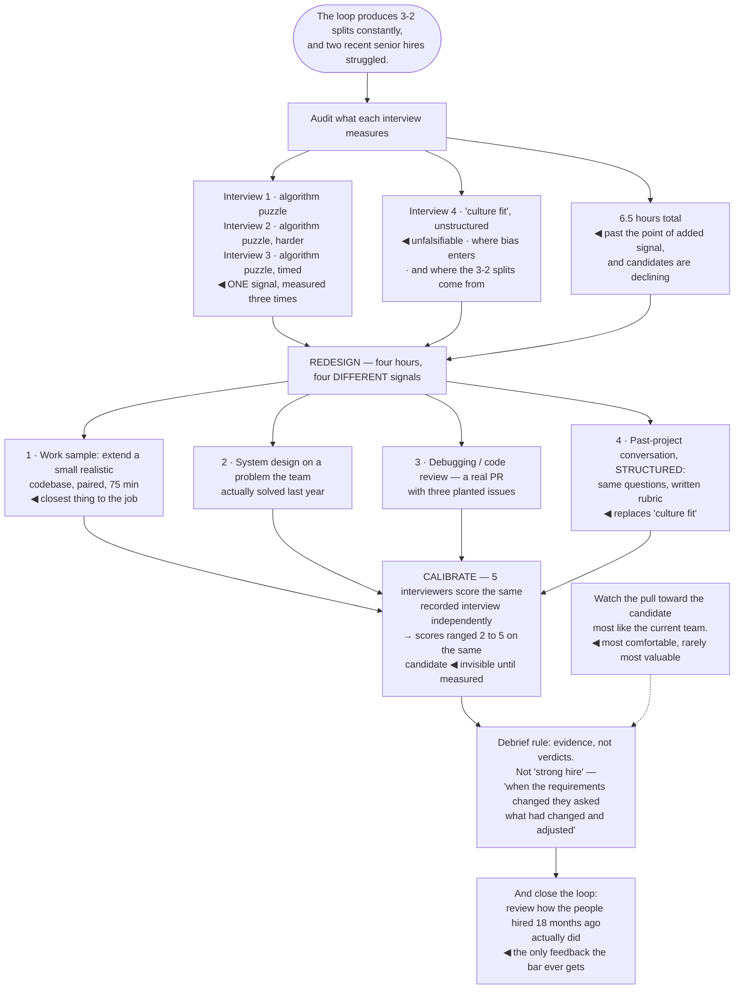

## The model

A hire persists for years and shapes everything around them — the code, the standards, who else
joins, what the team believes is normal. Almost nothing else a staff engineer influences has that
half-life.

Most interview processes are nonetheless built by accident, out of whatever the last person did.
The research is unusually clear about what works: **structured interviews**, on job-relevant work
samples, scored against a defined rubric, by calibrated interviewers. Almost every other signal
people believe in — including the confident gut read after twenty minutes — measures much less than
it feels like it does.

## When to use it

You are designing an interview loop, sitting on one, or in a levelling discussion.

1. **What does this interview actually measure?** If two interviewers would score the same
   candidate very differently, it measures the interviewer.
2. **Is this signal job-relevant?** The strongest predictor is a work sample resembling the job.
   Puzzles and trivia mostly measure exposure to puzzles and trivia.
3. **What is the cost of each error?** A bad hire is expensive and slow to correct; a missed good
   candidate is invisible and also expensive. Pretending only one direction matters is how bars
   drift.

## Speedrun

**What** — a small number of structured, job-relevant interviews, scored against a rubric by people
who have been calibrated against each other.

**How to design a loop**

1. **Write down what you are hiring for** before designing anything — the actual work, at the
   actual level.
2. **Use work samples.** Realistic problems resembling the job predict performance far better than
   abstract puzzles.
3. **Structure every interview.** Same questions, same rubric, same scale. Unstructured interviews
   have among the weakest predictive validity of any common method.
4. **Optimise signal per hour** — for both sides. Four well-designed hours beat eight
   improvised ones, and the candidate is evaluating you throughout.
5. **Calibrate the interviewers.** Have several score the same recorded or shadowed interview and
   compare. Divergence is normal and invisible until you measure it.
6. **Decide in a debrief with evidence**, not with impressions. "Strong yes" is not a data point;
   "here is what they did when the requirements changed" is.

**Why it works** — structure removes the variance that comes from the interviewer rather than the
candidate. That variance is large, and it is where bias enters most easily.

**The finding worth internalising** — unstructured interviews feel the most informative and predict
the least. Confidence in a gut read is not evidence about the candidate.

## Going deeper

### What actually predicts performance

Schmidt and Hunter's meta-analysis is the standard reference, and the ordering it produces is
consistently surprising to people who interview a lot.

Work-sample tests — doing something resembling the job — are near the top. Structured interviews
are close behind, and combining the two is stronger than either. Unstructured interviews, reference
checks and years of experience are all substantially weaker, and years of experience is close to
uninformative past the first few.

The mechanism behind structure is variance reduction. An unstructured interview varies by
interviewer mood, rapport, what they happened to ask, and how the candidate's background resembles
their own. That variance is noise, and noise is where bias lives — because in the absence of signal,
familiarity fills the gap.

The practical translation for engineering loops: a realistic coding or design exercise on a problem
resembling the actual work, the same problem for every candidate at that level, scored against
written criteria decided in advance.

What to remove is equally specific. Trivia, algorithmic puzzles unrelated to the role, and "culture
fit" as an unstructured impression — the last one is the single most reliable route for bias to
enter a process, because it is unfalsifiable and feels like judgment.

Google's own re:Work findings are worth citing precisely because they undercut a practice they were
famous for: the brainteaser questions predicted nothing, and they stopped using them.

### Signal per hour

**Signal per hour** is the right optimisation target, and it is bidirectional — the candidate is
spending the same hours evaluating you.

Most loops are too long and get less from the extra time than people assume. Marginal predictive
value drops off quickly after about four hours, and every additional hour costs candidate goodwill,
interviewer time, and offer-acceptance rate.

The way to increase signal without increasing hours is to make the interviews measure different
things. Four interviews that all assess coding fluency produce one signal measured four times; one
coding, one system design, one debugging or code review, and one collaboration or past-project
discussion produce four.

The take-home exercise is a genuine tradeoff worth stating both sides of. It is more
job-realistic and it costs the candidate unpaid hours — which selects against people with
caregiving responsibilities or a current job that is demanding. A time-boxed pairing session
usually gets similar signal at lower cost to them.

And the loop is a hiring tool in both directions. Candidates decline offers because of how the
process felt, and a disorganised loop signals a disorganised engineering organisation — accurately,
often enough.

### Interviewer calibration, and the bar

**Interviewer calibration** is the process of getting interviewers to score the same candidate
similarly, and without it a "bar" is a fiction — the outcome depends on who happened to be assigned.

How to do it concretely: have several interviewers independently score the same shadowed or
recorded interview, then compare and discuss the divergence. It is uncomfortable and the gaps are
always larger than anyone expects.

The **levelling rubric** needs the same treatment. Written descriptions of what senior and staff
mean at this company, with concrete behavioural examples, and calibration sessions where people
apply it to real cases. A rubric nobody has practised applying produces confident, inconsistent
levelling.

**The bar** drifts in both directions and neither is self-correcting. Under hiring pressure it
falls; after a bad hire it rises reactively. Periodically reviewing outcomes — how did the people
hired eighteen months ago actually do — is the only feedback loop available, and almost nobody
closes it.

[[Goodhart's Law]] applies to recruiting metrics with real force. Time-to-hire as a target produces
faster, worse decisions; offer-acceptance rate as a target produces offers only to safe candidates.
Both need pairing with a quality-of-hire measure, however imperfect that measure is.

The asymmetry people invoke — "a bad hire is worse than a missed good one" — is true and is used to
justify far more caution than it supports. Missed good candidates are invisible, so the error is
never counted, and a process tuned entirely against one error type drifts steadily toward
rejecting everyone who is unlike the current team.

### The staff engineer's specific role

Your leverage in hiring is not the hours spent interviewing. It is loop design, calibration, and
the levelling conversations — because those apply to every candidate rather than to one.

Designing the technical interviews is the highest-value contribution available. You know what the
work actually requires, and most loops are inherited rather than designed, so the improvement
available is usually large.

In debriefs, the useful role is insisting on evidence. "Strong hire" is a feeling; "when the
requirements changed halfway through, they asked what had changed and adjusted rather than
defending the original design" is an observation someone else can weigh. Modelling that shifts the
whole debrief.

Levelling is where technical judgment matters most and where staff engineers are frequently absent.
Whether someone is senior or staff is a judgment about scope and impact, and a room without anyone
who has done the work at that level tends to over-weight interview polish.

Fournier's warning about hiring for the team you have versus the team you need applies directly.
The candidate most similar to the current team is the most comfortable hire and frequently not the
most valuable one — and noticing that pull is easier when someone in the room is watching for it.

## See it work

Redesigning a loop that keeps producing disagreement.

Three algorithm interviews is one signal measured three times, and it is the most common loop design
in the industry. It feels rigorous — three independent assessments — and it produces a candidate
ranking on a single dimension that resembles a fraction of the actual job.

The unstructured culture-fit interview is where the 3-2 splits were coming from. With no rubric and
no fixed questions, it measures the interviewer's rapport with the candidate, and disagreement is
the expected output rather than a sign of a hard call.

Four different signals in four hours is more information than six and a half hours of the same
signal. The work sample is the strongest single predictor available, and the debugging exercise
tests something the coding interview genuinely cannot — reading unfamiliar code, which is most of
the job.

The calibration result is the finding that changes behaviour. Five interviewers scoring the same
recorded candidate from 2 to 5 means the outcome was substantially determined by assignment, and
nobody in that process could have known — divergence is invisible until it is measured.

And closing the loop at eighteen months is the part almost no organisation does. Without checking
how past hires actually performed, "the bar" has no feedback at all: it drifts down under hiring
pressure and up after a bad hire, and neither movement is connected to whether the process is
predicting anything.

## Next

The Career group closes the section — how the work on these pages turns into a trajectory, and what
to do when it stops.
