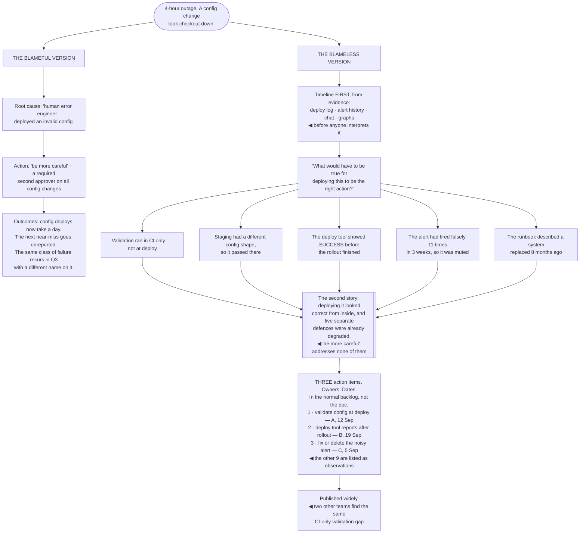

## The model

Something broke, and for a short window the organisation is willing to look honestly at how it
works. That window is the most valuable thing an incident produces, and it closes fast.

A **blameless postmortem** exists to keep it open. Not because nobody made a mistake — someone
usually did — but because the moment the analysis becomes about who, everyone starts managing their
exposure, and the information you needed stops arriving. Allspaw's framing is that you are trading
the satisfaction of attribution for the ability to learn, and the trade is overwhelmingly worth
making.

## When to use it

Something has failed, or you are deciding how your organisation handles failure.

1. **What did this reveal about the system?** Not what went wrong — what was already true that
   this made visible.
2. **Would the same person have done the same thing?** If a reasonable engineer with the same
   information would have made the same call, it is not a person problem.
3. **What will actually change?** A postmortem whose action items do not get done is a ritual, and
   people stop investing in rituals.

## Speedrun

**What** — a written account of what happened, why it made sense at the time, and what changes.

**How to run one**

1. **Separate response from analysis.** During: **incident command**, mitigate, communicate.
   After: understand. Trying to do both at once does neither.
2. **Build the timeline from evidence** — logs, deploys, messages, alerts — before anyone
   interprets it. Memory reconstructs, and it reconstructs toward whatever the conclusion became.
3. **Ask why it made sense at the time.** Dekker's **second story**: the actions looked reasonable
   from inside, and understanding why is where the systemic cause lives.
4. **Find [[contributing factors]], not a root cause.** Complex systems fail from combinations;
   a single root cause is almost always the place the investigation stopped.
5. **Write action items with owners and dates**, and fewer than you want. Three that happen beat
   twelve that rot.
6. **Publish it widely.** The organisation learns from incidents it did not have, and that is most
   of the value.

**Why it works** — the failure is information about the system, and the system is the thing you can
change. People change teams; a missing timeout does not fix itself.

**The signal your culture is not blameless** — postmortems that identify "human error" as a cause.
That is where the analysis stopped, not where it arrived.

## Going deeper

### Why blameless, mechanically

The argument for blamelessness is practical rather than moral, and stating it that way is what
persuades sceptics.

If naming a person has consequences, people optimise for not being named. They omit the detail that
would explain the decision, they do not mention the workaround everyone uses, and the near-misses —
the incidents that almost happened and are the cheapest information available — stop being
reported entirely.

What you lose is precisely the information you need. The engineer who made the change knows why it
seemed safe, and that reason is the systemic finding: the documentation said X, the staging
environment did not have Y, the alert had fired falsely eleven times so it was ignored.

Blameless does not mean consequence-free, and this is the distinction that gets muddled. A just
culture still addresses recklessness and repeated negligence. What it does not do is treat a
reasonable action that turned out badly as a personal failing — and the vast majority of incidents
are the second kind.

Cook's observation from *How Complex Systems Fail* is the underlying reason: complex systems run in
a degraded mode continuously, containing latent failures at all times. Practitioners are the ones
holding them together, so an incident is usually a defence being overwhelmed rather than a person
being careless.

The practical test: if the postmortem's finding is "the engineer should have been more careful",
nothing has been learned. Careful was already the input, and the next engineer will have exactly the
same information.

### Contributing factors, not root cause

"Root cause" implies a single thing, and complex systems do not fail that way. **Contributing
factors** is the more honest framing and produces more useful action items.

A typical incident has several: a change that was safe in isolation, a monitoring gap that made it
invisible for forty minutes, an alert that had been noisy so nobody looked, a runbook that was
written for a system that has since changed, and a dependency behaving in a way nobody had
documented.

Fixing any one of them prevents this specific incident. Fixing the pattern — noisy alerts,
undocumented dependencies — prevents a class of them, which is the difference between a postmortem
that is filed and one that is worth the hour.

The **second story** is Dekker's term for what you are looking for. The first story is "an engineer
deployed a bad config." The second story is why deploying it looked correct: the validation only ran
in CI, staging had a different config shape, and the deploy tool showed a success message before the
rollout completed.

The question that gets you there is *"what would have had to be true for this to be the right
action?"* — asked genuinely, not rhetorically. It reliably surfaces the environment that produced
the decision, and the environment is what you can change.

The counter-technique to guard against is hindsight. Knowing the outcome makes the warning signs
look obvious, and they were not obvious among the fifty other signals present at the time. Building
the timeline from evidence before interpreting it is the main defence.

### Running the incident itself

Analysis is after. During an incident, the job is different, and conflating them makes both worse.

**Incident command** is the practice worth adopting: one person coordinates and explicitly does not
debug. They track what is being tried, decide, and communicate — and separating that role from the
people investigating is what stops five engineers from independently changing the same thing.

The roles that matter are few. A commander who coordinates, an operations lead who makes the
changes, and a communications lead who handles status updates and stakeholders. In a small
organisation one person may hold two of them, and knowing which hat is on still helps.

Mitigate before diagnosing. Rolling back is almost always faster than understanding, and the
instinct to find the cause first is the single most common reason incidents run long. Restore
service, then investigate with the pressure off.

Communication during is underrated and cheap. A status update every thirty minutes, even one saying
"still investigating, no new information", prevents the second incident — the one where six people
interrupt the responders to ask what is happening.

And write things down as they happen. The timeline is far easier to reconstruct from a channel where
people narrated their actions than from memory the following day, and the narration costs almost
nothing at the time.

### Action items, and why they rot

**Action item rot** is the failure mode that quietly ends postmortem culture: items are written,
nobody owns them, they are not done, and the next postmortem is treated as paperwork.

Three properties make an item survivable. It has a named owner rather than a team. It has a date. And
it is small enough to actually be finished — "improve monitoring" rots, "add an alert on
reconciliation lag above 10 minutes" does not.

Fewer is better. Three items that get done are worth more than twelve that do not, and the twelve
version is what happens when a postmortem tries to fix everything it noticed. The rest can go on a
list as observations without pretending they are commitments.

Tracking them where normal work is tracked matters more than it sounds. Action items in a separate
postmortem document are invisible to planning, so they lose to everything on the actual backlog. In
the backlog, they compete on merit, which some of them will win.

The [[error budget]] mechanism is the strongest available forcing function. If reliability work is
funded automatically when the budget is exhausted, action items get done because there is capacity
allocated to them — rather than depending on someone remembering to advocate for them.

And the review is what closes the loop. A monthly look at open action items, with the ones that have
not moved either done or explicitly dropped, keeps the list honest. Silently abandoned items are
what teach people that the process is theatre.

## See it work

A four-hour outage, analysed two ways.

The blameful version is not obviously wrong at the moment it is written. "Engineer deployed an
invalid config" is factually accurate, and requiring a second approver sounds like a reasonable
safeguard — which is why this version gets past review so often.

Its three outcomes are all worse than the incident. Config deploys now take a day, which is a
permanent tax on every safe change; the next near-miss goes unreported, which removes the cheapest
information the organisation gets; and the same failure recurs because none of the five actual
defences was touched.

The timeline-before-interpretation ordering is doing real work. Once a conclusion exists, memory
reconstructs toward it and the warning signs look obvious in hindsight — building from deploy logs,
alert history and chat before anyone narrates it is the main defence against that.

The second story is where the findings actually are. Five separate defences were already degraded
before this change was made: validation in the wrong place, staging that did not match, a deploy
tool that lied about completion, a muted alert, and a runbook describing a system that no longer
exists. Every one of those existed the day before the incident.

Three action items with owners, dates and a place in the normal backlog is what makes this different
from a filed document. The other nine observations are recorded honestly as observations — which is
better than listing twelve commitments and completing three, because that is what teaches people the
process is theatre.

## Next

Metrics and goals covers the numbers these action items get measured against, and the specific ways
those numbers stop meaning anything.
