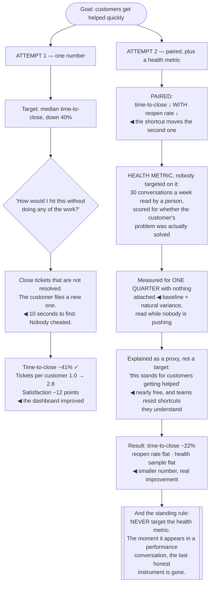

## The model

Numbers change behaviour, which is the point and the problem. The moment a team is judged on a
metric, they begin working on the metric rather than on the thing it was measuring —
[[Goodhart's Law]] operating exactly as described, without anyone cheating.

The design response is not to stop measuring. It is Grove's: **pair every metric with a
counter-metric that moves the wrong way if the first one is being gamed.** A single number will be
optimised in whatever way is cheapest; a pair can only be moved by doing the actual work.

## When to use it

You are choosing what a team will be measured on, or arguing that an existing metric is doing
damage.

1. **What is the cheapest way to move this number?** Ask it adversarially. If the cheapest path is
   not the work you wanted, the metric is already broken.
2. **What gets worse if this improves?** That is your **counter-metric**, and it belongs on the
   same dashboard as the one it constrains.
3. **Is this measuring an outcome or an activity?** Activity metrics — tickets closed, lines,
   commits — are **vanity metrics** with a cost, because they can be moved without producing
   anything.

## Speedrun

**What** — pairs of numbers, chosen so that gaming one shows up in the other.

**How to design them**

1. **Start from the outcome you want**, then find the closest measurable proxy. Never start from
   what is easy to measure.
2. **Pair speed with stability.** Deploy frequency against change failure rate; velocity against
   incident count. This is the single most reliable pairing in engineering.
3. **Add a [[health metric]]** that nobody is targeted on — a sample, a survey, a qualitative
   review. Something the optimisation pressure cannot reach.
4. **Prefer ratchets to targets** where the metric is gameable. "Coverage may not decrease" is
   useful; "hit 85% coverage" produces tests that assert nothing.
5. **Use the four DORA measures** as the default engineering set: deploy frequency, lead time for
   changes, change failure rate, time to restore.
6. **Re-examine annually.** A metric that was a good proxy two years ago may have been optimised
   into meaninglessness, and nobody will notice unless someone checks.

**Why it works** — a proxy is trustworthy only while nobody is pushing on it. Pairing restores the
link between the proxy and the goal, because the shortcuts that move one metric move the other in
the wrong direction.

**The question that catches most bad metrics** — "how would I hit this target without doing any of
the work?" If you can answer in ten seconds, so can everyone else.

## Going deeper

### Pairing, and why it is the whole technique

Grove's practice of paired indicators is the most durable idea here: for every measure of quantity,
carry a measure of quality that would degrade if the quantity were pursued carelessly.

The engineering pairs that work:

- **Deploy frequency** against **change failure rate.** Shipping more, breaking less. Either alone
  is trivially gameable — deploy nothing, or deploy constantly and let quality fall.
- **Lead time** against **time to restore.** Fast to ship, fast to recover.
- **Throughput** against **incident count** or **escalation rate.**
- **Cost per request** against **containment** or a quality score, for anything model-backed.

The mechanism is that the cheap path to moving one metric is visible in the other. A support team
closing tickets faster by closing them unresolved shows up immediately in reopen rate, so the
shortcut stops being a shortcut.

The four DORA measures are a well-evidenced instance of this design rather than a separate idea.
Two speed measures and two stability measures, and the *Accelerate* finding that high performers
improve both simultaneously is what makes the set trustworthy — the tradeoff people assume is
there does not appear in the data.

The pairing has to be visible in the same place, though. A quality metric that lives on a different
dashboard, reviewed by different people, does not constrain anything.

### Leading, lagging, and health

Three roles, and confusing them is a common source of bad targets.

A **lagging metric** measures the outcome you actually care about — revenue, retention, incidents per
quarter. They are the truth and they arrive too late to steer with.

A **leading metric** predicts a lagging one and moves sooner — deploy frequency, lead time, escalation rate.
They are steerable and they are proxies, which means they are exactly the ones that Goodhart
applies to.

A **health metric** is one nobody is targeted on. A sample of outputs reviewed by a person, a
quarterly survey, a qualitative read. Their entire value is that no optimisation pressure touches
them, so they still measure what they appear to measure.

The health metric is the part most organisations skip and the one that catches the failures the
others cannot. When every targeted number looks good and the health sample says quality is falling,
the targeted numbers have been optimised — and without the sample there is no way to know.

The corollary is a rule worth holding: **never target a health metric.** The moment it appears in a
performance conversation it becomes a leading metric, and you have destroyed the only instrument
that was still telling the truth.

### The specific bad metrics

Some measures are reliably worse than nothing, and they recur across organisations.

**Lines of code, commits, pull requests.** Pure activity, trivially inflatable, and they reward the
opposite of good engineering — deleting code is usually the higher-value act.

**Story points and velocity as a target.** Points are a planning aid; as a target they inflate.
Velocity is useful *to the team* for forecasting and destroyed the moment it is reported upward.

**Test coverage as a target.** Coverage falling is a real signal; coverage as a goal produces tests
that execute code and assert nothing. This is why the ratchet form works and the target form does
not.

**Tickets closed.** Rewards closing over resolving, exactly as in the canonical Goodhart example,
and the pair it needs is reopen rate.

**Utilisation.** Teams driven to 100% utilisation have no slack, and queueing theory says wait
times grow without bound as utilisation approaches capacity. High utilisation is a symptom of a
system about to be slow, not of efficiency.

The common thread: each measures effort or output volume rather than outcome, and each has a cheap
path to improvement that produces nothing. The ten-second adversarial question catches all of them.

### Introducing and retiring metrics

How a metric is introduced determines whether it survives contact with the organisation.

**Measure before you target.** Watch a number for a quarter with nothing attached to it. That tells
you the baseline, the natural variance, and — crucially — what it looks like when nobody is pushing
on it, which is the only honest reading you will ever get.

**Explain what it is a proxy for.** A team that understands the number stands for "customers get
helped" will resist the shortcuts; a team told to move a number will move the number. This is the
cheapest defence against Goodhart available and it is almost free.

**Let the team choose the leading metrics** where possible. Ownership of the measure produces
better measures and much less gaming, because the team knows the shortcuts and has no interest in
taking them.

**Retire them.** Metrics accumulate, and a dashboard with thirty numbers is one nobody reads. An
annual review that removes the ones that no longer inform a decision is what keeps the remaining
ones meaningful.

And watch for the specific failure of a proxy that has drifted. A metric can be a good proxy for two
years and then stop, because the system changed or because it was quietly optimised — and nothing
about the number's appearance tells you which. The health sample is how you find out.

## See it work

A support-tooling team, measured twice.

The first attempt is what a reasonable person writes. Time-to-close is a genuine proxy for customers
being helped quickly, it was measured accurately, and the target was ambitious but not absurd —
which is why this shape of mistake is so common.

The adversarial question finds the failure in ten seconds. Closing an unresolved ticket ends the
clock and the customer files a new one, so the number improves while the thing it stood for gets
worse — and nobody involved had to act in bad faith for that to happen.

The pair is what closes the shortcut. Reopen rate moves the wrong way for exactly the behaviour that
moves time-to-close cheaply, so the only path that improves both is resolving problems, which was
the goal all along.

The health metric is the part that gets skipped and the only instrument immune to the pressure.
Thirty conversations a week, read by a person, scored on whether the problem was actually solved —
if every targeted number improves and this one falls, the targeted numbers have been optimised, and
without it there is no way to detect that.

And the smaller result is the better one. Twenty-two percent with reopens and quality flat is a real
improvement; forty-one percent with satisfaction down twelve points is a dashboard. The second one
looks better in every report that only shows one number.

## Next

Planning covers the process these metrics feed, and why the annual version of it is usually
fiction.
