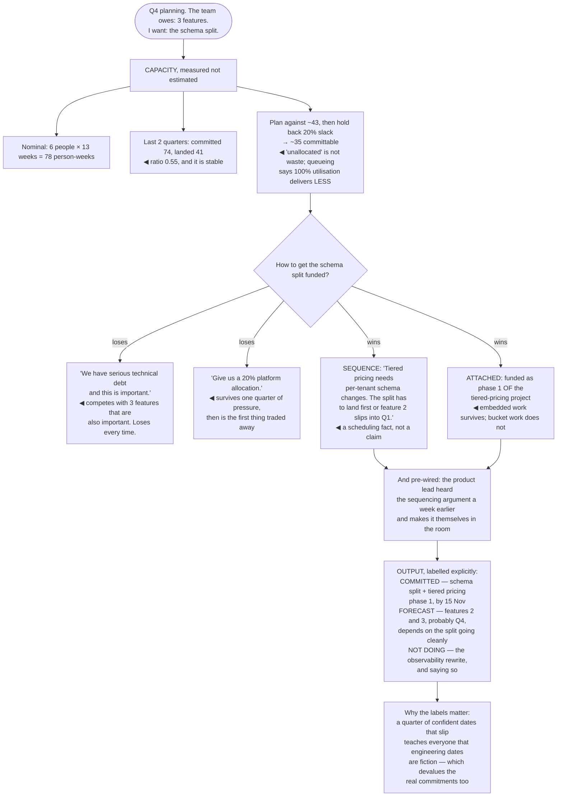

## The model

Planning is where the organisation decides what gets built, and engineers frequently treat it as
overhead imposed by other people. That is the mistake that costs the most, because the arguments
lost there are lost silently.

If reliability work, migrations and platform investment are not in the plan, they will not happen —
regardless of how correct they are or how well you can explain them in April. Reilly's point is
that showing up to planning with a sequencing argument is one of the highest-leverage things a
staff engineer does, and most of them delegate it to their manager.

## When to use it

A planning cycle is starting, or you are being asked to commit to dates.

1. **Is this a commitment or a forecast?** They are different things and conflating them is the
   root of most planning dysfunction.
2. **What is the real capacity?** Not headcount times weeks. Subtract on-call, support, holidays,
   interviews and the work that always arrives.
3. **What has to happen before what?** The **sequencing argument** is where technical judgment
   actually enters the plan, and it is usually the only lever you have.

## Speedrun

**What** — a recurring negotiation about what the next quarter contains, in which technical work
either has an advocate or does not.

**How to be useful in it**

1. **Show up.** Technical work that nobody argues for does not get funded, and the argument
   happens in the room rather than in a document afterward.
2. **Be honest about capacity.** A team of six has nothing like six people of capacity, and
   planning against the fictional number guarantees the plan fails.
3. **Argue sequence, not priority.** "This has to come first because everything else depends on
   it" wins arguments that "this is important" loses.
4. **Attach technical work to something someone wants.** The migration that unblocks the feature
   gets funded; the migration that reduces technical debt does not.
5. **Protect [[slack]].** A plan at 100% capacity has no room for the incident that will happen,
   and queueing means it will run late in a way arithmetic predicts.
6. **Distinguish commitments from forecasts, out loud.** A small number of commitments you will
   keep is worth more than a full quarter of confident guesses.

**Why it works** — the plan is the allocation of the only genuinely scarce resource, which is
engineering time. Everything else is a conversation about it.

**The reframe that gets technical work funded** — stop arguing that it is important. Argue what it
unblocks, in the language of the thing it unblocks.

## Going deeper

### Capacity honesty

The most common planning failure is arithmetic, and it happens before any prioritisation
disagreement.

A team of six over a thirteen-week quarter is not 78 person-weeks. Subtract holiday, on-call and
its recovery, interviews, support rotations, meetings, and the interrupt load that arrives whether
or not it is planned. The realistic figure is frequently 50–60% of the nominal one.

Planning against the nominal number produces a quarter that is late from week one, and the lateness
is then attributed to execution rather than to the arithmetic. Which means the same mistake repeats,
because the wrong lesson was learned.

The number to use is measured rather than estimated. Look at the last two quarters: what was
committed, what landed, and what the ratio was. That ratio is your capacity multiplier and it is
usually stable — and much more persuasive in a planning meeting than an argument about principle.

Larson's framing is that most organisations are running at or beyond capacity permanently, and the
work of planning is largely deciding what to *stop* rather than what to start. A plan that adds
without subtracting is not a plan.

### Slack, and why full utilisation is slow

DeMarco's argument, and Reinertsen's queueing version of it, is the least intuitive thing in
planning: **a team planned to 100% capacity delivers less than one planned to 80%.**

The mechanism is queueing. As utilisation approaches capacity, wait times grow non-linearly —
[[Little's Law]] and the queueing curve behind it are unforgiving near the limit. At 95%
utilisation, any variability produces a queue that takes a long time to drain, and variability is
guaranteed.

Concretely: the incident happens, the urgent customer request arrives, someone leaves. With slack,
those absorb. Without it, everything behind them slips, and the slip propagates through every
dependent piece of work.

Slack also buys the things nobody plans and everyone needs — the opportunistic fix, the
investigation that prevents an incident, the half-day that turns into a genuinely better design.
A plan with no unallocated time produces none of them.

The practical version is planning to about 70–80% of measured capacity, and being explicit that the
remainder is not waste. That is a hard argument to make, because unallocated capacity looks like
inefficiency to anyone who has not read the queueing maths — which is why having the arithmetic
ready matters.

### Commitments and forecasts

**Commitment vs forecast** is a distinction that removes an enormous amount of dysfunction once
everyone uses it consistently.

A **commitment** is a small number of things you are confident about and will treat as fixed —
other teams can plan against them, and if one is at risk you raise it early and loudly.

A **forecast** is what you currently expect, with uncertainty attached. It will change, everyone
knows it will change, and nobody should build a dependency on it without asking.

The dysfunction comes from treating everything as a commitment. A quarter of confident-sounding
dates, most of which slip, teaches everyone that engineering dates are fiction — which then makes
the real commitments untrustworthy too, and that is the expensive part.

The healthy shape is a few commitments, a larger set of forecasts, and explicit labelling.
"Committed: the reconciliation fix, done by 15 October. Forecast: the reporting migration, probably
November, depends on whether the schema split goes cleanly." Both are useful and only one is a
promise.

Grove's related point is that the value of a plan is mostly in the thinking, not the document. The
plan will be wrong; the question is whether the process surfaced the dependencies and tradeoffs
before they arrived on their own.

### Getting technical work into the plan

Technical work loses prioritisation arguments for a structural reason: its benefit is diffuse and
delayed, and it competes against features whose benefit is specific and soon.

Four moves change that, in rough order of effectiveness.

**Attach it to something wanted.** The schema split does not get funded; the schema split that
makes the tiered-pricing feature possible does. This is the single most reliable technique and it
requires knowing the roadmap well enough to find the attachment point.

**Argue sequence rather than importance.** "This has to happen before the three things you already
committed to" is a scheduling fact. "This is important" is a claim competing with every other
claim, all of which are also true.

**Price it in the language of the audience.** Forty engineer-days a year and three declined
features is a number a director can weigh. "The code is bad" is not, as the [[technical debt]]
argument covers in detail.

**Get a sponsor before the meeting.** The [[pre-wiring]] argument applies here more than anywhere:
a planning meeting is where positions are ratified, and the person who will argue for your work when
you are not speaking is worth more than your own slide.

The thing to avoid is the separate technical-debt bucket that gets cut first. A percentage
allocation — "20% for platform work" — survives one quarter of pressure and then becomes the first
thing traded away. Work embedded in funded projects survives; work in a bucket does not.

## See it work

A staff engineer entering a quarterly planning cycle.

The capacity arithmetic comes first and settles more than any argument about priorities.
Seventy-eight person-weeks is the number on the slide; fifty-five percent of it is what has landed
in each of the last two quarters, and planning against the first number guarantees a plan that is
late from week one and blamed on execution.

The measured ratio is what makes the argument winnable. "We historically deliver 55% of what we
commit" is a fact about two quarters of evidence, and it is far more persuasive than any principled
case for conservative estimates.

Both losing arguments are ones engineers make constantly. "This is important" competes against three
features that are also important, and a percentage allocation for platform work is the first thing
traded when the quarter gets tight — so the technical work is funded on paper and cut in practice.

The sequencing argument wins because it is not a claim about value at all. Tiered pricing needs
per-tenant schema changes, so the split either lands first or feature two moves into Q1 — that is a
scheduling consequence anyone can verify, and it does not require agreeing that technical debt
matters.

And labelling commitments separately from forecasts is what protects the next quarter. Two
commitments that land and two forecasts that move is a credible engineering organisation; four
confident dates where two slip teaches everyone that none of the dates mean anything.

## Next

Hiring and levelling closes the group: the other lever on capacity, and the one where a staff
engineer's judgment has the longest half-life.
