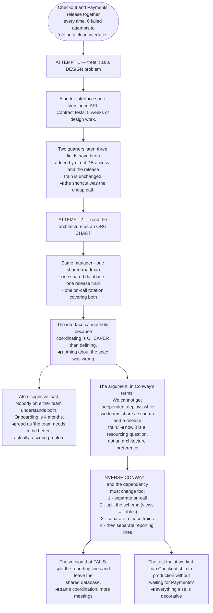

## The model

[[Conway's Law]] says an organisation designing a system produces a design that copies the
communication structure of the organisation. Sixty years on, it is one of the most reliably
observed things in software.

The practical consequence for a staff engineer is that many architecture arguments are
organisational arguments in disguise. Two teams that cannot decouple their systems frequently
cannot decouple because they share a manager, a roadmap or a database — and no amount of interface
design fixes a communication structure that requires them to coordinate anyway.

## When to use it

You are proposing a boundary, or trying to understand why one keeps failing to hold.

1. **Who has to talk to whom to ship this?** That is the real architecture, whatever the diagram
   says.
2. **Can one team own this end to end?** If a change requires three teams to release together, the
   boundary is in the wrong place regardless of how clean the code is.
3. **What is the team's [[cognitive load]]?** A team owning more than it can hold in its head will
   degrade every part of it, and the fix is scope rather than effort.

## Speedrun

**What** — the observation that structure follows communication, and the deliberate use of it.

**How to apply it**

1. **Read the current architecture as an org chart.** Where systems are tangled, the teams are
   usually coupled — and that is the thing to change.
2. **Draw the boundary where a team can own it end to end**, including deploy, on-call and the
   decision to change it. Partial ownership produces partial accountability.
3. **Use the [[inverse Conway manoeuvre]]** where you can: change team structure to get the
   architecture you want, rather than fighting the structure with design.
4. **Bound cognitive load.** Skelton and Pais' central claim is that a team's capacity to hold
   domains is the binding constraint, and most teams are over their limit.
5. **Make the interaction mode explicit** — collaboration, a service, or a facilitated handover.
   Ambiguity about which one is in play is a reliable source of friction.
6. **Expect the structure to reassert itself.** An architecture that fights the org chart will be
   eroded, quietly, by everyone taking the path of least resistance.

**Why it works** — communication paths determine what is cheap to change. Two people on the same
team change an interface in an afternoon; two teams in different reporting lines negotiate it over
a month, so the interface hardens whether or not anyone intended it to.

**The test for a boundary** — can this team ship a change to production without waiting for
another team? If not, the boundary is decorative.

## Going deeper

### Reading architecture as an org chart

The diagnostic move is to look at a tangled system and ask what the team structure is, because the
tangle usually has an organisational cause and an organisational fix.

The recurring shapes, and what each one actually is:

- three services that always release together are one system with three deployment units, usually
  because one team owns all three or three teams share a roadmap
- a shared database between two teams is a communication requirement expressed in schema
- an interface that keeps growing is two teams who talk constantly and have no incentive to define
  what they need

Conway's original argument explains the mechanism: the design is constrained by the communication
structure available to the designers. If the only way for two groups to coordinate is a weekly
meeting, the interface between their systems will be as coarse as that meeting allows.

Which means an architecture proposal that requires more communication than the organisation
supports will not survive. You can design a clean boundary between two teams that share a manager
and a deadline, and within two quarters there will be a shortcut across it — not from
carelessness, but because the shortcut is the cheap path and cheap paths win.

The useful inversion: when a boundary keeps eroding, stop redesigning it and ask what
communication requirement is pushing through it.

### The inverse Conway manoeuvre

[[inverse Conway manoeuvre|The inverse Conway manoeuvre]] is deliberately restructuring teams to produce the architecture
you want, rather than designing an architecture and hoping the organisation accommodates it.

It is the highest-leverage version of this insight and the one staff engineers can least often
execute alone — team structure is a manager's decision. What you can do is supply the argument, and
supplying it in Conway's terms is what makes it land: "we cannot get independent deploys while the
two teams share a schema and a release train" is a resourcing conversation rather than an
architectural preference.

The manoeuvre works because it changes what is cheap. Once two groups are separately staffed,
separately on call and separately accountable, defining the interface between them becomes in their
own interest — and the design you wanted starts to happen without you advocating for it.

The costs are real and worth stating. Reorganisations are disruptive, they lose context, and they
are frequently done for reasons unrelated to architecture. Proposing one to fix a design problem is
a large ask and should be reserved for cases where the design problem is genuinely structural.

There is also a version that fails: restructuring teams without changing the underlying
dependencies. Two teams that still share a database and a deadline will coordinate exactly as much
as before, with more meetings, because the reporting line was never the binding constraint.

### Cognitive load as the real limit

Skelton and Pais' argument is that team boundaries should be drawn to fit within a team's
**cognitive load** — the total amount a team can hold, understand and be responsible for — and that
most teams are well past theirs.

The three kinds they distinguish are worth separating. Intrinsic load is the difficulty of the
domain itself. Extraneous load is the accidental overhead — deployment complexity, undocumented
tooling, environments that do not work. Germane load is the part that produces value, and it is
what gets squeezed when the other two grow.

The practical consequence: reducing extraneous load is usually the cheapest capacity increase
available. A [[paved road]] that removes deployment complexity does not make the team smarter, it
returns the attention that was being spent on accidental work.

The overload signals are consistent — no team member understands the whole scope, changes in one
area break another nobody predicted, on-call requires a specialist per system, and onboarding takes
months. All four are read as "the team needs to be better" and all four are scope problems.

The fix is to reduce what the team owns, and the two ways are splitting the team or removing
systems from it. Both are unpopular and one of them is usually correct, and "work harder" is
neither.

### Ownership that actually holds

An **ownership boundary** is only real if the owning team can change what they own without waiting
for anyone.

The checklist is short and rarely fully satisfied:

- can they deploy independently?
- do they hold the pager?
- do they decide the roadmap for it?
- can they change the interface without a negotiation?

Each "no" is a place where accountability is diluted, and where the boundary will erode under
pressure.

Partial ownership is the common failure and it is worse than either extreme. A team that is on call
for something they cannot change gets the cost with none of the control — which is the exact
control mismatch that produces resentment and, eventually, an unowned system.

*Accelerate* provides the empirical support: loosely coupled architectures and autonomous teams
correlate strongly with delivery performance, and the specific measure that matters is whether a
team can deploy and test independently of other teams' schedules. That is a boundary question, not
a code-quality question.

And ownership has to be recorded and reviewed, because reorganisations create [[orphaned
system|orphans]] silently. A register of systems with a named owning team, checked whenever teams
move, is unglamorous and is the difference between an ownership model and an aspiration.

## See it work

Two teams that cannot decouple, diagnosed twice.

Five weeks of interface design was not wasted effort so much as effort aimed at the wrong layer.
The spec was fine; the reason it eroded is that direct database access remained cheaper than using
it, and cheap paths win over correct ones every time.

Reading the same situation as an org chart produces a different and more actionable diagnosis. One
manager, one roadmap, one database, one release train and one rotation is a single team with two
names — and no interface between two halves of one team survives contact with a deadline.

The cognitive load observation is a separate finding from the same look. A four-month onboarding
and nobody understanding both systems reads as a hiring or capability problem, and it is a scope
problem — the team owns more than it can hold, and effort does not fix that.

Stating the argument in Conway's terms is what converts it into something a manager can act on.
"Two teams sharing a schema and a release train cannot deploy independently" is a claim about
resourcing and structure; "we should have cleaner boundaries" is a preference that competes with
every other preference.

And the warning branch is the one that catches people who have read the theory. Splitting the
reporting lines while leaving the shared database changes nothing that mattered — the dependency
was the binding constraint, and the org chart was only the reason nobody had removed it.

## Next

Incidents and postmortems covers what happens when these boundaries fail in production, and how an
organisation converts that into knowledge rather than blame.
