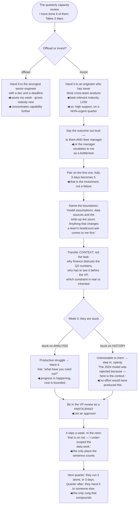

## The model

Everyone knows they should delegate. The reason it does not happen is not ignorance — it is that
delegation done badly is genuinely worse than doing it yourself, and most people have experienced
the bad version.

The bad version is handing over a task and hoping. The good version is a **handover**: the outcome
stated publicly, the first instance done together, the decision boundaries named, and an explicit
statement that if it goes wrong it lands on you. That is more work than doing the task. It is also
the only thing that produces someone who can do it next time.

## When to use it

Something is on your plate that someone else could grow into.

1. **Is this an offload or an investment?** Handing over what is already easy for you saves your
   week and grows nobody. The stretch is where the value is.
2. **What has this person done before?** Grove's point about task-relevant maturity: the same
   person needs close support on an unfamiliar task and none on a familiar one, and the mistake is
   calibrating to the person rather than the task.
3. **Which decisions are theirs now?** If you have not named them, every decision comes back to
   you and the delegation has made things slower.

## Speedrun

**What** — a structured transfer of a piece of work, where you keep the accountability and they
gain the capability.

**How to hand over**

1. **Say the outcome out loud**, to them and to their manager. Accountability nobody else knows
   about is not accountability.
2. **Pair on the first instance.** Not a handover document — do one together, so the parts that
   are hard surface while you are both there.
3. **Name the decision boundaries explicitly.** Which calls are theirs, which come to you, and what
   the threshold is. Ambiguity here is what turns a handover into hovering.
4. **Transfer the context, not just the task** — the history, the people, why the odd thing is
   odd. The task is the easy part to hand over.
5. **Book yourself into the risky moment** as a participant, not an approver. An approver adds a
   gate; a participant absorbs risk.
6. **Say "if it slips, that is on me"** — and hold to it in the retro, which is the only place it
   counts.

**Why it works** — capability transfers through doing, with support, on something that matters. It
does not transfer through documents, and it does not transfer through work that was already easy.

**The cost to accept** — the first handover is slower than doing it yourself, and probably the
second. That cost is the investment, and treating it as a failure of the process is why people stop.

## Going deeper

### Task-relevant maturity

Grove's concept is the most useful calibration tool here: how much support someone needs is a
property of **the person and the task together**, not of the person.

A strong senior engineer running their first cross-team migration needs close support, and it is
not a comment on their ability. The same person running their third needs none. Calibrating to
"they're senior, they'll be fine" is how good engineers get dropped into work they had no way to
succeed at.

The support level maps roughly: low maturity on this task means structure, frequent check-ins and
pairing; high maturity means an outcome, a boundary, and getting out of the way. The failure in
both directions is real — under-supporting looks like abandonment, and over-supporting looks like
distrust and removes the learning.

The check that keeps it honest is asking them. "How much do you want me involved in this?" is a
question most people answer accurately, and it converts a guess into an agreement you can revisit.

And it moves. A handover that started with weekly pairing should be visibly reducing over a
quarter, and if it is not, one of you has become comfortable with an arrangement that was meant to
be temporary.

### The handover, step by step

Each step in the sequence is there because a specific failure happens without it.

**Saying the outcome out loud, including to their manager.** Without it, the owner appears to be on
their own, and their manager escalates *to you* as a bottleneck rather than coming to you as a
backstop. It also makes your accountability real to someone other than you.

**Pairing on the first instance.** A document records what you already knew; pairing surfaces the
parts you would have handled by instinct. Those instincts are most of the value and they are the
hardest thing to write down.

**Naming decision boundaries.** "You own it" without specifics means every decision returns to you,
and the work is now slower than before. The useful form is a threshold: "anything under a week's
work or £5k is yours; above that, tell me first."

**Transferring context.** The task is the easy part. What they need is the history — why the
previous attempt stopped, who has to be consulted, which constraint is real and which is
inherited — and none of that is in a ticket.

**Being in the risky moment as a participant.** The cutover, the migration switch, the difficult
conversation. An approver adds a gate and a delay; a participant absorbs risk and is visibly
sharing it.

**"If it slips, that is on me."** Worth nothing unless it survives the retro. If it slips and you
let the owner absorb it, everyone learns the sentence was decoration, and your next handover is
declined.

### Productive struggle, and when to step in

**Productive struggle** is the part where someone is stuck and learning, and it is
indistinguishable from the beginning of a failure. Telling them apart is most of the skill.

Struggle is productive when they are making progress, however slowly, and when the cost of the
detour is bounded. It stops being productive when they are stuck on something unknowable — a
piece of history, a political constraint, a decision made two years ago — because no amount of
effort produces information that is not available to them.

The default should be later than feels comfortable. The instinct to rescue is strong, and rescuing
early teaches that struggling produces a rescue, which removes the mechanism you were trying to
build.

The intervention that helps most is a question rather than an answer. "What have you ruled out?"
or "what would you do if I were on holiday?" keeps ownership with them and frequently unblocks
without transferring the decision.

And when you do step in, be explicit about what is happening and why: "I am going to take this
piece because of the deadline, and here is what I would have done." Silent rescues are the ones
that damage, because the person cannot tell whether they failed.

### Delegation poverty

**Delegation poverty** is the state where you cannot delegate because nobody is ready, and nobody
is ready because you never delegated. It is self-reinforcing and it is where a lot of senior
engineers live.

The way out is deliberately taking the slower path on something that is not urgent. A handover
during a crunch is a bad handover — no time to pair, no room for the learning detour — so the
investment has to be made when there is slack, which is exactly when it feels unnecessary.

There is a second-order version worth naming. If you only ever delegate to the person who is
already strongest, you concentrate capability rather than distributing it, and the [[opportunity
allocation]] problem compounds — the same person gets every growth opportunity and everyone else
stays where they are.

The measure that tells you whether this is working is not how much you handed over. It is how many
people can now do something they could not do before, and whether any of them has started handing
things over themselves.

Reilly's framing closes it: the objective is to make yourself unnecessary for the things you are
currently necessary for. That is uncomfortable, and it is the only version of the role that scales
past one person's week.

## See it work

Handing over a quarterly capacity review.

The choice at the top is the whole page. Handing it to the strongest engineer is faster, safer, and
produces nothing new — and it quietly makes the capability concentration worse, because that person
already had every opportunity like this one.

Task-relevant maturity is why the support level is high without it being a judgment. This engineer
is capable and has never done cross-team analysis, so the correct response is structure and pairing
— and choosing a non-urgent quarter is what makes that affordable.

Five days instead of three is the investment stated plainly. Treating that overrun as evidence that
delegation does not work is the specific reasoning that produces delegation poverty, and it is the
most common way people talk themselves out of the second attempt.

Week three separates the two kinds of stuck, and the distinction is what makes intervention a skill
rather than a reflex. Stuck on the analysis is learning and should be left alone with a question;
stuck on why the 2024 model was rejected is unknowable to them, and no amount of persistence
produces information that exists only in someone else's head.

Owning the slip in the retro is what makes the next handover possible. The sentence was said at the
start and it only means anything at the end — and the engineer who watched their sponsor absorb a
public slip is the one who will accept the next stretch assignment.

## Next

Sustainability closes the group, because everything on this page assumes the person doing it still
has the capacity to invest.
