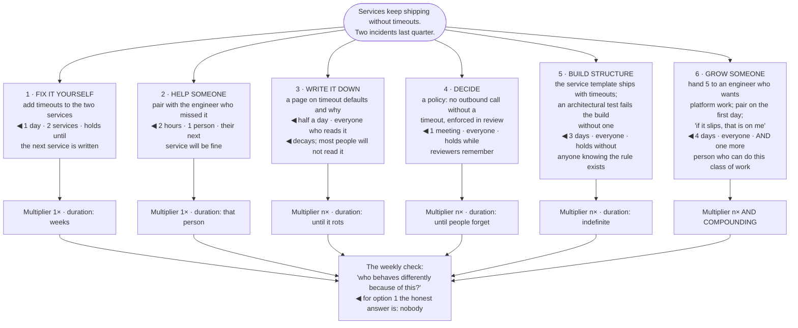

## The model

Grove's definition is the useful one: your output is the output of your organisation plus the
output of the neighbouring organisations you influence. Not what you produced — what changed
because you were there.

That reframing has an uncomfortable consequence. An afternoon writing code produces an afternoon of
code. An afternoon writing the document that stops four teams from building the same thing
differently produces four teams of changed behaviour. Both feel like a day of work, and they differ
by an order of magnitude — which is why **leverage** has to be chosen deliberately rather than
felt.

## When to use it

You are deciding what to spend a week on.

1. **How many people does this change?** One-to-one help is real and bounded. **One-to-many** work
   — a document, a tool, a default — has a multiplier.
2. **Does it persist?** A decision made in a meeting lasts until the next meeting. The same
   decision in a lint rule holds without anyone remembering it.
3. **Would this happen without me?** If yes, your involvement is not the scarce input, however
   useful you are being.

## Speedrun

**What** — a way of ranking work by what changes rather than by what gets produced:

| | Multiplier | Persists | Example |
|---|---|---|---|
| Doing it yourself | 1× | no | writing the code |
| Helping someone | 1× | somewhat | pairing, reviewing |
| Teaching | n× | yes | a written explanation, a talk |
| Deciding | n× | until reversed | a policy, an interface |
| Building structure | n× | yes | a tool, a default, a paved road |
| Growing people | n× compounding | permanently | sponsorship |

**How to find it**

1. **Ask the multiplier question**: how many people behave differently because of this, and for
   how long?
2. **Prefer structure over vigilance.** Anything holding because people remember it will stop
   holding. Anything holding because the build fails will not.
3. **Write once instead of explaining five times.** The threshold is low — the second time you
   explain something, write it down.
4. **Unblock rather than solve.** Removing the obstacle that is stopping four people is worth more
   than doing one of their tasks well.
5. **Spend on the small fraction that matters.** [[Pareto principle]] applies to your calendar as
   much as to anything else, and most of your week is not where the value is.
6. **Notice the pull toward low-leverage work**, because it is the pleasant work. Merged PRs are
   satisfying today; a policy pays out in six months and nobody notices.

**Why it works** — organisations have far more work than people, so the constraint is never how
much one person can produce. It is how much a system of people can produce, and that is what a
staff engineer can actually move.

**The check that recalibrates a week** — list what you did, and for each item name who behaves
differently now. Most weeks the honest answer for most items is "nobody".

## Going deeper

### Grove's arithmetic

Grove's formulation from *High Output Management* is `output = output of your organisation +
output of neighbouring organisations you influence`, and the reason it is worth taking literally is
that it changes what counts as a productive day.

He also gives the multiplier form: **managerial leverage** is the number of people affected times
the impact per person times the duration. Each term is a lever, and the second and third are the
ones engineers systematically ignore.

Worked concretely. Fixing a bug takes an afternoon and affects one system once. Writing the test
that prevents that class of bug takes a day and affects every engineer touching that code, forever.
The second is more than ten times the first and it feels less productive while you are doing it.

The duration term is the one that quietly dominates. A decision that holds for two years, in an
organisation of forty engineers, has an enormous denominator — which is why the boring
infrastructure of persistence (writing it down, encoding it, defaulting it) beats the exciting
version of the same idea.

Negative leverage is also real and is worth naming. A bad default, a wrong abstraction, or a
badly-run meeting series multiplies too, in the wrong direction. The same arithmetic that makes
structure valuable makes bad structure expensive.

### The ladder of persistence

The most reliable way to rank two options is to ask what makes each one hold, which is the same
ladder as [[quality leverage ladder|improving quality]] and generalises past quality.

**Doing it yourself** holds for exactly as long as you are doing it. Necessary sometimes, never
leverage.

**Helping one person** improves their next attempt. Genuinely valuable, bounded at one person, and
it is where most senior engineers' time goes by default.

**Writing it down** converts one conversation into an unbounded number. The threshold for doing
this is much lower than people apply — the second time you explain something is the moment, not the
fifth.

**Deciding** — a policy, an interface, a standard — settles many future decisions from one act. Its
value is the count of decisions it removes, which is why vagueness is expensive: a policy that does
not exclude anything settles nothing.

**Building structure** is the top of the ladder for things that can be encoded. A template, a
generator, a default, a build-time check. Nobody has to know the rule, because the easy path already
follows it.

**Growing people** is the only one that compounds. An engineer who becomes capable of doing what you
do produces indefinitely, and produces people themselves. It is slower than everything else on the
list and it has no ceiling.

### Where the pull goes wrong

The gravitational pull is toward low-leverage work, and it is not weakness — it is a feedback-timing
problem.

Writing code gives you a merged PR, a green build, and a visible artifact today. Setting technical
direction gives you, in six months, a thing that did not go wrong — and nobody notices an incident
that failed to occur. One of those rewards you this afternoon.

The specific traps recur across the role:

- taking the hardest ticket because you are fastest
- being the escalation point because you resolve them quickest
- reviewing everything because your reviews are good

Each is locally correct and structurally wrong, and each is the [[the hero trap|hero pattern]] wearing a
different hat.

The counter-move is not discipline, it is measurement. At the end of a week, list what you did and
name who behaves differently. That five-minute audit surfaces the drift faster than any intention
to be more strategic.

The exception worth protecting: staying technically current has leverage that does not show up in
this arithmetic. An architect who has not written code in three years loses the judgment the role
runs on. The point is that hands-on time should be chosen for what it teaches you, not defaulted
into because it feels productive.

### Delegation as leverage, not offloading

The highest-leverage version of handing work over is the one that grows someone, and it looks
different from the version that just moves a task.

Offloading asks: what can I get off my plate? Growing asks: what would stretch this person, and
what support makes it survivable? The first optimises your week; the second optimises the team's
capacity, permanently.

Which means delegation should be slower than doing it yourself, at least the first time, and that
cost is the investment rather than a failure of the process. If handing something over is not
costing you time this quarter, you are probably delegating only what is already easy.

The multiplier compounds in a way nothing else on the ladder does. Someone you grew grows others.
Hogan's framing is that sponsorship has a multiplier effect precisely because capability, unlike a
document, reproduces itself.

The check: over the last two quarters, who can do something now that they could not before, because
of you? If the answer is nobody, you have been producing rather than multiplying — regardless of how
much you produced.

## See it work

The same problem, addressed at five points on the ladder.

Option one is the one that feels most like work and produces the least. Two services get timeouts,
the third service written next month does not, and the same incident recurs — with the person who
fixed it feeling productive throughout.

Options three and four look like leverage and only partly are. Both reach everyone in principle,
and both depend on people remembering: a document that is not read and a policy that reviewers stop
enforcing are the two most common ways an apparently high-leverage intervention quietly stops
working.

Option five is where the arithmetic actually changes. Three days buys a state where nobody needs to
know the rule, because the easy path already satisfies it and the build fails if it does not —
duration indefinite, and no vigilance required from anyone.

Option six costs one more day and is categorically different from all of the others. It produces
the same structural fix *and* an engineer who can now do this class of work — and who will
themselves grow someone, which is the only term in Grove's arithmetic that compounds.

And the audit at the bottom is what makes the choice visible in the moment rather than in
retrospect. "Who behaves differently because of this?" answered honestly about option one is
"nobody" — which is a fine answer for a Tuesday afternoon and a poor answer for a quarter.

## Next

Writing as leverage takes the third rung seriously, since writing is the cheapest multiplier
available and the one most engineers underuse.
