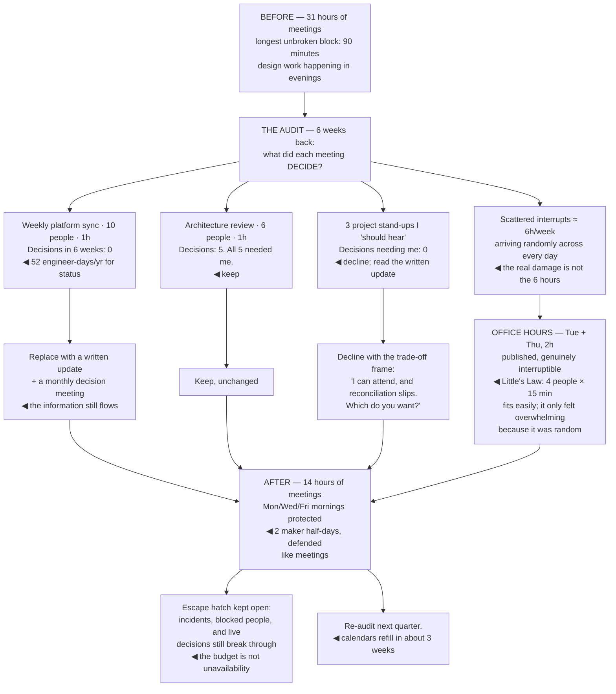

## The model

Nobody decides to spend their week in meetings. Each individual invitation is reasonable — a design
review you genuinely add to, a planning session where your context matters, an incident you know
something about. The calendar fills by accumulation, not by decision.

Graham's distinction explains why this hurts more than the hours suggest. On a **maker schedule**,
work happens in half-day units, and a single meeting in the middle of an afternoon does not cost an
hour — it costs the afternoon. A staff engineer needs both schedules and gets neither by default.

## When to use it

Your calendar is fuller than you chose and you cannot point at what you removed to make room.

1. **What did this meeting decide?** A recurring meeting that has not produced a decision in six
   weeks is a status update that could be written.
2. **What is the fully-loaded cost?** Eight people for an hour is a day of engineering. Priced
   that way, most recurring meetings do not survive.
3. **Where is your contiguous time?** If the answer is "evenings", the schedule is broken and no
   amount of efficiency inside meetings fixes it.

## Speedrun

**What** — a deliberately shaped week: protected blocks, a bounded interrupt channel, and fewer
recurring commitments than arrived by default.

**How to reclaim it**

1. **Audit the calendar.** Six weeks back, per meeting: what did it decide, and would anything be
   worse if you had not been there?
2. **Price meetings in engineer-hours.** Attendees × duration. It is the only framing that makes
   the cost visible to the people scheduling them.
3. **Batch the interrupts.** **Office hours** — a published window where you are interruptible —
   converts scattered interruptions into one bounded block.
4. **Protect contiguous blocks** and defend them like a meeting. Two half-days a week is the
   minimum that produces anything.
5. **Decline with the [[the trade-off frame|trade-off frame]]**, not with a refusal. "I can be
   there and the migration slips — which do you want?"
6. **Replace status meetings with writing.** Anything that is one person talking and others
   listening is a document with worse attendance.

**Why it works** — meetings and interrupts consume the resource that staff work most depends on:
uninterrupted time long enough to hold a whole system in your head.

**The number that ends most recurring meetings** — attendees times hours times a loaded rate. A
weekly one-hour sync with ten people is a quarter of an engineer's year.

## Going deeper

### The two schedules

Graham's essay identifies the structural conflict. A **manager's schedule** is divided into hour
slots, and a meeting costs an hour. A **maker schedule** runs in half-days, because the work needs
enough continuous time to build up the state it operates on.

The asymmetry is what causes the friction. To someone on a manager's schedule, adding a meeting
costs them one hour and costs you one hour, so it looks symmetric and cheap. On a maker schedule, a
meeting at 2pm removes the afternoon — you do not start something substantial in the 90 minutes
before it.

Staff engineers need both and are given neither. The influence work is a manager's schedule:
one-on-ones, alignment conversations, reviews. The technical work is a maker's schedule: design,
prototyping, reading a system deeply enough to have a real opinion about it.

The only reliable resolution is separation rather than balance. Meeting days and making days, or
meeting afternoons and making mornings — a shape where the two kinds of work do not interleave.
Scattering four meetings across four afternoons costs four afternoons; stacking them into one costs
one.

Newport's argument adds the reason the interleaved version is worse than the arithmetic suggests:
the residue of switching persists. You do not resume where you left off, you resume some distance
behind it, and the distance grows with how deep the work was.

### Pricing meetings honestly

The **meeting cost** framing is the single most effective intervention available, and it is
arithmetic rather than persuasion.

Eight people for one hour is one engineer-day. Weekly, that is 52 engineer-days a year — a quarter
of an engineer. Stated that way, "should this recurring meeting exist?" becomes a resourcing
question rather than a preference.

The questions that follow from pricing it:

- **What decision does this produce?** A meeting that has not decided anything in six weeks is
  status, and status is more accurate written.
- **Does everyone need to be here?** Halving attendance halves the cost with no loss when most
  people were listening.
- **Could this be a document with comments?** Most reviews and updates could. Meetings are for
  disagreements that written exchange did not resolve.
- **Does it need to be weekly?** Cadence is usually inherited rather than chosen, and biweekly
  frequently loses nothing.

The one to be careful about is cancelling the meeting where coordination actually happens.
Reilly's caution applies: some meetings look like pure overhead and are the only place two teams
talk, and removing them produces a coordination failure three months later that nobody connects
back.

The test is what replaces it. Cancelling a status meeting and replacing it with a written update is
a strict improvement. Cancelling it and replacing it with nothing means the information stops
flowing.

### Interrupts, and the budget

Being useful makes you interruptible, and at staff level the interrupt volume is high enough to
consume the week if it is unstructured.

The **interrupt budget** framing: decide in advance how much of your week is interruptible, and
protect the rest. Not "I will be less available" as an intention, but a shape — a published window,
a rotation, or a channel someone else watches.

**Office hours** are the highest-return version. A published two-hour window twice a week where you
are genuinely interruptible converts a scattered stream into a bounded block. People wait, which
costs them a little; you get contiguous time, which costs them much less than the alternative.

[[Little's Law]] explains why the wait is usually small. If four people a week need you and each
takes fifteen minutes, a two-hour window is more than sufficient — the queue is short because the
arrival rate is low, and it only *felt* overwhelming because it was arriving randomly.

The structural fix underneath is the same one as everywhere else in the role. Recurring interrupts
are a signal: five people asking the same question is a missing document, and being the only person
who can answer something is a [[the hero trap|hero pattern]] to design out rather than a workload
to manage.

And there is a category that should always break through. A real incident, a genuinely blocked
person, a decision being made right now that you have information about. The point of the budget is
not to be unreachable; it is that everything else can wait two hours.

### Auditing the calendar

The **calendar audit** is a thirty-minute exercise that recalibrates a quarter, and almost nobody
does it.

Take the last six weeks. For each recurring meeting, write down what it decided and whether
anything would have been worse if you had not attended. For each block of unscheduled time, note
whether it was contiguous enough to be useful.

The pattern that usually appears: two or three meetings produce most of the value, several produce
none, and the contiguous time is smaller than it felt. People consistently overestimate how much
uninterrupted time they had, because the fragments feel like the same total.

Then act on it in one pass rather than gradually. Decline the ones that decide nothing, halve
attendance where you can, propose written replacements, and block the contiguous time before the
calendar refills — which it will, within about three weeks.

The maintenance is the part that fails. Calendars re-accumulate, so the audit is a quarterly habit
rather than a one-time cleanup. And the block you protect has to be defended in the same terms as a
meeting: "I have something then" is a complete answer, and treating your own focus time as less
real than someone else's meeting is why it disappears.

## See it work

A staff engineer's calendar, audited.

Thirty-one hours of meetings and a ninety-minute maximum block is the shape that produces design
work in the evenings. Nobody chose it — every one of those meetings was individually reasonable when
it was accepted.

The platform sync is the clearest case and the hardest to cancel socially. Zero decisions in six
weeks, ten people, weekly: fifty-two engineer-days a year spent on information that would be more
accurate written. Pricing it is what makes that arguable rather than rude.

The architecture review survives the same audit unchanged, which is the point of auditing rather
than trimming uniformly. Five decisions, all of which needed the person in the room — this is the
meeting the protected time exists to make room for.

The interrupt fix is not about the six hours. Six hours a week is affordable; six hours arriving in
eleven random fragments across five days is what removes every contiguous block, and batching them
into two published windows costs the interrupters a short wait and returns the week.

And the escape hatch matters as much as the structure. Incidents, genuinely blocked people and
live decisions still break through — the budget exists so that everything *else* can wait two
hours, not so that you become unreachable.

## Next

Sustainability closes the group: the failure mode where all of this is done correctly and the
person doing it runs out anyway.
