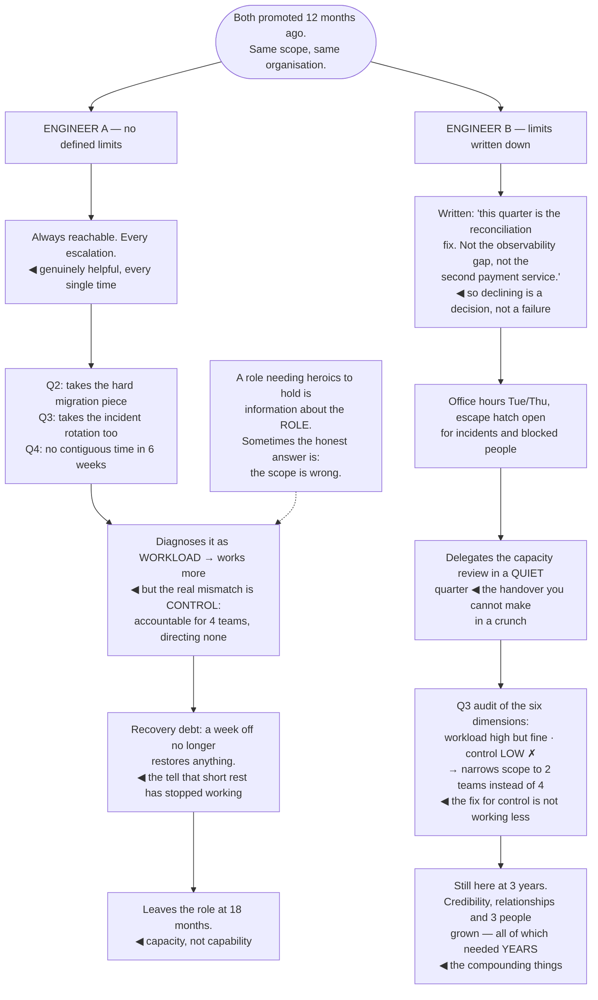

## The model

A senior engineer's job has edges: their tickets, their service, their sprint. A staff engineer's
does not. There is always another team that would benefit, another document worth writing, another
decision that would go better with you in the room.

**The unbounded role** is the structural fact underneath most staff burnout. Nothing tells you when
you are finished, so the stopping point has to be chosen — and the people best suited to the role
are exactly the people least inclined to choose one.

## When to use it

You are in the role, and the question is whether you can still be in it in three years.

1. **What tells you a week was enough?** If the answer is "nothing", you are relying on exhaustion
   as a stopping signal, and it arrives late.
2. **What are you not recovering from?** **Recovery debt** accumulates like any other debt — a hard
   quarter is fine, four in a row is a different thing.
3. **Which of these is actually true: too much work, or too little control?** They feel identical
   and have opposite fixes.

## Speedrun

**What** — a set of deliberate limits, in a role that supplies none.

**How to make it hold**

1. **Define enough, in advance.** A written statement of what this quarter is for, so "not doing
   that" is a decision rather than a failure.
2. **Watch the six dimensions**, not the hours. Maslach's research points at workload, control,
   reward, community, fairness and values — and burnout usually comes from the second and sixth,
   not the first.
3. **Protect recovery like a deadline.** Real evenings, real holidays, real disconnection. Recovery
   is what makes intensity survivable and it is the first thing cut.
4. **Notice the [[the availability trap|availability trap]]** — being reachable makes you more
   useful today and less able to do the work that needed contiguous attention.
5. **Delegate before you need to.** The handover you cannot make in a crunch is the one you needed
   to have made a quarter earlier.
6. **Treat sustained overload as a signal about the system**, not about you. A role that requires
   heroics to hold is a design problem with a person absorbing it.

**Why it works** — capacity is the actual constraint on a multi-year career at this level, and it
is the one nobody measures until it fails.

**The thing to internalise** — the reason staff engineers burn out is rarely the amount of work. It
is caring about outcomes you cannot control, which is a permanent feature of influence without
authority.

## Going deeper

### Why this role in particular

Three properties of staff work make it unusually hard to bound, and none of them is about
workload.

**No natural completion.** There is always another team, another document, another decision. A
sprint ends; technical direction does not, so nothing in the environment produces a "done".

**Responsibility exceeding authority.** You are accountable for outcomes across teams you cannot
direct. Maslach's research identifies lack of control as a stronger predictor of burnout than
workload, and influence without authority is a structural mismatch between those two — which means
the stress is a feature of the role rather than a sign you are doing it wrong.

**Invisible failure.** Nobody notices the incident that did not happen. Success at this level is
frequently the absence of a bad thing, which means the feedback that tells you the work mattered
often never arrives.

Reilly's observation is that the role rewards exactly the people who will over-extend in it —
conscientious, capable, able to see more that needs doing than anyone else. The trait that makes
someone good at it is the trait that makes it dangerous.

The consequence is that limits have to be structural rather than intentional. "I will be better
about this" fails against a role that supplies infinite reasonable work; a written definition of
what the quarter is for does not.

### The six dimensions

Maslach and Leiter's model is more useful than "too much work" because it identifies which mismatch
is actually happening, and the fixes differ completely.

- **Workload** — more than can be done well. The obvious one, and less often the real one.
- **Control** — responsibility without the ability to act. The most common cause at staff level.
- **Reward** — effort that goes unrecognised, which is the default for invisible work.
- **Community** — isolation, which the role produces structurally by placing you between teams.
- **Fairness** — decisions made in ways that feel arbitrary, or credit landing in the wrong place.
- **Values** — being asked to build things you think are wrong. The most corrosive of the six.

The diagnostic value is in telling them apart. Someone working sixty hours on something they
believe in, with credit and control, is tired. Someone working forty hours on something they think
is a mistake, with no control over it, is burning out — and "work less" does nothing for the second
case.

The control dimension is the one to examine first at this level. Feeling responsible for outcomes
you cannot direct is intrinsic to the job, and the resolution is narrowing what you consider yours
rather than gaining authority you will not be given.

The values dimension deserves particular attention because it is the one people ignore longest.
Sustained work on something you believe is wrong is not a resilience problem, and no amount of
recovery addresses it.

### The availability trap

**The availability trap** is that being reachable makes you useful today, and it is the thing that
removes your ability to do the work only you can do.

The mechanism is straightforward. Every interruption is individually small and reasonable, the
person on the other end is genuinely helped, and the cumulative effect is a week with no contiguous
block in it. Being available is also socially rewarded in a way that being unreachable for a morning
is not.

The [[error budget]] framing transfers usefully here. You have a budget of interruptibility, and
spending all of it means nothing is left for the moments that genuinely need you — so the question
is not whether to be available but how much, on what, and when.

The structural version is the fix: [[office hours]] rather than permanent availability, an explicit
escape hatch for real emergencies, and someone else in the rotation for the recurring things. All
of these are covered as calendar mechanics; the point here is that they are also the load-bearing
part of not burning out.

And there is a related trap in being the only person who can do something. It feels like security
and it is the opposite — it removes your ability to take a holiday, to be ill, or to change teams,
and it is the [[the hero trap|hero pattern]] compounding into a personal constraint.

### Recovery, and the long view

**Recovery debt** is the accumulated deficit from sustained intensity, and it behaves like any other
debt: manageable in small amounts, compounding if never paid.

A hard quarter is fine. Four hard quarters in a row is a different phenomenon, and the tell is that
recovery stops working — a weekend or a week off no longer restores anything, which is the signal
that the debt is past what short rest addresses.

What actually recovers people is more specific than time off. Genuine disconnection rather than
low-grade monitoring; sleep, which is the one non-negotiable; something with a completion you can
see; and people who are not colleagues. A holiday spent checking messages is not recovery, it is
the same load in a different location.

The on-call literature is relevant because the same mechanism applies. The SRE practice of capping
interrupt load and requiring recovery after incident-heavy periods exists because sustained
vigilance degrades judgment measurably — and the degradation is invisible from inside.

The long view is the part worth ending on. This is a career measured in decades, and the
sustainable version outperforms the intense version by a wide margin — because the compounding
things at this level, credibility and relationships and people you have grown, all require
being present over years rather than being maximal over months.

And a role that requires heroics to hold is information about the role. Sometimes the honest
conclusion is that the scope is wrong, the organisation is understaffed, or this particular job is
not survivable — and naming that is a better outcome than absorbing it privately until something
breaks.

## See it work

Two staff engineers, four quarters in.

Engineer A does nothing wrong at any single point. Every escalation taken was one they could resolve
fastest, every extra piece of scope was real, and the helpfulness was genuine each time — which is
exactly why nothing in the environment corrected it.

The misdiagnosis in Q3 is the decisive moment. Reading it as workload leads to working more; the
actual mismatch is control — accountable for four teams' outcomes while directing none — and no
amount of additional hours addresses a control deficit. The two feel identical from inside and have
opposite fixes.

Recovery stopping working is the signal that matters, and it arrives late. A week off that restores
nothing means the debt has passed what short rest addresses, and by then the available options are
much narrower than they were two quarters earlier.

Engineer B's written quarter statement is the cheapest intervention on the diagram. Naming what the
quarter is *not* for converts every subsequent decline from a personal failing into a decision that
was already made — which is the difference between limits that hold and limits that are intentions.

And the Q3 audit is what makes B's version durable rather than lucky. Diagnosing low control and
responding by narrowing scope from four teams to two is a fix aimed at the actual mismatch, and it
is what leaves them present three years later — long enough for credibility, relationships and
grown people to have compounded at all.

## Next

The Organisational systems group steps back from the individual: the structures that decide how
much of this pressure exists in the first place.
