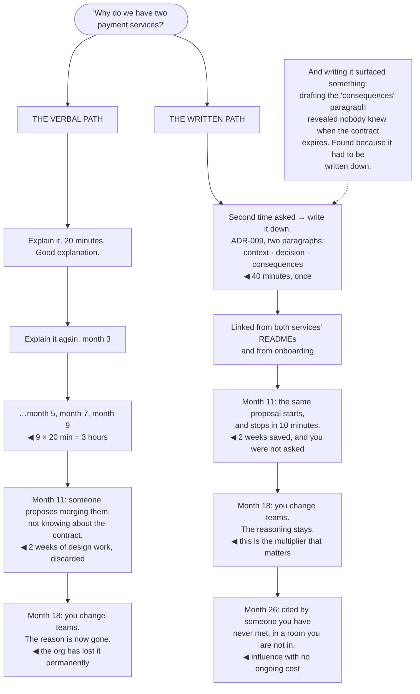

## The model

A conversation reaches the people in the room, once. A document reaches everyone who ever needs it,
including people who have not joined yet, in meetings you are not invited to.

That is the whole argument, and it is why writing is the highest ratio of effort to reach available
to a staff engineer. The reason it stays underused is that the return is delayed and invisible: the
afternoon costs you an afternoon, and the payoff arrives over the following two years in
conversations you never see.

## When to use it

You have explained something twice, or you need agreement from people you cannot get in a room.

1. **Have you said this before?** The **write it down threshold** is the second time, not the
   fifth. If you have explained it twice, you will explain it ten times.
2. **Do you actually understand it?** Writing is the test. An argument that will not go onto a page
   cleanly is usually an argument with a hole in it.
3. **Who needs this when you are not there?** Decisions get made in rooms you are not in, and a
   document is how you are present in them.

## Speedrun

**What** — a small number of durable artifacts, each of which does work repeatedly.

**How to make writing pay**

1. **Write when you have explained something twice.** The threshold is low and almost everyone
   applies it too high.
2. **Lead with the answer.** The first paragraph says what you think and why. A reader should be
   able to stop after it and still have the point.
3. **Keep it short enough to be read.** One to six pages for a design; a paragraph for most things.
   An unread document has the same effect as no document, plus the cost.
4. **Write for the person not in your team.** They do not know your service names or your
   acronyms, and they are frequently the reader who matters.
5. **Use writing to think**, not only to record. The gaps in an argument become obvious on the
   page in a way they never do in your head.
6. **Maintain the few that matter.** An out-of-date document is worse than none, because the next
   reader believes it.

**Why it works** — writing decouples your influence from your presence. It scales across people,
across time, and across the meetings you are not in, which is most of them.

**The compounding effect** — a good document gets cited, linked and quoted by people you never
meet. That is influence you are not spending time on, arriving years later.

## Going deeper

### Writing to think

Graham's argument is that writing is not the transcription of a finished thought, it is how the
thought gets finished. You believe you understand something until you try to put it on a page, and
the gaps become visible immediately.

This is why "I know what I think, I just need to write it down" is usually wrong. Writing surfaces
the assumption you never examined, the step that does not follow, and the case you had been quietly
not considering.

The practical use is diagnostic. If a design will not write up cleanly, that is evidence about the
design rather than about your prose. Sections that come out vague are almost always sections where
the thinking is vague, and the fix is upstream of the writing.

It also makes disagreement productive. A verbal position is a moving target — people remember
different versions, and the argument relitigates itself. A written one can be pointed at, quoted,
and objected to specifically.

Which means the first draft has value even if nobody reads it. Writing the argument out is how you
find out whether you have one, and that is worth an hour regardless of what happens to the document
afterward.

### Asynchronous influence

**Asynchronous influence** is the part that makes writing structurally different from talking, and
it has three separate multipliers.

**Across people.** Everyone who needs it reads it, including people who join in two years and
people in teams you have never worked with.

**Across time.** The document works while you are asleep, on holiday, or at a different company.
Larson's observation is that the artifacts outlive the author's tenure, and they are how an
organisation's judgment accumulates rather than resetting.

**Across rooms.** Decisions are made in meetings you are not in. A document is how your reasoning
is present when you are not — and it is often more persuasive there, because it cannot be
interrupted.

The compounding case is the one worth planning for. A genuinely good document gets linked in
onboarding, quoted in design reviews, and cited in arguments by people who do not know who wrote
it. That is influence with no ongoing cost, and there is no verbal equivalent.

The cost of this reach is that misinformation propagates the same way. An out-of-date document is
believed, which is why maintaining a small number of documents beats writing many and abandoning
them.

### What to write

Not everything deserves a document, and the highest-return categories are consistent.

**The thing you have explained twice.** Onboarding context, why the system is shaped this way,
how the deploy actually works. Cheap to write and reused constantly.

**Decisions and their reasoning.** An [[architecture decision record]] answers the question that
costs the most time in any codebase — *why is it like this?* — years after everyone involved has
left.

**Design documents**, which exist to be disagreed with before the code exists.

**Strategy**, in Rumelt's sense: a diagnosis, a policy, and what you are not doing. Two pages, and
it settles decisions without you.

**The postmortem**, which is where an organisation converts an incident into knowledge rather than
into a feeling that things are unreliable.

**The narrative** for something you are trying to align people on — short enough that your
coalition can restate it accurately.

What not to write: status that could be a dashboard, meeting notes nobody will read, and the
comprehensive documentation of a system that is about to change. The last one is the most common
waste, because it feels thorough.

### Making it read

A document that is not read has cost you an afternoon and produced nothing, so the mechanics of
readability are not polish — they are whether the leverage exists at all.

**Lead with the answer.** Say what you think in the first paragraph. Building to a conclusion works
in an essay and fails in a work document, because most readers stop before the conclusion.

**Length is a hard constraint.** One to six pages for a design; a paragraph for most things. Amazon
caps its narrative memos at six pages for exactly this reason — the discipline is in the cutting,
and a twenty-page document is skimmed by everyone and read by no one.

**Write for the outsider.** They do not know your acronyms, your service names, or which of the
three things called "the pipeline" you mean. They are also frequently the person whose objection
matters most, because they can see the assumptions you have stopped noticing.

**Make the disagreement points obvious.** Flagging "the contentious decision is X, and here is the
case against it" gets you better review than burying it, and it signals you are looking for
problems rather than approval.

**Say what it costs.** Every real proposal makes something worse, and naming it buys more
credibility than any argument in the document.

And put it where people will find it. A brilliant document in a personal folder has the reach of a
conversation and cost more to produce.

## See it work

The same question, answered two ways over eighteen months.

Three hours of repeated explanation is the visible cost of the verbal path and the smallest part of
it. Forty minutes of writing beats it on arithmetic alone, and that comparison is not why writing
wins.

Month eleven is where the real difference shows. Two weeks of design work gets spent on a merge
proposal that was never viable, because the constraint lived in one person's memory and that person
was not in the room — and on the written path the same proposal stops in ten minutes without anyone
consulting you.

Month eighteen is the one that should decide it. When you change teams, the verbal path loses the
reason permanently: nobody knows the contract exists, and the next team will rediscover it the
expensive way. The written path is unaffected by your departure, which is the property that
distinguishes an artifact from an explanation.

Month twenty-six is the compounding return. A document being cited by someone you have never met, in
a room you are not in, is influence you are no longer spending anything to have — and there is no
verbal equivalent of it at any price.

And the note at the bottom is the argument for writing even when nobody will read it. Drafting the
consequences paragraph forced the question of when the contract expires, and nobody knew — a real
gap, found because writing does not let you skip the part you were vague about.

## Next

Meetings covers the other channel: which conversations genuinely need to be synchronous, and what
they cost when they are not.
