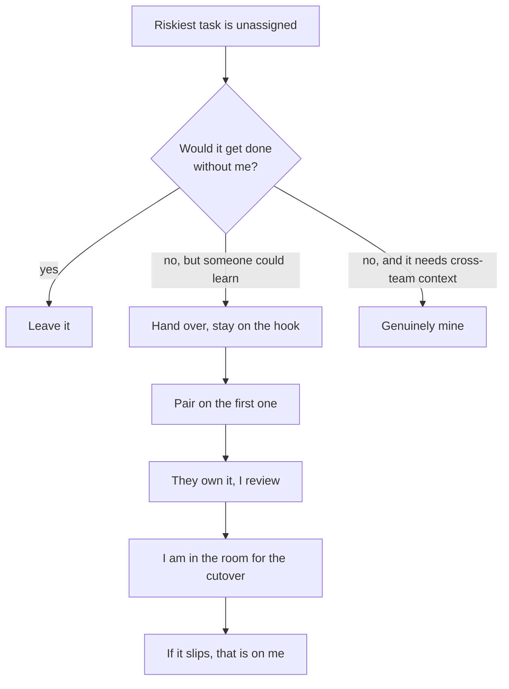

## The model

Staff engineer is the first level where the job is defined by scope rather than output.
A senior engineer is accountable for their own work landing; a staff engineer is
accountable for outcomes spanning more work than one person can do.

That is an arithmetic constraint, not a philosophy. Once what you are accountable for
exceeds what you can personally build, time spent building is time not spent on the
part only you can do.

## When to use it

For any piece of work in front of you, you are choosing between three things: doing it
yourself, handing it over while staying accountable, and leaving it alone.

1. **Would this still get done, roughly as well, if I did not do it?** If yes, leave it
   — your involvement is not what is scarce here.
2. **Does doing it myself build anyone else's capability?** Then hand it over with
   support. Work that grows another person is worth your time even when you are slower.
3. **Is this the highest-leverage use of the one thing nobody else has — context across
   teams?** If yes, it is genuinely yours.

## Speedrun

**What** — the shift from being accountable for your own output to being accountable
for outcomes bigger than your own hands.

**How** — the transition is subtractive first. You remove the senior behaviours that no
longer fit — taking the hardest ticket, being the fastest implementer — and the gap
that opens is what the new work fills.

**Why it works** — all four of Larson's staff archetypes (tech lead, architect, solver,
right hand) share one property. The bottleneck on their work is never typing speed; it
is deciding what should be built and getting other people to agree.

**The counterweight** — not all invisible work is waste. Reilly's "glue work" — noticing
the gap between two teams, writing the document nobody owns — is precisely the job. The
razor is narrower: stop doing work whose only justification is that you are fast at it.

**The one failure everyone hits** — drifting back to the keyboard. Implementing is
legible and rewarding today; direction-setting pays off on a lag of months, and often
the payoff is a bad thing that quietly did not happen.

## Going deeper

### Why the pull is so strong

That asymmetry is not a character flaw, it is a feedback loop. A merged PR rewards you
this afternoon; a migration that did not go wrong rewards you never, because nobody
notices an incident that failed to occur.

Left alone you drift back to the keyboard, and the drift feels like productivity the
entire time it is happening.

### Nobody will tell you

From the outside, a staff engineer doing senior work still looks like a strong
contributor. No alarm fires. The cost — the four teams whose sequencing nobody held —
is invisible, because it shows up as things that did not happen.

Watkins' framing for the first 90 days applies directly: the behaviours that made you
successful in the previous role are the default you have to actively override, because
nothing in the environment will override them for you.

## See it work

A newly promoted staff engineer is three weeks into a migration spanning four teams.
The riskiest piece — rewriting the dual-write path — is unassigned, so they take it,
because they are the fastest implementer available and the deadline is real.

That is the wrong call, and it is wrong in a specific way. For three weeks they are
unavailable to the four teams whose sequencing nobody is holding, and the one engineer
who could have learned the dual-write path does not learn it.

The alternative is not "delegate and walk away." It is to move the work while staying
accountable for the outcome: "I will pair with you on the first dual-write, then you
own it and I review. I will be in the room for the cutover. If it slips, that is on me,
not you."

The last sentence is the one to notice. Taking the ticket keeps you accountable by
doing; saying "if it slips, that is on me" keeps you accountable without doing, and
that is the whole transition compressed into one line.

## Next

Days 1–30, picking the wedge, and the traps are the pages that follow — this one is
what to stop, and those are what to start.
