## The model

**Deprecation** is the announcement. **Removal** is the project. Confusing the two is why every
large codebase contains services marked deprecated three years ago that are still receiving
traffic.

The gap between them is not laziness. Announcing costs an email; removing costs finding every
caller, moving them, absorbing the ones nobody owns, and taking responsibility for whatever breaks.
Nobody is rewarded for it and everybody benefits, which is exactly the shape of work that does not
happen by default.

## When to use it

Something exists that should not, and you are deciding whether to actually end it.

1. **Is anyone going to do the removal?** If the answer is "the teams will migrate eventually", it
   will not happen. Deprecation without an owner is a label.
2. **What does keeping it cost?** Maintenance, security patching, cognitive load on everyone who
   encounters it, and the incidents caused by a system nobody understands.
3. **Who depends on behaviour you never promised?** [[Hyrum's Law]] guarantees someone does, and
   they will find out when you turn it off rather than when you announce it.

## Speedrun

**What** — a project with an owner, a date, and a removal, of which the announcement is step two of
six.

**How to run one**

1. **Decide it is going away, and who owns that.** A deprecation with no owner is a comment.
2. **Find every caller by instrumentation**, not by asking. Log usage on the old path with enough
   attribution to name the caller.
3. **Provide the replacement first**, and make moving cheap — the codemod, the pull request, the
   pairing session.
4. **Announce with a [[sunset date]]**, then escalate: documentation, warnings in logs, warnings at
   build time, errors in non-production, brownouts, removal.
5. **Ratchet.** Block new usage the day you announce, or the set you are shrinking will keep
   growing.
6. **Actually remove it**, and delete the code. Anything short of deletion means you still own it.

**Why it works** — an escalating sequence of increasingly loud signals reaches teams at whatever
level of attention they are paying, and the brownout catches the ones who ignored everything else.

**The technique that finds the last callers** — the **brownout**: turn it off for an hour, on a
published schedule, and see who complains. It is the only reliable way to find callers who never
read anything.

## Going deeper

### Why deprecation does not lead to removal

The economics are against it and it is worth being precise about why, because the fix follows from
the diagnosis.

The costs of removal are concentrated and immediate: one team spends weeks finding callers, doing
other people's migrations, and being blamed for anything that breaks. The benefits are diffuse and
delayed: everyone's codebase is slightly simpler, forever, and nobody notices.

That is the classic shape of work that does not get done without someone deliberately choosing it.
No individual team's incentives point at it, which means it happens only when a person with scope
across teams — which is the staff engineer's actual position — takes it as their own.

There is also a status asymmetry. Building a new system is visible and creditable; deleting an old
one is invisible and slightly embarrassing, because it draws attention to the fact that it existed.
Larson's argument is that removal work has to be counted explicitly as impact, or it is rational for
everyone to avoid it.

The practical consequence for the person doing it: get the value stated in advance, in terms someone
senior cares about. "Removing this frees two engineers from on-call, ends a security exception, and
deletes 40,000 lines" is a case. "Cleaning up technical debt" is not.

### The escalation ladder

Teams pay attention at different thresholds, so the signal has to escalate until it reaches all of
them. The standard ladder, roughly in order of how loud it is:

1. **Documentation** — marked deprecated, with the replacement named. Reaches people who read docs
   before writing code, which is a minority.
2. **Code annotation** — a **deprecation warning** at build time, from a compiler attribute or a
   linter rule. Reaches people who read warnings, which is a smaller minority.
3. **Runtime log warning**, with the caller's identity attached. This one is also your instrument:
   it is how you find who is left.
4. **Build failure in non-production**, with an escape hatch. Now it is on someone's sprint.
5. **Brownout** — scheduled unavailability, announced in advance. This finds the callers who
   ignored every previous step, and it does so before the permanent removal rather than after.
6. **Removal.**

The two steps people skip are the ratchet at the start and the brownout at the end, and they are
the two that decide whether the project converges.

Timelines should be proportionate to the cost of moving. Weeks for a library function, quarters for
an internal service, a year or more for an external API with contracts attached — and the schedule
should be published up front, because a deadline that moves teaches everyone that the next one will
move too.

### Hyrum's Law and the undocumented dependency

[[Hyrum's Law]] states that with enough users, every observable behaviour of your system becomes
something someone depends on, regardless of what you promised. Deprecation is where the bill for
that arrives.

The dependencies that surface during removal are consistently the ones nobody documented: response
ordering, timing, an error message's exact text, a field that was never in the schema, the fact
that a call happened to be synchronous. None of these were in the contract, and all of them are
load-bearing for someone.

Which is the argument for the brownout rather than a clean removal. A one-hour outage on a published
schedule surfaces those dependencies while the system still exists and can be turned back on — the
same information for a fraction of the cost of discovering it permanently.

*Software Engineering at Google* makes the related point about scale: the larger the system, the
more certain it is that every behaviour is depended upon, so at sufficient scale removal is never a
technical question and always a coordination one.

The mitigation to build in advance is a narrow contract. The less you promise and the less you
expose, the less accumulates — which is a design decision made years before the deprecation and
one of the strongest arguments for keeping interfaces small.

### The orphaned system

The hardest case is the **orphaned system**: something in production that no team owns, usually
because of a reorganisation, often critical, and understood by nobody currently employed.

Orphans do not deprecate themselves, and they accumulate. The first step is inventory — a list of
systems with a named owning team, reviewed on a schedule, with "unowned" as an explicit and
uncomfortable status rather than a blank.

Then a decision per orphan, and there are only three: adopt it (a real team takes it on with
resourcing), remove it, or state that it is unowned and accept that it will fail eventually with
nobody to respond. The third is a legitimate choice and is much better made explicitly than by
default.

The reason to force the decision is that unowned systems fail eventually, and the incident is
always worse than it needed to be. Nobody knows how it works, there is no runbook, and the people
who could have written one left.

Reorganisations are when orphans are created, so that is when to check. A reorganisation that moves
teams without explicitly reassigning every system produces orphans immediately, and they are much
cheaper to reassign in that week than in the year after.

## See it work

Sunsetting an internal reporting service with 60 callers and no owner.

```mermaid
flowchart TD
  S(["'report-svc' — deprecated in 2023<br/>still serving 2M requests/day<br/>no owning team since the 2024 reorg"]) --> CASE["Make the case in someone's terms:<br/>2 engineers on an on-call rotation for it<br/>1 open security exception<br/>41k lines, 0 tests<br/>◀ not 'technical debt'"]
  CASE --> OWN["Name an owner for the REMOVAL<br/>◀ the 2023 deprecation had none,<br/>which is why nothing happened"]
  OWN --> INST["Instrument first: log every call<br/>with caller identity<br/>→ 60 callers, not the 24 anyone remembered"]
  INST --> RATCH[["Ratchet on day 1:<br/>CI fails on new imports<br/>◀ otherwise the set keeps growing"]]
  RATCH --> REPL["Provide the replacement + the codemod<br/>+ send the PRs for the top 20 callers<br/>◀ cheaper than chasing them"]
  REPL --> LAD["Escalate on a published schedule:<br/>docs → build warning → log warning<br/>→ non-prod failure"]
  LAD --> LEFT["Month 4 — 7 callers left, all silent<br/>4 unowned · 2 quarterly jobs · 1 unknown"]
  LEFT --> BROWN[["BROWNOUT — 1 hour, announced 2 weeks out<br/>3 teams complain within 20 minutes<br/>◀ including one nobody had identified,<br/>depending on a field not in the schema"]]
  BROWN --> HYRUM["Hyrum's Law, arriving on schedule:<br/>the field was never promised, never<br/>documented, and is load-bearing"]
  HYRUM --> FIX["Add the field to the replacement,<br/>migrate the last 7"]
  FIX --> DEL["Remove the service. DELETE the code.<br/>◀ anything less and you still own it"]
```

The 2023 deprecation failed for one reason: nobody owned the removal. The label was accurate, the
replacement existed, and none of that produces action — which is why the first real step here is
naming a person rather than sending a second announcement.

Making the case in on-call rotations, security exceptions and deleted lines is what gets the work
funded. "Technical debt" is a phrase that loses every prioritisation conversation; two engineers
freed from a rotation is one that wins some of them.

Instrumentation found sixty callers where the team remembered twenty-four. That gap is normal and it
is the reason the inventory has to be measured — the thirty-six nobody remembered include the ones
most likely to break, because they are the ones nobody is thinking about.

The brownout earns its place in the last month. Three teams surfaced within twenty minutes,
including one that no amount of asking had found, depending on a field that was never in the schema
and never promised. Discovering that during a one-hour scheduled outage is enormously cheaper than
discovering it during a permanent one.

And deleting the code is what makes it finished. A service turned off but still in the repository is
still maintained, still patched, still read by people trying to understand the system — which means
the cost you were removing is mostly still there.

## Next

Technical debt covers the thing deprecation is usually cleaning up, and why the metaphor is more
precise than the way it is normally used.
