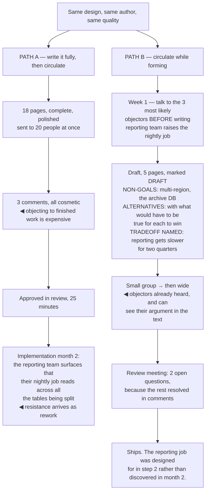

## The model

A **design document** is not a record of what you are going to build. It is a mechanism for finding
out that you are wrong while being wrong is still cheap.

Everything about how it is written follows from that. It has to be readable by people who will
disagree, it has to state the alternatives fairly enough that someone can argue for one, and it has
to arrive early enough that the answer can change. A polished design circulated after the decision
is documentation, and calling it a design doc trains people not to read the next one.

## When to use it

The change is expensive to reverse, spans teams, or several reasonable approaches exist.

1. **Is this decision hard to undo?** Data models, external interfaces, and anything requiring a
   migration deserve a document. A refactor inside one service usually does not.
2. **Who has to agree, and who has to live with it?** Those are different groups, and both need to
   see it before it is decided.
3. **Is there genuinely more than one option?** If not, write three paragraphs and ship. A document
   defending a foregone conclusion wastes everyone's time and yours.

## Speedrun

**What** — a short document, circulated before the work, structured so that disagreement is easy.

**How to write one**

1. **Lead with the problem and who has it.** Not the solution. A reader who does not accept the
   problem will not evaluate the solution.
2. **State the goals, and the [[non-goals]].** Non-goals prevent the scope argument that otherwise
   consumes the review.
3. **Describe the proposal concretely** — interfaces, data shapes, failure behaviour, migration
   path. Concrete is what makes disagreement possible.
4. **Give the alternatives an honest hearing.** An **alternatives considered** section where every
   option is obviously worse is a tell that the decision was already made.
5. **Name the tradeoffs you are accepting**, including the ones that will hurt. This is what
   distinguishes a design from a pitch.
6. **Circulate it early and to the right people**, then hold a review only if the written comments
   do not converge.

**Why it works** — writing forces specificity that conversation lets you avoid, and specificity is
what makes a flaw visible. Most designs that fail in review fail on a detail the author had not yet
had to decide.

**The length rule** — one to six pages. Longer is not read, and a document nobody reads has the
same effect as no document plus the cost of writing it.

## Going deeper

### The parts, and what each is for

The structure varies by organisation and the functions do not.

**Context and problem.** What is happening, who it affects, why now. Ubl's observation about
Google's practice is that this section does most of the work — a reader who understands the problem
can evaluate anything, and a reader who does not will argue about preferences.

**Goals and non-goals.** Goals are what success looks like. **Non-goals** are the explicitly
excluded things, and they are the highest-value section per word in the whole document. "This does
not address multi-region" ends an argument before it starts.

**The proposal.** Concrete enough to be wrong: interfaces with signatures, data shapes, what
happens when each dependency fails, what the migration looks like. Vagueness here reads as
diplomatic and is what lets a flawed design pass review.

**Alternatives considered.** Each option, why it was not chosen, and what would have to be true for
it to win. That last clause is what makes the section honest — it tells a reader what evidence
would change your mind.

**Tradeoffs and risks.** What gets worse. Every real design makes something worse, and naming it
buys more credibility than any argument in the document.

**Rollout and rollback.** How it ships and how it un-ships. A design without a rollback story has
not been finished.

### Circulating it, which is where most of them fail

A design document that arrives finished invites review. A design document that arrives in progress
invites ownership, and the difference decides whether it lands.

The **review-vs-ownership** distinction is the practical core of this page. If people first see a
polished document with a decision in it, their available responses are approve or object — and
objecting to finished work is socially expensive, so you get silence followed by resistance during
implementation.

The sequence that works is incremental:

1. Talk to the two or three people most likely to disagree, before writing anything, and let their
   objections shape the draft.
2. Circulate a rough version to a small group.
3. Then broaden.

By the time it is widely visible, the people who would have objected have already been heard, and
several of them can see their own arguments in the text.

Reilly's framing for this is that alignment is built before the meeting rather than in it. A review
meeting is for the disagreements that written comments could not resolve — if that is most of them,
the circulation was skipped.

Timing is the other half. A document circulated after the prototype exists is asking people to
agree with something already built, and everyone can tell. The cost of changing course is visible
in the room and it suppresses exactly the objections you needed.

### The RFC process, and when it is worth it

An **RFC** — the term comes from the IETF's Request for Comments series and was adopted by Rust,
Python and many companies — is a design document with a defined lifecycle: proposed, discussed,
accepted or rejected, with the outcome recorded.

What the process adds over an ad-hoc document is legitimacy and a decision point. Everyone knows
where proposals go, who decides, and when discussion ends. That last part matters more than it
sounds — an open-ended design discussion has no natural termination and can absorb months.

What it costs is overhead, and organisations routinely apply it too broadly. An RFC for every change
produces a queue, a backlog of undecided proposals, and engineers who route around the process. The
scope should be decisions that are expensive to reverse or that bind other teams — everything else
is a pull request with a good description.

The failure mode specific to RFC processes is the undecided proposal. A document that is neither
accepted nor rejected, sitting open for months, is worse than a rejection: the author cannot
proceed, nobody else can either, and the ambiguity blocks adjacent work. A process needs someone
accountable for closing things, and a default outcome when nobody does.

### Writing so people actually read it

Length is the first constraint and the one most often violated. One to six pages. A twenty-page
design document gets skimmed by everyone and read by no one, and the parts that most needed
scrutiny are in the middle where skimming is heaviest.

Lead with the answer. The first paragraph should say what you propose and why, so a reader can
decide how carefully to read the rest. Building to a conclusion is a good essay structure and a bad
document structure.

Write for the reader who is not in your team. They do not know your service names, your acronyms,
or which of the three things called "the pipeline" you mean. That reader is usually the one whose
objection matters most, because they can see the assumptions you have stopped noticing.

Make the disagreement points obvious. Explicitly flagging "the contentious decision here is X, and
here is the case against it" gets you better review than burying it, and it signals that you are
looking for problems rather than approval.

And keep it alive. A design document is a decision record after the fact, so update it when the
design changes during implementation. An out-of-date design doc is actively misleading — the next
person reads it as the truth, and there is nothing on the page to warn them.

## See it work

A design for splitting a shared database, circulated two ways.

The two paths differ in sequence, not effort. Path A is not lazier or worse-written — it is the
more natural instinct, which is to finish the thinking before asking anyone to look at it.

Three cosmetic comments on an eighteen-page document is the signal that the process failed, and it
reads at the time like agreement. Objecting to obviously finished work costs the objector something,
so the response is silence, and silence gets recorded as consensus.

The reporting team's nightly job was findable in week one for the price of one conversation. Found
in month two it is rework, an unhappy team, and a schedule that was committed on the assumption it
did not exist.

Naming the tradeoff explicitly — reporting gets slower for two quarters — is what makes path B
credible rather than merely earlier. A design that claims no downside invites people to go looking
for the one you hid; a design that states it is arguing in good faith.

And the short review meeting is the outcome to aim for. Two open questions means the written
circulation did its job. A review meeting full of fundamental objections is not a rigorous review
culture — it is a document that arrived too late.

## Next

Making a technical decision covers the decision itself: how to tell which ones deserve this much
machinery and which ones deserve none of it.
