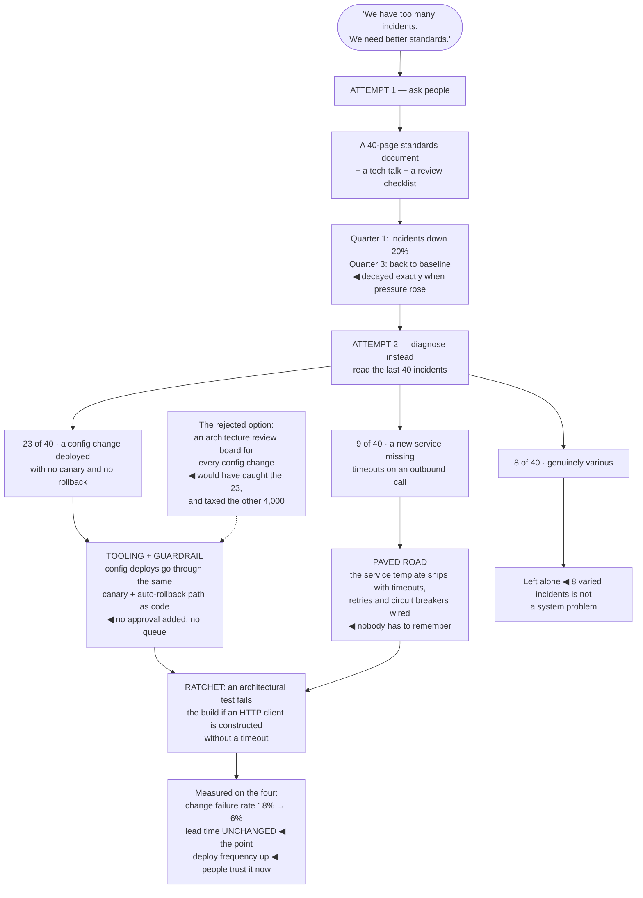

## The model

The instinct when quality is poor is to find the bad code and fix it. That works once, for that
code, and the same code comes back — because the thing that produced it is unchanged.

Larson's framing is that quality is a property of the system that generates the code: the tooling,
the defaults, the review culture, the architecture, what is easy and what is hard. Improving it
means changing what an average engineer on an average day naturally produces, and that is a
different activity from reviewing harder.

## When to use it

Quality is being discussed as a problem, and someone is about to propose a standards document.

1. **What is the actual failure?** Incidents, slow changes, fear of touching something, features
   declined. Each has a different cause and "quality" is not a diagnosis.
2. **Is the easy path the right path?** If doing it correctly takes more effort than doing it
   badly, quality depends on vigilance — and vigilance does not scale.
3. **What would this catch automatically?** A rule enforced by a tool holds. A rule in a document
   holds until the person who wrote it leaves.

## Speedrun

**What** — a **quality leverage ladder**: interventions in ascending order of leverage and cost.

| Rung | Example | Holds because | Cost |
|---|---|---|---|
| Ask people | a standards doc, a talk | memory and goodwill | low, decays fast |
| Review | design and code review | someone notices | ongoing, scales badly |
| Tooling | linters, types, CI checks | the build fails | one-off, holds |
| **Paved road** | the easy path is the good path | nobody has to choose | high, holds hardest |
| Architecture | a wrong thing is unrepresentable | it cannot be expressed | highest |

**How to improve it**

1. **Diagnose the specific failure**, not "quality". Incidents and slow changes have different
   causes and different fixes.
2. **Start where the interest is.** Fix the area actually being changed, not the ugliest one.
3. **Climb the ladder.** Anything you have asked for twice should become a tool; anything a tool
   catches repeatedly should become a default.
4. **Build the [[paved road]]** — make the correct approach the path of least resistance, and most
   of the problem disappears without anyone deciding anything.
5. **Ratchet every gain.** A **quality ratchet** stops the fixed thing from regressing: a lint rule,
   a type, an architectural test, a coverage floor that can only rise.
6. **Measure outcomes, not proxies.** Change lead time, deploy frequency, change failure rate, time
   to restore — the four measures *Accelerate* found actually correlate with performance.

**Why it works** — every rung reduces the amount of correctness that depends on someone
remembering. The top rungs cost more up front and stop costing anything afterward.

**The rule that decides where to spend** — if you have asked for the same thing twice, stop asking
and make it automatic. Repeated requests are a signal that the system, not the person, is the
problem.

## Going deeper

### The ladder, and why the top rungs win

Each rung holds for a different reason, and the reason is what determines whether it survives
contact with a busy quarter.

**Asking** — a standards document, a tech talk, a code review comment — depends on people
remembering and caring. It works briefly and decays, and it decays fastest exactly when the team is
under pressure, which is when quality matters most.

**Review** catches things reliably and does not scale. It costs senior time per change forever, its
quality varies by reviewer, and the things reviewers miss are consistent rather than random —
which means a class of defect passes systematically.

**Tooling** is where most teams should be spending and are not. A linter rule, a type, a CI check:
written once, enforced always, never tired, never rushed. Anything that can be stated as a rule
should be a tool rather than a review comment.

**The paved road** is the highest-leverage rung. Make the correct approach the easiest one — a
service template with logging, metrics, tracing and deployment already wired; a library that makes
the safe call the obvious call; a generator that produces the right shape. Nobody has to know the
standard, because following it takes less effort than not.

**Architecture** is the ceiling. If the wrong thing cannot be expressed — a module boundary that
will not compile across, a type that makes the invalid state unrepresentable — then it will not
happen, and no discipline is required.

The general move is to convert vigilance into structure. Every time correctness depends on someone
being careful at a specific moment, you have a recurring cost with a failure rate; every time it
depends on the shape of the system, you have paid once.

### The paved road, in practice

A **paved road** is a supported, opinionated, well-lit path through the common cases. Off-road is
allowed, and it is where you take the friction.

What makes one work is that it is genuinely easier. A service template that produces a working
deployable service with observability, health checks and a pipeline in ten minutes will be used —
not because of a policy, but because building that by hand takes three days.

What makes them fail is being mandatory before being good. A required framework that is worse than
what teams were doing generates resentment and workarounds, and it burns the credibility needed for
the next one. Earn adoption first, then make it the default, then make deviation require a
conversation.

The maintenance obligation is real and frequently underestimated. A paved road is a product with
users, and an unmaintained one is worse than none — teams build on it, it rots, and now everyone is
stuck on an abandoned foundation.

The escape hatch has to exist and has to be visible. A road with no exit gets routed around
entirely, and then you have neither adoption nor visibility into what people are doing instead.

### Measuring without Goodharting yourself

Quality is hard to measure, which is why the proxies chosen are so often the wrong ones.

The four measures from *Accelerate* are the best-evidenced set available: **deploy frequency**,
**change lead time**, **change failure rate**, and **time to restore service**. What makes them
unusually good is that they resist gaming in pairs — speed measures paired with stability measures,
so pushing one without the other shows up immediately.

The proxies to avoid are the ones that measure activity rather than outcome. Test coverage
percentage, lines of code, ticket counts, review comment counts. Each can be moved without moving
anything real, which is [[Goodhart's Law]] operating exactly as advertised.

Coverage is the most instructive case, because it is not useless. Coverage falling is a genuine
signal; coverage as a target produces tests that execute code and assert nothing. So the usable
version is a ratchet — coverage may not decrease — rather than a number to hit.

The pairing discipline generalises. Any speed measure needs a stability measure beside it, and any
quality measure needs a throughput measure beside it. A single number will be optimised, and the
question is only whether you chose what else it drags with it.

### Gates versus guardrails

The distinction decides whether a quality effort makes the organisation faster or slower, and it is
the one most often got wrong.

A **gate** blocks progress until someone approves. An architecture review board, a mandatory
sign-off, a security review before every launch. Gates catch problems and add latency to
everything, including the 95% of changes that had no problem.

A **guardrail** lets work proceed and makes the wrong outcome hard or loud. A type system, a
canary deploy with automatic rollback, an alert on a boundary violation, a lint rule. It catches
the same class of problem without a queue.

**Guardrail-not-gate** is the default worth holding, and the *Accelerate* research supports it
directly: heavyweight change-approval processes correlate with *worse* stability, not better —
they slow delivery and do not reduce failures, because the approver has less context than the
author.

Gates are still right where the failure is unrecoverable and rare. Irreversible data operations,
production access, anything with a regulatory consequence. The test is whether the reviewer can
actually catch the thing — a gate staffed by people without the context to evaluate what they are
approving is pure latency with a signature attached.

## See it work

An organisation with too many incidents, addressed twice.

The standards document is not a stupid idea, and its failure is instructive rather than
embarrassing. It worked for a quarter — which is exactly what "asking people" buys, and it decayed
first under pressure, which is when the incidents were happening anyway.

Reading forty incidents converts "too many incidents" into two specific, fixable causes. Thirty-two
of forty come from two mechanisms, and neither of them is a knowledge problem — the engineers
involved knew about canaries and timeouts.

The config-deploy fix is a guardrail rather than a gate, and the contrast at the bottom is the whole
argument. A review board would have caught the same twenty-three incidents while adding latency to
four thousand safe changes; routing config through the existing canary path catches them and costs
nothing per change.

The service template is the paved road doing its job invisibly. Timeouts and circuit breakers are
not something anyone has to know about any more, because the easy way to create a service is now
the way that has them.

And the measurement is what confirms it was a quality improvement rather than a speed tax. Change
failure rate fell by two thirds while lead time held and deploy frequency rose — which is the
signature of structure replacing vigilance, rather than of process replacing speed.

## Next

The Influence group covers the other half of this work: none of these changes land without other
teams choosing to adopt them, and you have no authority to make them.
