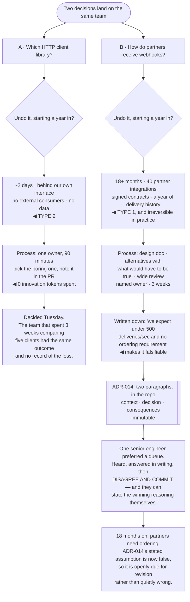

## The model

The most expensive failure in technical decision-making is not choosing wrong. It is applying the
same process to every decision — three weeks of deliberation on something you could undo in an
afternoon, and an afternoon on something you will live with for five years.

[[Type 1 decision|Type 1 decisions]] are one-way doors: hard to reverse, so they deserve the machinery. Type 2
decisions are two-way doors, and the correct process there is to pick one quickly and find out.
Getting the classification right saves more time than getting any individual decision right.

## When to use it

A choice is in front of you and someone is asking what the process should be.

1. **How hard is this to undo?** Reversibility in months, not in feelings. A library choice is
   weeks; a data model that external partners consume is years.
2. **Who is the decision owner?** Not "the team" — a person. Decisions owned by groups are the ones
   that stay open.
3. **What would change your mind?** If nothing would, you are not deciding, you are announcing.

## Speedrun

**What** — a classification, an owner, and a record:

| | Type 2 (two-way door) | Type 1 (one-way door) |
|---|---|---|
| Examples | library, internal API shape, log format | data model, external interface, vendor lock-in, language |
| Process | one person decides, quickly | design doc, alternatives, wide review |
| Time | hours to days | weeks |
| Failure | over-deliberation | under-deliberation |
| Record | a commit message | an ADR |

**How to decide**

1. **Classify by reversibility first**, before any discussion of the options. It sets the budget
   for everything that follows.
2. **Name one owner.** Consensus is a goal, not a mechanism — someone has to be able to end it.
3. **Write down what would change your mind.** It makes the decision falsifiable and it turns
   disagreement into evidence-gathering.
4. **Prefer the boring option unless you can name what the exciting one buys.**
   [[Innovation tokens]] are finite, and most decisions should spend none.
5. **Record Type 1 decisions as an [[architecture decision record]]** — context, decision,
   consequences. Two paragraphs, in the repository.
6. **Close it explicitly**, including for the people who lost. **Disagree and commit** is a real
   discipline and it requires the disagreement to have been genuinely heard first.

**Why it works** — the cost of a wrong Type 2 decision is bounded by how fast you can undo it, so
speed dominates. The cost of a wrong Type 1 decision is unbounded, so care dominates. One process
cannot serve both.

**The most common error** — treating a Type 2 decision as Type 1, which is invisible because it
looks like rigour. Three weeks of deliberation on a reversible choice costs three weeks and nobody
records it as a failure.

## Going deeper

### Classifying honestly

Reversibility is measurable if you ask the right question: **how long would it take to undo this,
starting from a year in?** Not "could we" — how long, with the code and data that will exist by
then.

That question moves things across the line in both directions. A library choice sounds reversible
and becomes a Type 1 decision once it is threaded through four hundred files. A database engine
sounds permanent and can be Type 2 if the access layer is genuinely isolated and the data volume is
small.

Two things reliably make a decision harder to reverse than it looks. **External consumers** — once
another team, or a customer, depends on the shape, you no longer control the timeline. And
**data**, because migrating a schema with five years of history in it is a project regardless of
how clean the code is.

One thing reliably makes decisions more reversible than they look: a seam. If the choice is behind
an interface you own, you can replace it. That is why "keep the seam, defer the build" is worth
more than most architectural decisions — it converts Type 1 decisions into Type 2 ones, which is
the highest-leverage move available.

The asymmetry in error costs is worth stating. Over-deliberating is invisible and looks like
diligence; under-deliberating produces a visible incident. So organisations drift toward
over-deliberation, and the correction has to be deliberate.

### The owner, and how decisions actually close

A **decision owner** is one named person who can end the discussion. Without one, the discussion
does not end — it fades, and everyone acts on their own reading of it, which is worse than either
outcome.

The owner's job is not to be the smartest person on the topic. It is to gather the input, weigh it,
choose, and communicate. Grove's framing from *High Output Management* is that the decision-making
process needs to be explicit about who has been consulted and who decides, and confusion between
those two roles is where organisations lose weeks.

Consensus is worth seeking and is a poor stopping rule. Waiting for it means the most persistent
objector decides by attrition, and that selects for stamina rather than for being right.

**Disagree and commit** is the discipline that makes this survivable, and it has a precondition
people skip: the disagreement has to have been genuinely heard and answered. A team told to disagree
and commit without having been listened to learns that the phrase means "stop talking", and the next
decision gets silence instead of input.

The other half is that the person who lost should be able to state the reasoning for the decision
that beat them. If they cannot, they were not persuaded — they were overruled, and the commitment
will not survive the first difficulty.

### Boring technology, and what novelty costs

McKinley's argument is the sharpest available on the most common Type 1 decision, which is what to
build on.

The **innovation token** framing: you get roughly three tokens to spend on new, exciting,
poorly-understood technology. Everything else should be boring — not because boring is better in the
abstract, but because boring technology has known failure modes, and the cost of a new technology is
paid mostly in the failure modes you have not met yet.

What "boring" actually means is well-understood, not old. A technology your team has operated for
three years is boring for you regardless of its age; a fifteen-year-old system nobody there has run
in production is not.

The costs that get underestimated are all operational rather than technical. Hiring, debugging at
3am, the library ecosystem, the shape of the failure nobody has documented, and the specific
person on the team who becomes the only one who understands it.

[[boring technology|Choosing boring technology]] does not say never adopt anything. It says spend the tokens where the
novelty is the point — on the thing that is genuinely your differentiator — and take the boring
option everywhere else, so the interesting problem gets your whole attention.

### The record, and why it is short

An **architecture decision record** is Nygard's format: a short document capturing the context, the
decision, and the consequences. Numbered, immutable, in the repository next to the code.

It is short deliberately. Two or three paragraphs: what was going on, what we chose, what follows
from it. A long ADR does not get written, and an ADR that does not get written is the whole failure
mode this practice exists to prevent.

What it buys is the answer to the question that costs the most time in a codebase: *why is it like
this?* Two years later, the people are gone and the reasoning is not in the code. Without the
record, the next team either preserves a constraint that expired or removes one that is still
load-bearing — and both are expensive.

ADRs are immutable, which surprises people. A superseded decision gets a new ADR that references
the old one rather than an edit, because the history is the value. Knowing that you tried the other
thing in 2023 and why it failed is worth more than a tidy current-state document.

They also make the decision falsifiable. Recording "we chose this because we expect fewer than 500
writes per second" gives the next person a specific condition to check. When it turns out to be
5,000, the decision is visibly due for revisiting rather than quietly wrong.

## See it work

Two decisions in the same week, given very different budgets.

Classifying before discussing is what makes the week work. Both decisions felt significant to the
people holding them, and the reversibility question separates them immediately — two days versus
eighteen months is not a matter of degree.

The library decision is the one where speed *is* the correct process. Ninety minutes and the boring
option produces the same answer as three weeks of comparison, and the three-week version costs three
weeks that nobody records as a loss because deliberation looks like diligence.

The webhook decision earns everything it gets. Forty partner integrations and signed contracts mean
the timeline stops being yours, which is the single clearest signal that a decision has become
one-way regardless of how the code looks.

Writing the assumption down is the detail that pays off latest and largest. "Under 500 deliveries
per second and no ordering requirement" is a checkable condition, so when partners need ordering
eighteen months later the ADR flags itself — instead of the team discovering slowly that a decision
nobody remembers making is now wrong.

And the disagree-and-commit is real only because of what preceded it. The engineer who preferred a
queue was heard, answered in writing, and can state the winning argument themselves. That is what
makes the commitment hold when the implementation gets difficult, which is the moment it is actually
tested.

## Next

Running a migration covers the decisions that are already made and now have to be carried through a
live system without stopping it.
