## The model

A **migration** is how large systems actually change, and Larson's claim is stronger than it first
sounds: migrations are the only scalable way to fix technical debt in a system nobody can stop.

They also fail in a characteristic way. Not at the start — starting is exciting and well-staffed —
but at 80%, where the remaining work is small, tedious, and owned by teams with other priorities.
The design problem is therefore not "how do we move" but **how do we make finishing inevitable**,
and that changes what you build first.

## When to use it

You are replacing something that is live, and turning it off is not an option.

1. **Can you name who is on the old thing?** If you cannot enumerate the callers, you cannot
   finish, and building that inventory is task one rather than a later step.
2. **What makes the last 20% happen?** If the answer is "we will ask them", it will not happen.
   The forcing function has to be structural.
3. **Can old and new run at once?** If not, you have a cutover rather than a migration, and it
   needs a completely different plan.

## Speedrun

**What** — a long-running programme moving callers from an old thing to a new one, with both alive
throughout.

**How to run one**

1. **De-risk before committing.** Migrate one real, awkward caller end to end before announcing
   anything. It is the only honest estimate you will get.
2. **Build the inventory.** Every caller, named, with an owner. Instrument the old path so the list
   is measured rather than remembered.
3. **Make the new path obviously better**, or at least effortless. A migration that asks teams to
   do work for someone else's benefit does not finish.
4. **Close the door behind you** — a **migration ratchet**: block new usage of the old path so the
   remaining work is finite and shrinking.
5. **Publish a number that goes to zero.** Percentage migrated, visible, per team. Nothing else
   sustains momentum through the tail.
6. **Own the tail yourself.** The last 20% is 50% of the work, and it is the part nobody else will
   prioritise.

**Why it works** — a live migration is a slow rollout with a rollback at every step, which is what
lets you change something load-bearing without a night of downtime and a prayer.

**The number to internalise** — the last 20% of callers take about half the total effort. Plan the
staffing for that shape, or the project will be declared "nearly done" for a year.

## Going deeper

### The shape: strangler fig

Fowler's **strangler fig** pattern is the standard structure, and the metaphor is precise. The fig
grows around the host tree, gradually taking over its structure, until the host can be removed
without the shape collapsing.

Practically: put an interception layer in front of the old system, route a slice of traffic to the
new one, expand the slice, and remove the old system when nothing routes to it. Every step is
reversible, and at no point does the system stop working.

The interception point is the design decision that matters most. A router, an API gateway, a facade
in the code, a feature flag — whatever it is, it must be able to route per-caller or per-request,
because that granularity is what makes incremental progress and per-step rollback possible.

The alternative shape is the big-bang cutover, and it is right in a narrow set of cases: when the
system is small, when running both is genuinely impossible, or when the migration cost of dual
support exceeds the risk of the cutover. Those cases exist. They are rarer than the number of
big-bang plans suggests.

For data specifically, the standard sequence is **dual write**, then [[backfill]], then verify,
then read from the new store, then stop writing to the old. Each step is separately reversible —
and the verification between backfill and read-switch is the one that gets cut under schedule
pressure, and the one that catches silent divergence.

### Why the tail is where migrations die

The first 80% of callers are the easy ones: actively maintained, owned by engaged teams, using the
old thing in ordinary ways. The remaining 20% are none of those things.

**The long tail** is made of specific, recognisable cases:

- the service nobody has owned since a reorganisation
- the batch job that runs quarterly and nobody remembers
- the integration whose only expert left
- the caller depending on an undocumented behaviour the new system does not reproduce

Each of those is small and none of them is easy. They cost investigation, archaeology, and often a
conversation with someone who has no reason to care about your migration — which is why the effort
distribution is so uneven.

Three things get the tail finished, and all of them are structural rather than motivational.

**The ratchet.** Block new usage of the old path — a lint rule, a deprecation error in CI, a
permission that stops being granted. This is the single highest-value mechanism, because without it
the tail grows while you are shortening it, and the project genuinely cannot converge.

**Doing the work yourself.** For the unowned and the abandoned, waiting for the owner is waiting
forever. Budget for the migrating team to make the change directly, which means budgeting for them
to learn systems they do not own.

**A deadline with consequences attached.** Not a date on a slide — the old path stops working on
this date, and the announcement says so months ahead with escalating warnings. This is the only
mechanism that reliably reprioritises other teams' work, and it costs political capital to use.

### Making the new path attractive

The most reliable accelerator is not a mandate. It is making the new thing so obviously better that
teams migrate because they want to.

If the new path is faster, simpler, better documented, or removes a step people hate, migration
becomes a favour to them rather than to you. Larson's version of this is that the best migrations
feel like an upgrade — and that framing changes what you should build first, since the delightful
part is now on the critical path rather than a nice-to-have.

Where the new thing is merely equivalent, minimise the cost of moving instead — provide the
codemod, send the pull request, offer to pair. Every hour you take off their side is worth several
hours of chasing on yours.

The failure to avoid is asking teams to do work with no benefit to them, on a schedule set by
someone else, for reasons expressed in terms of technical debt. That request loses to every other
item on their backlog, every time, and no amount of follow-up changes the arithmetic.

The uncomfortable corollary: if you cannot make the new path better and cannot make moving cheap
and have no authority to mandate it, the migration is unlikely to finish. That is worth knowing
before it is announced.

### Communication, and the number that goes to zero

A migration lasting two quarters needs a communication rhythm, and the single most useful artifact
is a public number that goes to zero.

Percentage of callers migrated, visible to everyone, broken down by team. It creates gentle social
pressure, it makes progress legible to leadership, and it converts "how is the migration going?"
from a status meeting into a link.

The measurement has to be instrumented rather than self-reported. Teams believe they have migrated
when they have migrated the path they were thinking about, and the dashboard finds the other two.

Regular short updates matter more than detailed ones. What moved, what is blocked, who is next. A
migration that goes quiet is assumed to be dead, and re-mobilising attention costs far more than
maintaining it.

Then declare the end explicitly, and delete the old thing. A migration that reaches 99% and stops
has produced the worst possible state — two systems, both maintained, plus the migration machinery,
forever. Reilly's framing applies: the value is not in the new system existing, it is in the old one
being gone.

## See it work

Moving 214 callers off a legacy payments API over three quarters.

```mermaid
flowchart TD
  Q0["Before announcing anything:<br/>migrate ONE awkward caller end to end<br/>◀ took 9 days, not the estimated 2<br/>◀ the estimate for 214 is now honest"] --> INV["Inventory from INSTRUMENTATION, not memory<br/>214 callers · 31 have no owner<br/>◀ the 31 are the whole risk"]
  INV --> BUILD["Build the new path to be BETTER:<br/>one call instead of three, typed client,<br/>4× faster ◀ teams now want it"]
  BUILD --> RATCHET[["RATCHET, week 1 of migration<br/>CI fails on any NEW use of the old client<br/>◀ the tail can now only shrink"]]
  RATCHET --> SF["Strangler fig: facade routes per caller<br/>flip one caller at a time · rollback = one flag"]
  SF --> DASH["Public dashboard, per team,<br/>measured not self-reported<br/>◀ 'how is it going' becomes a link"]
  DASH --> P80["Month 5 — 172 of 214 done (80%)<br/>◀ and now the hard half begins"]
  P80 --> TAIL["THE TAIL — 42 callers, 4 months<br/>• 31 unowned → the migrating team does it<br/>• 6 rely on an undocumented quirk of the<br/>  old API → new endpoint or a shim<br/>• 4 quarterly batch jobs → found only by<br/>  instrumentation, not by asking<br/>• 1 external partner → a contract conversation"]
  TAIL --> DATE["Announced 4 months out, escalating:<br/>'the old API returns 410 on 1 March'<br/>◀ the only thing that moves other backlogs"]
  DATE --> DEL["Delete the old API, the facade,<br/>and the dashboard.<br/>◀ 99% is the worst state to stop at"]
```

The nine-day spike before the announcement is the highest-value step in the whole programme. Two
days was the estimate and nine was the truth, so the plan for 214 callers is built on a real number
rather than an optimistic one — and that difference is usually the gap between a two-quarter project
and a two-quarter project that takes five.

The ratchet goes in first, before any bulk migration, and that ordering is deliberate. Until new
usage is blocked, the denominator grows while you work; after it, the remaining work can only
shrink, and the project is guaranteed to converge even if it converges slowly.

Building the new path to be genuinely better is what makes the first 80% cheap. One call instead of
three and four times faster means teams migrate for their own reasons, and the migrating team spends
its effort on the hard cases instead of on persuasion.

The tail breakdown is the part to plan staffing around. Thirty-one unowned callers cannot be
delegated to anyone — there is nobody to delegate to — so the migrating team absorbs them, and four
quarterly batch jobs were invisible to every survey and appeared only because the old path was
instrumented.

And deleting everything at the end, including the facade and the dashboard, is what converts the
work into a return. Stopping at 99% leaves both systems alive, both maintained, plus the migration
scaffolding — which is more total complexity than existed before anyone started.

## Next

Deprecation covers the same discipline pointed at the end state: turning something off, on purpose,
without breaking the people who depended on it.
