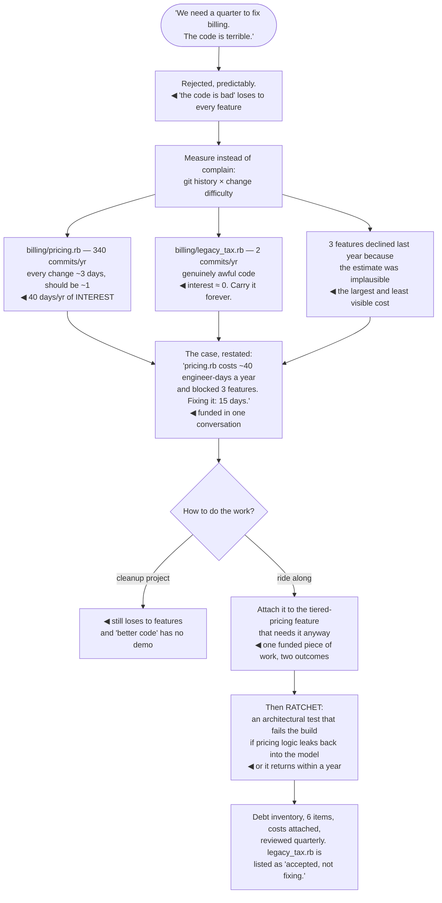

## The model

Cunningham's metaphor was specific and most uses of it are not. His point was that shipping code
based on an incomplete understanding is like borrowing money: you get to move now, and you pay
interest until you go back and reflect what you have since learned.

That is a deliberate, reasoned trade. **Technical debt** in the original sense is a decision, and
the decision can be correct. Using the phrase for everything unpleasant in a codebase — bad code,
old code, code you did not write — loses the part that made it useful, which is the ability to
argue about a specific loan and its specific interest.

## When to use it

You are arguing for time to fix something, or deciding whether to take a shortcut.

1. **Is this debt or a mess?** Debt was a choice made for a reason. A mess is just poor work, and
   Martin's point is that calling it debt borrows a legitimacy it has not earned.
2. **What is the interest?** Debt matters in proportion to how often you pay it. Ugly code in a
   file nobody touches costs nothing.
3. **Is the loan still worth holding?** Some debt should be carried indefinitely, and the honest
   answer is often "we are never fixing this, and that is fine".

## Speedrun

**What** — a deliberate trade: ship sooner, pay a recurring cost until you go back.

**How to reason about it**

1. **Name the interest, in something measurable.** "Every change to billing takes three days
   instead of one, and we make six a quarter" is an argument. "The billing code is bad" is not.
2. **Separate debt from mess.** Both may need fixing; only one of them is a decision anyone made,
   and conflating them makes the conversation about blame.
3. **Prioritise by interest rate, not by ugliness.** The worst code in the system might be in the
   part nobody touches, in which case it is free.
4. **Take debt deliberately when it is the right trade**, and write down the terms — what you did,
   why, and what would trigger paying it back.
5. **Pay it down inside the work**, not in a separate cleanup project. Cleanup projects lose to
   features every time.
6. **Ratchet.** Make the thing you fixed hard to re-break, or you will fix it again in a year.

**Why it works** — expressing debt as a recurring cost converts an aesthetic argument into an
economic one, and economic arguments are the ones that win prioritisation conversations.

**The sentence that gets time allocated** — "this costs us N days per quarter and will cost M to
fix." Nobody funds "the code is bad"; that number is funded routinely.

## Going deeper

### The four quadrants

Fowler's quadrant is the most useful refinement of the metaphor, splitting debt on two axes:
deliberate versus inadvertent, and prudent versus reckless.

**Deliberate and prudent** — "we ship now and deal with the consequences." This is **deliberate
debt** in Cunningham's original sense, and it is a legitimate engineering decision. A deadline that
matters, a hypothesis you need to test, a launch window: taking the loan is correct.

**Deliberate and reckless** — "we don't have time for design." Knowing what good would look like
and skipping it for no particular reason. This is the one that compounds fastest, because it
usually becomes a habit rather than an event.

**Inadvertent and prudent** — "now we know how we should have done it." Cunningham emphasised this
one: you could not have known at the time, you learned by building, and the debt is the gap between
the code and your improved understanding. This is unavoidable and is the healthiest kind.

**Inadvertent and reckless** — "what's layering?" Not really debt at all. It is missing knowledge,
and the fix is teaching rather than refactoring.

The practical value of the quadrant is what it does to the conversation. Deliberate-prudent debt is
a decision to review; inadvertent-prudent debt is learning, and reacting to it as a failure
discourages exactly the exploration that produced the learning.

### Interest is what makes debt matter

The interest payment, not the principal, is what should drive priority — and it is the part people
skip because ugliness is easier to see than cost.

**Interest is paid in change.** Code you never modify costs nothing regardless of quality. A tangled
module changed six times a quarter, where every change takes three days instead of one, costs
thirty-six days a year. Those two can look identical in a code review and differ by everything.

So the measurement to make is change frequency crossed with change difficulty. Version-control
history gives you the first for free — the files with the most commits are where interest is
actually being paid, and they are frequently not the files people complain about.

Interest also comes in forms other than time. Incidents caused by a fragile area, onboarding time
lost to something incomprehensible, features declined because the estimate was implausible. That
last one is the most expensive and the least visible, because a feature nobody proposed leaves no
trace.

And some interest rates are effectively zero, which means the correct decision is to carry the debt
forever. A gnarly service that works, is never touched, and has no security exposure is not a
problem to solve — saying so out loud is more useful than leaving it on a list for three years.

### Taking debt on purpose

The metaphor's real payoff is that it makes deliberate borrowing legitimate, and staff engineers
should use that rather than resist it.

The trade is sometimes clearly right. A launch window that will not repeat, a hypothesis that needs
testing before more design is justified, a customer commitment where two weeks late costs more than
a year of interest.

What makes it a loan rather than a mess is writing down the terms. What was skipped, why, what the
interest is expected to be, and what would trigger repayment — three lines in the pull request or
an [[architecture decision record]]. Without that, the next person cannot tell a considered
shortcut from carelessness, and treats it as the latter.

The failure mode is silent debt. Undocumented shortcuts accumulate into a system nobody understands
the shape of, and eventually into the belief that the codebase is simply bad — which is
demoralising in a way that a known, chosen, listed set of loans is not.

[[The wrong abstraction]] is the specific case worth flagging, because it inverts the usual advice.
Removing a bad abstraction means inlining it back into duplication before re-abstracting, and
"duplication is cheaper than the wrong abstraction" is the counterintuitive move that most teams
resist and most need.

### Paying it down, in practice

Cleanup projects fail, reliably, and the reason is structural rather than cultural: a project whose
output is "the same behaviour, better code" loses every prioritisation conversation to a project
that adds something.

What works is paying inside feature work. When you touch an area, leave it better — the campsite
rule, applied at the scale of the change rather than the file. It is invisible in planning, it
compounds, and it targets exactly the code that is being changed, which is where the interest is.

For debt too large to fix incrementally, the move is to attach it to something someone wants. The
reconciliation rewrite is not funded; the reconciliation rewrite that makes the new reporting
feature possible is. Larson's framing is that debt work should ride along with the work it unblocks
rather than competing with it.

The **debt inventory** is worth keeping and worth keeping short. A list of the significant loans,
each with its interest expressed as a number, reviewed quarterly, with things removed when they
stop mattering. A hundred-item list is a wish list; a six-item list with costs attached is a plan.

And whatever you fix, ratchet it. A lint rule, a test, a type, an architectural boundary that fails
the build — otherwise the same debt reappears within a year, taken out by someone who had no idea
it had been paid off once already.

## See it work

A team asks for a quarter to "fix the billing codebase".

The rejection is correct and worth understanding rather than resenting. "The code is terrible" gives
a decision-maker nothing to weigh it against, so it loses to any proposal that has a number — which
is every proposal that has a number.

The measurement inverts the team's own intuition. The genuinely worst file in the codebase turns out
to cost nothing, because it changes twice a year, while a file nobody had singled out is where forty
days a year are going.

The declined features are the largest cost and the one that never appears on a list. Three features
that were not attempted because the estimate was implausible leave no ticket, no incident, and no
trace — and they are usually the real reason the debt matters.

Riding along with the tiered-pricing feature is what gets it done at all. The same work, framed as
cleanup, stays unfunded indefinitely; framed as the thing that makes a wanted feature possible, it
is a line item in a project someone already approved.

And the ratchet is the difference between fixing it and fixing it repeatedly. Without a build-time
boundary, pricing logic leaks back into the model within a year, and the next team measures forty
days of interest again with no idea it was ever paid.

## Next

Improving quality takes this from one codebase to the whole organisation — the leverage points that
change what gets built rather than repairing what already is.
