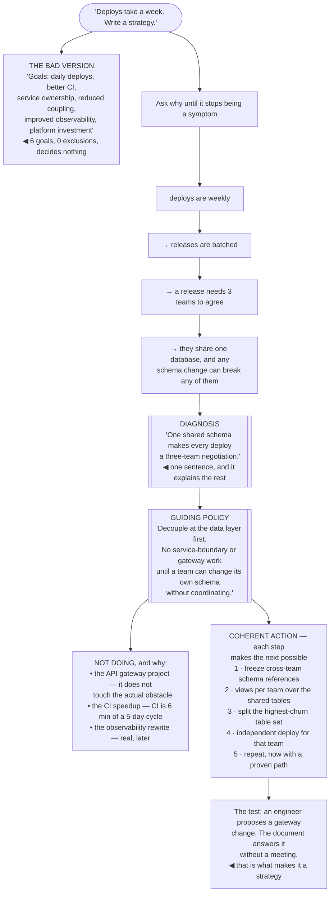

## The model

Most documents titled "technical strategy" are lists of goals. "Improve reliability, reduce
technical debt, modernise the platform, invest in developer experience." Nobody disagrees with
any of it, and nobody can use it to decide anything.

Rumelt's structure is what makes a strategy usable — a **diagnosis** that names what is actually
going on, a **guiding policy** that chooses an approach in response, and **coherent action** whose
steps follow from the policy and support each other. Remove any one and what is left is a wish.

## When to use it

You are being asked where the systems should go, or you are writing something that will be called
a strategy.

1. **What is the actual problem?** Not the symptoms — the underlying obstacle. If you cannot state
   it in a sentence, there is no diagnosis and everything downstream is decoration.
2. **What are you saying no to?** A policy that permits everything is not a policy. The declined
   options are what make it real.
3. **Do the actions reinforce each other?** Five independent initiatives are a list. A strategy is
   actions that compound, where doing one makes the next cheaper.

## Speedrun

**What** — three parts, in order, on two pages:

| Part | Answers | Fails when |
|---|---|---|
| **Diagnosis** | what is actually going on? | it restates the symptoms as the cause |
| **Guiding policy** | what is our approach? | it permits everything |
| **Coherent action** | what are we doing, in what order? | the steps are independent |

**How to write one**

1. **Diagnose first, and be specific.** "Deploys are slow" is a symptom. "Every service shares one
   database, so no team can deploy without coordinating with three others" is a diagnosis.
2. **Choose a policy that excludes things.** "Decouple at the data layer before anything else"
   excludes the API-gateway work someone wanted, and that exclusion is the point.
3. **Sequence the actions so they compound.** Each step should make the next one cheaper or
   possible, not merely also happen.
4. **Say what you are not doing**, explicitly, with reasons. This is the section people cut and
   the one that gets the document used.
5. **Ground it in what already exists.** Larson's argument is that good strategy is mostly written
   from the decisions already being made well, not invented from scratch.
6. **Keep it to two pages.** Anything longer is not read, and anything not read is not a strategy.

**Why it works** — a diagnosis makes disagreement productive, because people can argue about the
problem rather than about preferences. A policy that excludes things lets people decide without
you.

**The test** — hand it to an engineer with a real decision in front of them. If it does not change
what they do, it is not a strategy regardless of what the title says.

## Going deeper

### What bad strategy looks like

Rumelt's category of **bad strategy** is not weak strategy. It is a document with the shape of a
strategy and none of the content, and it has recognisable signatures.

**Fluff.** Abstractions restating the obvious in elevated language. "We will leverage a
cloud-native, API-first architecture to enable scalable innovation" contains no claim anyone could
disagree with, which is how you know it decides nothing.

**Failure to face the problem.** A document that describes an ambition without naming the obstacle.
If the hard thing is not stated, no plan in the document is a plan to get past it.

**Mistaking goals for strategy.** "Reduce p99 latency to 200 ms, improve deploy frequency to daily,
cut incidents by half" — those are outcomes. The strategy is how, given what is currently in the
way, and it is missing.

**A dog's dinner of objectives.** A list of everything important, produced by including each
stakeholder's priority so nobody objects. It is the most common failure and the most understandable
one, because saying no in a document is politically expensive.

The tell that catches all four: read it and ask what it forbids. A strategy that forbids nothing has
allocated nothing, and allocation is the entire function.

### The diagnosis, which is most of the work

A **diagnosis** explains what is going on in a way that makes some responses obviously better than
others. It is the hardest part and the part people skip.

The move that produces one is asking why until the answer stops being a symptom. Deploys are slow →
because releases are batched weekly → because a release needs three teams to coordinate → because
they share a database and a schema change can break any of them. The last one is the diagnosis, and
it is the only one that suggests what to do.

Good diagnoses have a shape: they simplify. Larson's framing is that strategy is compression — you
are replacing an overwhelming mess with a small number of things that explain most of it. If your
diagnosis has nine parts, you have described rather than diagnosed.

They also make some things obviously irrelevant. A diagnosis naming the shared database explains
why the API gateway project would not have helped, and that is useful — a diagnosis that leaves
every proposal equally plausible has not diagnosed anything.

The most common failure is diagnosing the symptom people complain about most loudly. Slow deploys
are what everyone feels; the shared schema is what causes it. Fixing the loudest thing is how teams
end up with a faster CI pipeline and the same weekly release train.

### Guiding policy, and the necessity of exclusion

A **guiding policy** is the chosen approach — the general method by which you intend to deal with
the diagnosed obstacle. It is not a goal and it is not a plan; it is the rule that makes the plan
derivable.

"Decouple at the data layer before touching service boundaries" is a policy. It tells you what to
do when a new proposal arrives, and it tells you what to decline. "Improve our architecture" is not,
because it tells you nothing about anything.

Exclusion is what gives it force. A policy that permits every reasonable option has not chosen, and
in practice that means the choice gets made repeatedly and inconsistently by whoever is in the room.

There is a leverage argument underneath this that is worth making explicit. A policy is worth having
because it is decided once and applied many times — the return comes from the number of decisions
it settles without you, which is why vagueness is expensive rather than diplomatic.

The political cost is real, and it is why most strategy documents avoid this. Naming the declined
option means telling someone their project is not happening, and doing it in writing means it stays
told. That discomfort is the price of the document being useful.

### Coherent action, and writing it down

**Coherent action** means the steps support each other. The test is whether doing step one makes
step two cheaper, easier or possible — if the steps are independent, you have a list.

Sequencing carries most of the coherence. Extracting the schema first makes independent deploys
possible, which makes service extraction safe, which makes team ownership meaningful. Reorder those
and each step fights the others.

On the document itself: two pages, and Larson's advice about where strategy comes from is the part
that changes how you write it. Good strategy is usually *documented* rather than invented — you
look at the decisions the organisation has already been making well, find the implicit policy behind
them, and write it down. That has two advantages: it is more likely to be right, and it arrives with
existing agreement rather than needing to be sold.

Then it has to be maintained. A strategy that is not revisited becomes a document people cite
selectively to support what they already wanted, which is worse than not having one. Revisit when
the diagnosis stops being true, and say so out loud when it does.

And it needs a decision it visibly settles, early. A strategy nobody has yet used to decline
something is still a proposal, however well written.

## See it work

An engineering organisation asked to "fix our deploy problem".

The bad version is what gets written when nobody wants to exclude anything. Six goals, all real,
all endorsed — and an engineer holding a concrete proposal gets no guidance from it, because
everything they might do is supported by one of the bullets.

Asking why four times is what converts a symptom into a diagnosis. "Deploys are weekly" is what
everyone feels; "one shared schema makes every deploy a three-team negotiation" is what causes it,
and only the second one tells you what to build.

The exclusions are the part that costs something and the part that makes it work. The CI speedup is
the clearest case: it is genuinely an improvement, and six minutes out of a five-day cycle is not
the problem, so funding it would consume attention without moving the diagnosis.

The actions compound rather than co-occur. Freezing cross-team references makes views possible;
views make the table split safe; the split makes independent deploys real; the first independent
deploy makes the fifth step a repeat of a proven path rather than a new risk.

And the test at the bottom is the only one that matters. When a gateway proposal arrives and the
document answers it without a meeting, the strategy is doing the work — settling many decisions
from one act of choosing, which is where its leverage comes from.

## Next

Design documents are how a strategy turns into specific decisions people can disagree with before
the code exists.
