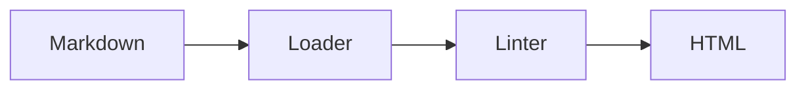

## The model

A short model paragraph.

## When to use it

1. First question?
2. Second question?

## Speedrun

**What** — a fixture page.

**How to use it**

1. Load it through the parser.
2. Run the linter over the result.
3. Render it and compare.

**Why** — to prove the pipeline holds its shape.

## Going deeper

Because the fixture says so.

## See it work

The loader reads this sample file from disk and hands it to the parser. Frontmatter
becomes a data object, and the body is split on its second-level headings. Each block
keeps the line number it started on, so a later lint violation can point at a real
place in the file.

Nothing here is rendered or checked for quality. This sample exists only to prove that
the loader produces the shape every later stage expects. When the build runs, the same
page travels through the linter, the templates, and the search index without any
further parsing. That is the whole contract this fixture guards.

## Next

Nothing yet.
